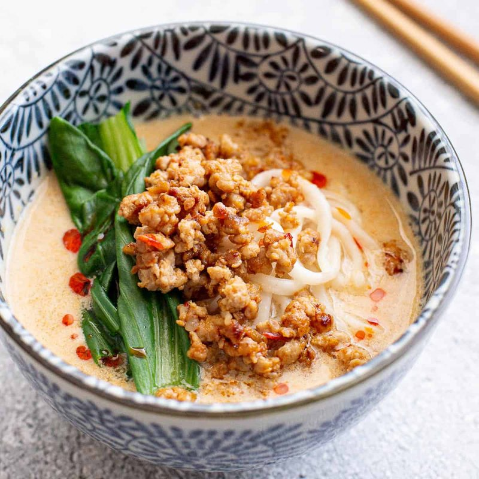

# Tantanmen

*Japan's take on dan-dan noodles: a brothy ramen with a thick sesame-and-chilli tare, topped with spiced ground pork and a soft-boiled egg.*

**Serves:** 2

**Prep Time:** 30 minutes

**Cook Time:** 25 minutes

## Overview
Three components assemble at service. (1) Niku miso: ground pork stir-fries with garlic, ginger, doubanjiang and miso, then sweetened with sugar and finished with sesame oil. (2) Tare (concentrated seasoning paste): white sesame paste (tahini), soy sauce, rice vinegar, chilli oil, miso paste, garlic, whisked together. (3) Hot soup: chicken stock with a touch more sesame paste and chilli oil swirled in. Ramen noodles cook separately. Bowls layered: tare in the bottom, hot soup ladled over, cooked noodles, mound of niku miso, blanched bok choy, soft-boiled marinated egg, scallions, extra chilli oil.

## Ingredients

### Niku miso (spiced pork topping)
- 200 g pork mince
- 1 tablespoon neutral oil
- 4 garlic cloves (minced)
- 25 g fresh ginger (minced)
- 1 tablespoon doubanjiang (Sichuan fermented chilli bean paste)
- 1 tablespoon red miso paste
- 1 tablespoon Shaoxing rice wine (or dry sherry)
- 1 tablespoon soy sauce
- 1 teaspoon caster sugar
- 1 teaspoon toasted sesame oil

### Tare (per bowl, makes 2)
- 3 tablespoons white sesame paste (Asian style — runnier than tahini; substitute tahini whisked smooth)
- 2 tablespoons soy sauce
- 1 tablespoon rice vinegar
- 1 tablespoon chilli oil (la-yu — Japanese rayu chilli oil; substitute homemade or a good shop-bought)
- 1 teaspoon white miso paste
- 1 garlic clove (grated to a paste)
- ½ teaspoon caster sugar

### Soup
- 800 ml chicken stock (good quality)
- 1 tablespoon white sesame paste (extra, whisked into the soup)
- 1 teaspoon chilli oil

### Noodles
- 200-250 g fresh ramen noodles (or 200 g good dried ramen)

### Toppings
- 2 soft-boiled eggs (6.5 minutes from cold water; peel and marinate in 2 tablespoons soy + 2 tablespoons mirin + 50 ml water overnight if possible)
- 200 g baby bok choy (halved lengthways)
- 4 spring onions (sliced thin, green parts)
- 1 tablespoon toasted sesame seeds
- Extra chilli oil and Sichuan pepper for the table

## Method

### Stage 1 - Niku miso
1. Heat oil in a small pan over medium-high heat.
1. Add the pork mince; brown 5 minutes, breaking up.
1. Add garlic and ginger; 30 seconds.
1. Add doubanjiang and miso; stir-fry 1 minute (they should darken and become fragrant).
1. Add Shaoxing, soy and sugar; cook 2 minutes till the liquid mostly evaporates.
1. Off heat; stir in sesame oil. Keep warm.

### Stage 2 - Tare
1. In each serving bowl directly, whisk together: 1 ½ tablespoons sesame paste, 1 tablespoon soy sauce, ½ tablespoon rice vinegar, ½ tablespoon chilli oil, ½ teaspoon white miso, half a grated garlic clove, ¼ teaspoon sugar.
1. The tare will be a thick glossy paste at the bottom of the bowl.

### Stage 3 - Soup
1. Heat the chicken stock in a saucepan to just-simmering.
1. Whisk in 1 tablespoon sesame paste and 1 teaspoon chilli oil — the soup turns a creamy beige with red flecks.
1. Keep hot.

### Stage 4 - Bok choy and noodles
1. Bring a wide pot of water to a rolling boil.
1. Blanch the bok choy halves 90 seconds; lift out; set aside.
1. Cook the ramen noodles according to packet (usually 90 seconds for fresh, 3-4 minutes for dried).

### Stage 5 - Assemble
1. Working fast (everything wants to be hot):
1. Pour 400 ml of the hot soup into each bowl over the tare — whisk briefly with chopsticks so the tare emulsifies into the soup.
1. Drain the noodles; lift into the soup; arrange in a small mound at the centre.
1. Spoon half the niku miso on top of the noodles in each bowl.
1. Add 2 bok choy halves alongside.
1. Halve a soft-boiled egg and place cut-side-up.
1. Scatter the spring onion greens, sesame seeds.
1. Extra drizzle of chilli oil for those who want more heat.

### Stage 6 - Serve
1. Bring to the table immediately, with extra chilli oil and Sichuan pepper available.
1. Eat by stirring the niku miso into the soup; slurp the noodles loudly (Japan-approved).

## Notes
- **Doubanjiang is critical:** Sichuan fermented broad-bean chilli paste. Pixian brand is the standard. Other chilli pastes (sambal, harissa, gochujang) are all wrong flavour profiles.
- **Two sesame pastes (Asian + tahini):** Japanese tantanmen uses runnier roasted-sesame paste; Middle-Eastern tahini works but is slightly nuttier. Whisk well into the soup or it sinks.
- **Tare in the bowl, soup over the top:** unlike clear ramens, tantanmen's flavour is in the bottom paste that the soup emulsifies into. Mixing in a separate jug loses the layered effect.
- **Eat fast:** the noodles soften in the hot soup within 5 minutes. Serve in a hot bowl and don't dawdle photographing.

## Storage
- Niku miso keeps 5 days refrigerated; reheats well.
- Marinated eggs keep 3 days refrigerated.
- Tare components keep 2 weeks refrigerated as a base.
- Don't pre-assemble; build each bowl to order.
