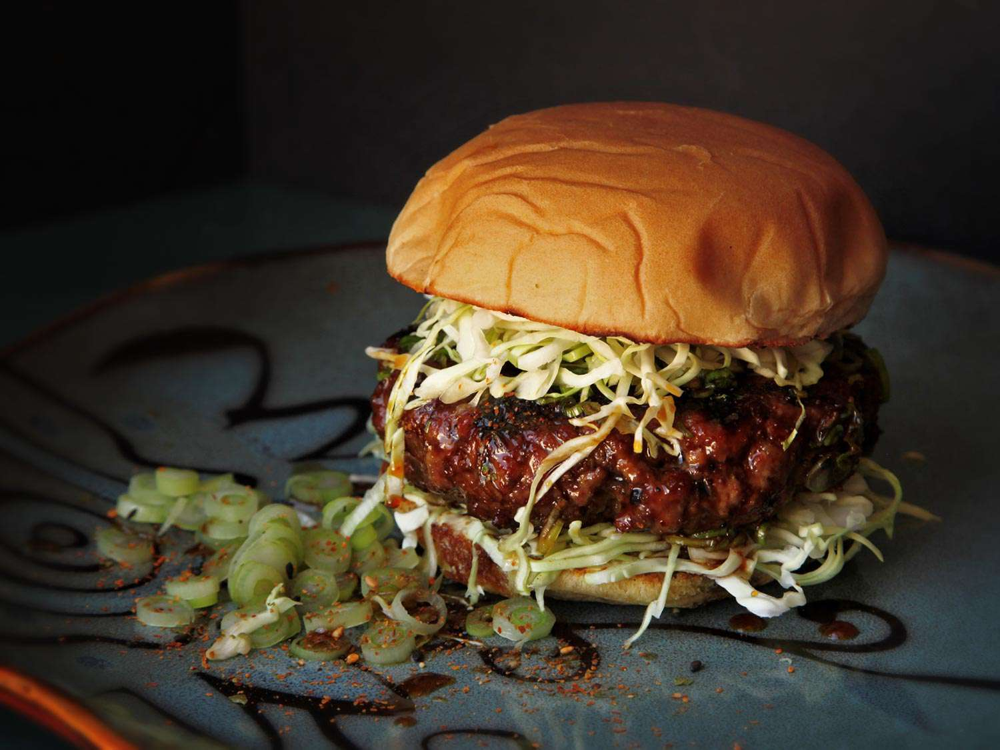

# Teriyaki Burger

*Japan's MOS Burger classic: a juicy beef patty glazed with a sweet-savoury teriyaki sauce of soy, mirin, sake and sugar, topped with shredded iceberg lettuce, a slice of fresh tomato, and a generous spoon of Japanese mayonnaise on a soft squishy white bun. The iconic Japanese-style hamburger that bridges American comfort food and Japanese sweet-soy flavours.*

**Serves:** 4

**Prep Time:** 20 minutes

**Cook Time:** 15 minutes

## Overview
The teriyaki burger is a fixture of Japanese-style fast food (championed by the home-grown MOS Burger chain since 1973, with Lotteria and McDonald's Japan offering their own takes) and one of the most iconic examples of Japan's domesticated twist on the American hamburger: a juicy beef patty (sometimes a beef-pork blend) pan-seared till crusted, then glazed with a teriyaki sauce reduced from soy, mirin, sake, sugar, ginger and garlic to a glossy mahogany syrup. Built on a soft white bun (the squishy convenience-store kind, not artisan brioche) with shredded iceberg, a slice of tomato and a generous spoon of Kewpie mayonnaise. The burger is recognisable, but the sweet-soy glaze, the squishy bun and the Kewpie make it unmistakably Japanese. The teriyaki must be reduced before glazing; watery sauce slides off the patty. Kewpie has more umami than standard mayo. The bun is tender and squishy, not crusty.

## Ingredients

### Patties
- 700 g ground beef (80/20)
- 1 small onion (very finely grated)
- 2 tablespoons soy sauce
- 1 tablespoon mirin
- 1 teaspoon caster sugar
- 1 teaspoon fine sea salt
- ½ teaspoon ground black pepper
- 1 teaspoon ginger (very finely grated)

### Teriyaki glaze
- 80 ml soy sauce
- 60 ml mirin
- 60 ml sake (or substitute extra mirin + 1 tablespoon rice vinegar)
- 4 tablespoons caster sugar
- 4 garlic cloves (crushed)
- 1 tablespoon ginger (grated)
- 1 tablespoon cornflour mixed with 2 tablespoons cold water

### Toppings
- 4 soft white burger buns
- 200 g iceberg lettuce (finely shredded)
- 1 large tomato (sliced)
- 8 tablespoons Kewpie Japanese mayonnaise

### Frying
- 2 tablespoons vegetable oil

### To serve
- Shoestring fries or sweet potato fries
- Pickled ginger or pickled cucumber on the side
- Cold Japanese beer (Asahi or Sapporo)

## Method

### Stage 1 - Make teriyaki glaze
1. In a small saucepan, combine soy sauce, mirin, sake, sugar, garlic and ginger.
2. Bring to a gentle simmer over medium heat; cook 5 minutes till slightly reduced.
3. Whisk the cornflour-water slurry into the bubbling sauce; cook 1 minute till glossy and thick (it should coat the back of a spoon).
4. Strain into a small jug; keep warm.

### Stage 2 - Mix patties
1. In a wide bowl, combine the beef, grated onion, soy sauce, mirin, sugar, salt, pepper, grated ginger.
2. Mix gently with clean hands.
3. Form into 4 patties about 11 cm wide and 1.5 cm thick. Press a shallow dimple into the centre of each.

### Stage 3 - Toast buns
1. Lightly toast the buns cut-side-down in a dry pan over medium heat 60 seconds till just warmed and golden at the edges (don't crisp; the MOS-style bun is soft).

### Stage 4 - Cook the patties
1. Heat the oil in a wide cast-iron pan or grill pan over medium-high heat.
2. Cook the patties 3 minutes per side till deeply browned.
3. Reduce heat to medium-low; spoon teriyaki glaze over each patty and flip once.
4. Cook 90 seconds more, basting; the glaze should coat the patty in a sticky layer.

### Stage 5 - Build the burgers
1. Spread Kewpie mayonnaise on both halves of each toasted bun.
2. Pile shredded iceberg on the bottom half.
3. A slice of tomato.
4. The teriyaki-glazed patty.
5. Drizzle the remaining warm glaze over the patty.
6. Close with the top bun.

### Stage 6 - Serve
1. Wrap each burger loosely in greaseproof paper if going for the MOS-Burger handheld look.
2. Fries and pickled ginger on the side.
3. Cold beer.

## Notes
- **Reduce the teriyaki glaze properly:** the sauce must be sticky-syrup before it goes on the patty. Thin teriyaki slides off and pools in the bun.
- **Kewpie mayo is essential:** the umami punch is what makes it taste Japanese. Substitute Hellmann's + 1 tsp rice vinegar + a pinch of MSG if Kewpie is unavailable.
- **Soft white bun:** the MOS-Burger style isn't about a crusty brioche; tender and squishy is the right texture.
- **Don't overcook the patty:** medium (62°C internal) keeps it juicy under the glaze.

## Variations
- **Rice-bun version:** swap the bread for two compressed rice patties (the iconic MOS Burger Rice Burger variant).
- **With cheese:** add a slice of mild cheese under the patty (a softer fusion).
- **Pork-and-beef blend:** swap 30% of the beef for ground pork for a juicier patty.
- **With Japanese curry sauce:** drizzle Japanese curry roux over instead of teriyaki for a curry-burger variation.
- **With shichimi togarashi:** sprinkle the seven-spice on top of the patty for a touch of heat.

## Serving
- At lunch at a Japanese fast-food counter; at home with fries and a cold beer.

## Storage
- Best fresh.
- Teriyaki glaze keeps refrigerated 2 weeks.
- Raw patties freeze 2 months.
- Cooked patties refrigerate 2 days; reheat briefly with a fresh spoon of glaze.
