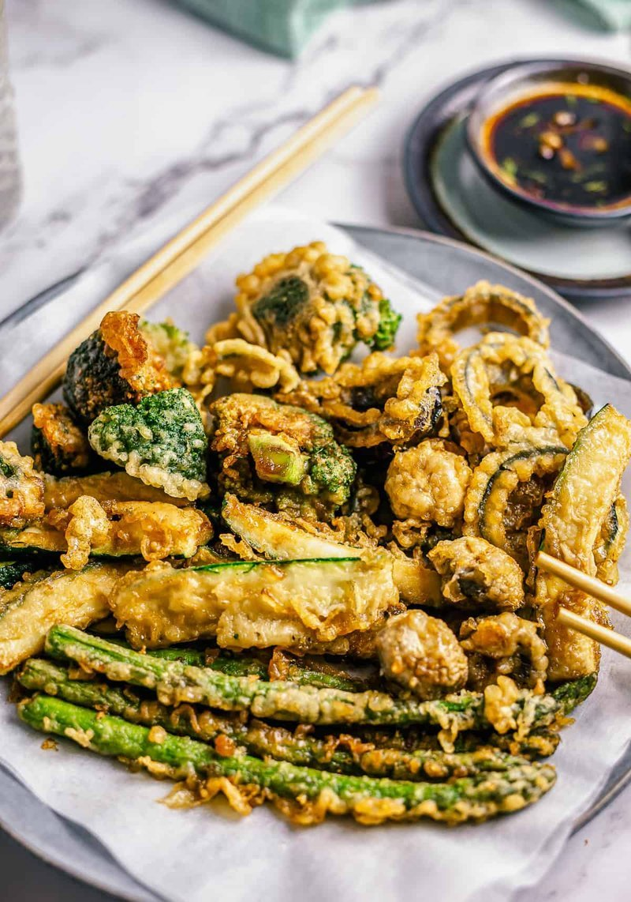

# Vegetable Tempura

*Japanese vegetable tempura: vegetables coated in a barely-mixed, ice-cold batter and deep-fried for under 2 minutes apiece. The batter shatters when bitten; the vegetables emerge just-cooked, distinct from each other. Tentsuyu dipping sauce on the side; grated daikon stirred through it at the table.*

**Serves:** 4

**Prep Time:** 20 minutes

**Cook Time:** 25 minutes

## Overview
The vegetable side of tempura: sweet potato, kabocha, aubergine, mushrooms, green beans, all coated in barely-mixed ice-cold batter and dropped for under two minutes apiece into 175°C oil. The result is a paper-thin lacy crust that shatters when you bite, the vegetables emerging just cooked, distinct from each other. You chill the flour and the sparkling water (cold cold cold is the whole point of tempura), whisk one egg yolk into the water, then mix the flour in with four or five strokes only; smooth batter develops gluten and goes chewy, and you want the opposite. Dust each piece in plain flour to grip the batter, dip, let the excess drip, slip it into the oil. Pale gold is the colour, never deep brown; lift onto a wire rack and salt lightly. Tentsuyu warms in a small pan and ladles into individual bowls, with daikon and ginger grated fresh at the table for guests to stir in to taste. Eat the moment they come off the rack; tempura goes soggy within minutes.

## Ingredients

### Batter
- 200 g plain flour (chilled in the freezer 30 min)
- 1 egg yolk (large)
- 300 ml ice-cold sparkling water
- A handful of ice cubes (to keep the batter cold)

### Vegetables (any selection)
- 1 sweet potato (sliced 5 mm thick)
- 8 shiitake mushrooms (stems trimmed)
- 1 kabocha squash (small, sliced 5 mm thick crescents)
- 1 aubergine (medium, sliced 5 mm thick rounds)
- 8 green beans
- 1 red onion (cut into 2 cm wedges, kept together with a toothpick)
- 8 shiso leaves (or basil, optional)

### Dusting and frying
- 50 g plain flour (for dusting)
- Vegetable oil (for deep-frying; about 1 ½ litres)

### Tentsuyu (dipping sauce)
- 200 ml dashi (or vegetable stock for vegan)
- 4 tablespoons light soy sauce
- 4 tablespoons mirin
- 100 g daikon (finely grated)
- 2 cm fresh ginger (finely grated)

## Method

### Stage 1 - Sauce
1. Combine the dashi, soy and mirin in a small pan; bring to a simmer; cook 1 minute.
1. Pour into 4 small dipping bowls.
1. Serve the grated daikon and ginger separately so guests can stir in to taste.

### Stage 2 - Heat the oil
1. Heat 5 cm of oil in a heavy pot or deep fryer to 175-180°C - a kitchen thermometer is the reliable check. Failing that, the handle of a wooden spoon dipped in should give off a steady stream of small bubbles.
1. Once the batter is mixed in Stage 3, drop a tiny piece in: it should sink halfway, then float and sizzle.

### Stage 3 - Batter (only when ready to fry)
1. In a wide bowl, whisk the egg yolk into the cold sparkling water; add a few ice cubes to keep it cold.
1. Add the chilled flour all at once; mix with chopsticks or a fork in 4-5 strokes only, leave lumps and dry patches; this is correct.

### Stage 4 - Fry
1. Working in small batches:
1. Dust each vegetable in plain flour; dip into batter; let excess drip off.
1. Slip carefully into the oil. Slice the dense root vegetables (sweet potato, kabocha, pumpkin) thin (3 mm) or par-steam them 3-4 minutes first - otherwise the batter colours before the inside cooks through.
1. Fry 90 seconds to 2 minutes (longer for any thicker dense pieces) until pale golden and crisp.
1. Lift onto a wire rack (not paper, which traps steam and softens the crust).
1. Skim any batter scraps out of the oil between batches; re-check temperature.

### Stage 5 - Serve
1. Pile tempura onto a plate or rack, vegetables grouped together.
1. Eat immediately with the dipping sauce, daikon and ginger.

## Notes
- **Cold cold cold:** The temperature differential between the batter and the oil is what gives tempura its characteristic shattering crust. Lukewarm batter gives a soggy, doughy result.
- **Lumpy batter is correct:** Smooth, well-mixed batter develops gluten and goes chewy. Two or three streaks of flour visible, perfect.
- **Pale, not deep golden:** Tempura should be the colour of straw, not toast. Deep brown means overcooked vegetables and a heavy crust.

## Storage
- Best eaten right away. Tempura goes soggy within minutes; refrigeration is murder. Re-crisp leftovers at 200°C for 4-5 minutes.
