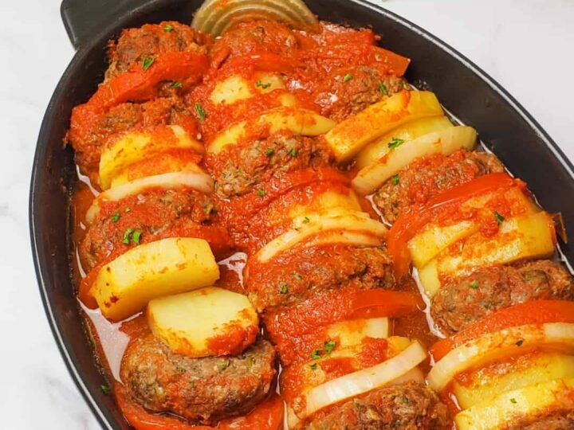

# Kafta Bil Saneya

*Jordanian baked kafta: spiced lamb-and-beef mince patties layered in a tray over sliced potato and tomato, topped with tomato slices, peppers and a tomato-pomegranate sauce, baked until everything is tender and the top is bronzed. A Friday lunch or family dinner; eaten with rice or warm bread.*

**Serves:** 4

**Prep Time:** 25 minutes

**Cook Time:** 50 minutes

## Overview
A Friday-lunch or family-dinner Jordanian tray bake: spiced lamb-and-beef mince patties layered over sliced potato and tomato, topped with peppers and onion rings, drowned in a tomato-pomegranate sauce, baked till everything is tender and the top bronzes. You mix lamb and beef with finely grated onion (saved juices and all, for moisture), parsley, allspice, cinnamon and salt, rest 10 minutes for the flavours to meld. Par-cook potato slices on an oiled tray first; the kafta cooks faster than potato in the same tin, so this is the catch that earns the patience. Layer everything in a wide oven dish: potato beneath, kafta over, then tomato slices, pepper rings, red onion on top. Whisk tomato puree and pomegranate molasses (the Jordanian signature, the deep sweet-sour note that makes the dish what it is) with garlic, allspice and hot stock, pour around the kafta so the liquid comes halfway up. Bake 40 minutes till the top bronzes; rest five minutes and scatter parsley. Eat with timman (white rice) or warm bread.

## Ingredients

### Kafta
- 500 g lamb mince
- 300 g beef mince
- 1 onion (large, very finely grated, juices reserved)
- 4 tablespoons fresh parsley (chopped)
- 2 garlic cloves (crushed)
- 1 ½ teaspoons ground allspice
- 1 teaspoon ground cinnamon
- ½ teaspoon ground black pepper
- 1 ½ teaspoons salt

### Tray layers
- 4 potatoes (medium, peeled, sliced 5 mm thick)
- 3 tomatoes (large, sliced 5 mm)
- 1 green bell pepper (sliced into rings)
- 1 red onion (small, sliced)

### Sauce
- 3 tablespoons tomato puree
- 2 tablespoons pomegranate molasses
- 4 garlic cloves (crushed)
- 1 teaspoon ground allspice
- 1 teaspoon salt
- 500 ml hot stock (or water)

### To finish
- 3 tablespoons olive oil (for drizzling)
- 2 tablespoons fresh parsley (chopped)

## Method

### Stage 1 - Kafta mix
1. Combine all kafta ingredients in a wide bowl. Mix thoroughly with hands.
1. Rest 10 minutes.

### Stage 2 - Pre-fry potato (optional but better texture)
1. Heat oven to 200°C (180°C fan).
1. Lay potato slices on an oiled tray; drizzle with oil; bake 15 minutes to par-cook.

### Stage 3 - Assemble
1. In a wide oven dish (28 x 22 cm), arrange the par-baked potato slices to cover the base.
1. Shape the kafta into 4 thick patties (or one flat 2 cm layer); place over the potato.
1. Top with sliced tomato, bell pepper, red onion.

### Stage 4 - Sauce
1. Whisk tomato puree, pomegranate molasses, garlic, allspice, salt with the hot stock.
1. Pour over the tray, around (not over) the kafta. The liquid should come halfway up the patties.

### Stage 5 - Bake
1. Drizzle olive oil over the top.
1. Bake 40-45 minutes - kafta is cooked through and the top is bronzed.
1. If the top is pale, switch to grill 3 minutes.

### Stage 6 - Serve
1. Rest 5 minutes; scatter parsley.
1. Eat with white rice (timman) or warm bread.

## Notes
- **Pomegranate molasses is the Jordan signature:** Gives the sauce the deep sweet-sour note. Don't substitute.
- **Pre-fry the potato:** Skipping this step gives raw potato - the kafta cooks faster than potato in the same tray. Par-cooking solves it.
- **Layering matters:** Potato on the bottom soaks up the kafta juices; tomato on top stays bright.

## Storage
- Refrigerate 3 days; reheat covered at 180°C 15 minutes.
- Freezes 2 months.
