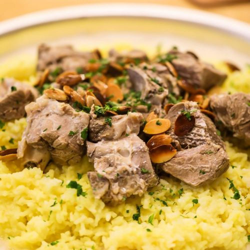

# Mansaf

*Jordan's national dish: lamb slow-cooked in a fermented dried-yogurt sauce (jameed), served on rice and shrak with toasted almonds and pine nuts.*

**Serves:** 6

**Prep Time:** 25 minutes (plus overnight soak for jameed)

**Cook Time:** 2 ½ hours

## Overview
Jordan's national dish: the platter that gets carried out at weddings, big family Fridays, and anyone-coming-home-from-abroad meals. Lamb slow-cooked in a fermented-dried-yogurt sauce called jameed, served on rice and torn flatbread with toasted almonds and pine nuts scattered across the top. Jameed is the soul of the dish: hard balls of dried-sour yogurt sold at any Middle Eastern grocer, soaked overnight then blended smooth to become the cooking liquid. Yogurt and salt is a poor substitute; the sourness and depth aren't the same. The lamb stock and the jameed whisk together over low heat (never a hard boil; jameed splits at high heat). Built on a wide platter: torn shrak across the base, sauce ladled to soak, rice piled on top, lamb arranged, more sauce spooned over, almonds, pine nuts and parsley scattered. Eat from the shared platter with the right hand.

## Ingredients

- 1 ½ kg lamb shoulder (cut into large 8 cm chunks; bone-in is better)
- 4 jameed balls (around 500 g; or 800 g goat's milk yogurt + 4 tablespoons salt as a substitute base)
- 2 onions (large, 1 quartered, 1 finely chopped)
- 6 cardamom pods (bashed)
- 1 cinnamon stick
- 4 bay leaves
- 1 teaspoon black peppercorns
- 1 teaspoon ground turmeric
- 1 ½ teaspoons salt
- 1 ½ litres water (for the lamb)

### Rice
- 500 g long-grain (or basmati rice, rinsed)
- 50 g unsalted butter
- ½ teaspoon ground turmeric
- 1 teaspoon salt

### To finish
- 4 sheets shrak bread (or markook, or 2 large lavash sheets)
- 50 g flaked almonds
- 50 g pine nuts
- 30 g unsalted butter
- A handful of flat-leaf parsley (chopped)

## Method

### Stage 1 - Soak the jameed
1. Crumble the jameed balls and soak overnight in 1 litre of cold water, the dried yogurt rehydrates and softens.
1. The next day, blend the soaked mixture smooth in a blender with its soaking liquid; pass through a sieve. Set aside.

### Stage 2 - Cook the lamb
1. Place the lamb in a large pot with the quartered onion, cardamom, cinnamon, bay, peppercorns, turmeric, salt and 1 ½ litres water.
1. Bring to the boil; skim the foam.
1. Reduce to a steady simmer; cover loosely and cook 1 ½-2 hours until the lamb is tender (a fork goes in easily).

### Stage 3 - Combine with jameed
1. Lift the lamb out; strain the cooking liquid; return both to a clean pot.
1. Whisk in the jameed liquid and the chopped onion; bring to a low simmer (don't boil, jameed splits at high heat).
1. Cook 30 minutes, whisking often, until thickened slightly and the flavours marry.

### Stage 4 - Rice
1. Melt the butter in a heavy pan; add the rice; toast 2 minutes.
1. Add 1 litre water, turmeric and salt; bring to the boil.
1. Reduce to lowest heat; cover; cook 15 minutes; rest off the heat 10 minutes.

### Stage 5 - Toast the nuts
1. Cook the almonds and pine nuts in the 30 g butter until golden; lift onto kitchen paper.

### Stage 6 - Assemble
1. Tear the shrak bread and lay across a wide platter.
1. Ladle some of the jameed sauce over the bread to soak.
1. Pile the rice on top.
1. Arrange the lamb pieces over the rice.
1. Spoon over more sauce.
1. Scatter the toasted nuts and parsley.

### Stage 7 - Serve
1. Bring extra sauce to the table in a jug.
1. Eat with the right hand from the shared platter, scooping rice, lamb and sauce.

## Notes
- **Jameed is essential:** Sold as hard balls at Middle Eastern grocers (sometimes "jameed" or "Jordanian dried yogurt"). Yogurt + salt is a poor substitute; the sourness and depth aren't the same.
- **Don't boil after jameed goes in:** Hard boiling splits the sauce. Steady simmer; whisk often.
- **Eat with bread:** Shrak (paper-thin Bedouin flatbread) is traditional. Lavash is the closest supermarket substitute.

## Storage
- Keeps 3 days refrigerated; reheat gently. Sauce thickens further.
- Freezes 3 months.
