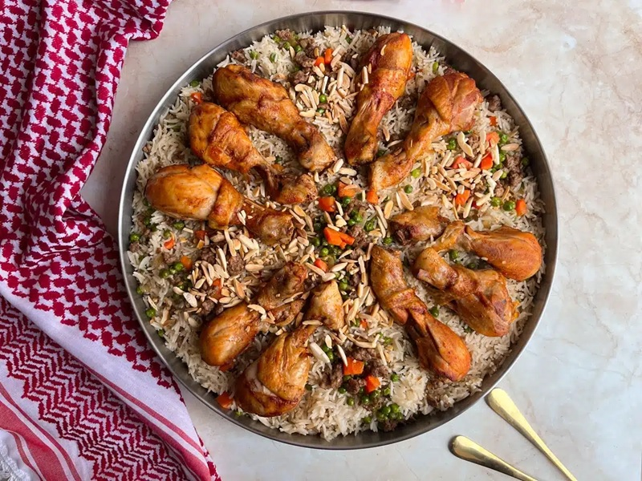

# Ouzi

*The Jordanian celebration parcel: spiced minced lamb, rice, peas, almonds and pine nuts wrapped in a thin pastry (phyllo or markook bread) and baked into a golden dome, sliced at the table like a cake. Served at weddings, Eid feasts and big family lunches. The pastry shell stays crisp; the rice-and-meat filling is rich, perfumed with baharat, allspice and cinnamon.*

**Serves:** 6

**Prep Time:** 40 minutes

**Cook Time:** 50 minutes

## Overview
Lamb mince fries with onion, garlic, baharat, cinnamon, allspice and pine nuts. Basmati rice cooks pilaf-style in a meat-spiced stock until almost done. Lamb and rice fold together with peas, almonds and parsley. The filling spoons into a phyllo-lined dome mould (or wide cake tin), tops are folded over to seal, brushed with ghee, baked 30 minutes until deep gold. Inverted onto a platter; sliced at the table.

## Ingredients

### Filling
- 500 g lamb mince
- 3 tablespoons ghee or olive oil
- 1 large onion (finely chopped)
- 4 garlic cloves (crushed)
- 2 tablespoons baharat
- 1 teaspoon ground allspice
- ½ teaspoon ground cinnamon
- ½ teaspoon ground black pepper
- 1 ½ teaspoons salt
- 50 g pine nuts (toasted)
- 50 g flaked almonds (toasted)
- 150 g frozen peas
- 3 tablespoons fresh parsley (chopped)

### Rice
- 300 g basmati rice (rinsed; soaked 20 minutes; drained)
- 2 tablespoons ghee
- 600 ml hot lamb or chicken stock
- 1 teaspoon salt
- 1 cinnamon stick
- 4 cardamom pods (bruised)

### Pastry shell
- 12 sheets phyllo pastry (thawed, kept covered with a damp tea towel)
- 100 g ghee (melted, for brushing)

### To finish
- 2 tablespoons sesame seeds (optional)

## Method

### Stage 1 - Lamb
1. Heat ghee in a wide pan over medium-high. Brown the mince hard 6 minutes, breaking up clumps.
1. Add onion; cook 6 minutes.
1. Add garlic, baharat, allspice, cinnamon, pepper and 1 teaspoon salt; cook 1 minute.
1. Off heat. Set aside.

### Stage 2 - Rice
1. Heat ghee in a heavy pot. Toast drained rice 1 minute.
1. Pour in hot stock; add salt, cinnamon stick, cardamom.
1. Bring to a boil; cover; reduce heat to lowest; cook 12 minutes (rice will be slightly underdone).
1. Off heat; rest 5 minutes.

### Stage 3 - Combine
1. Fold the lamb mixture, peas, pine nuts, almonds, parsley and remaining ½ teaspoon salt into the rice.
1. Discard the cinnamon stick and cardamom pods if you can see them.

### Stage 4 - Build the shell
1. Heat oven to 200°C (180°C fan).
1. Brush a 25 cm round oven dish or domed mould generously with melted ghee.
1. Lay a phyllo sheet to cover the base and let the overhang drape outside the rim. Brush with ghee.
1. Repeat with 7 more sheets, rotating 45° each so the entire rim is covered with overhang.
1. Pack the filling into the centre firmly.

### Stage 5 - Seal
1. Fold the overhanging phyllo over the filling to enclose. Brush ghee between each fold.
1. Crumple the remaining 4 sheets loosely on top to make a decorative dome; brush each with ghee.
1. Scatter sesame seeds if using.

### Stage 6 - Bake
1. Bake 35-40 minutes until deep gold and crisp.

### Stage 7 - Rest and serve
1. Rest 10 minutes.
1. Invert onto a wide platter (or serve straight from the dish for a less dramatic presentation).
1. Slice into wedges like a cake. Eat with yogurt and a salad.

## Notes
- **Phyllo not strudel:** Use thin Greek/Middle Eastern phyllo, not the thicker yufka or strudel dough. Brush each sheet generously with ghee.
- **Slightly underdone rice:** The rice finishes cooking in the bake. Fully cooked rice gives mushy ouzi.
- **Bread shell variant:** Traditional ouzi can be wrapped in markook (Jordanian thin bread) instead of phyllo. The bread version is softer; the phyllo version is crisper.

## Storage
- Best fresh. Refrigerate 3 days; reheat at 180°C 15 minutes covered.
- Don't freeze the assembled dish; the pastry goes soggy.
