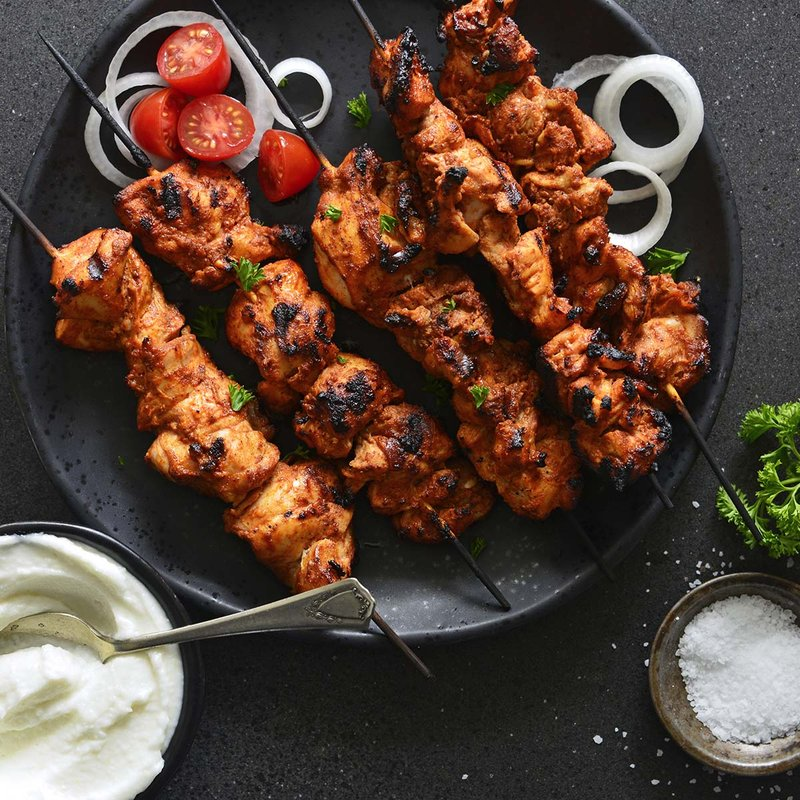

# Shish Tawook Jordani

*Jordan's grilled chicken skewers: boneless thighs marinated overnight in garlic, lemon, yogurt, tomato puree, allspice and paprika, then charred.*

**Serves:** 4

**Prep Time:** 20 minutes (plus 6 hours marinating)

**Cook Time:** 15 minutes

## Overview
Yogurt-based marinade with lemon, garlic, tomato puree, allspice, paprika and olive oil. Chicken thighs cube small (3 cm), marinate at least 6 hours, ideally overnight. Threaded onto skewers; grilled hot 8-10 minutes total. Served with garlic toum, hot bread and grilled tomatoes.

## Ingredients

### Marinade
- 1 kg boneless skinless chicken thighs (cut into 3 cm cubes)
- 300 ml plain yogurt
- 4 tablespoons olive oil
- Juice of 2 lemons
- 6 garlic cloves (crushed)
- 2 tablespoons tomato puree
- 2 teaspoons ground allspice
- 1 teaspoon sweet paprika
- 1 teaspoon ground cumin
- 1 ½ teaspoons salt
- 1 teaspoon ground black pepper

### To grill
- 8 cherry tomatoes
- 1 green bell pepper (cut into chunks, optional)
- 1 lemon (cut into wedges)

### To serve
- Garlic toum or yogurt sauce
- 4 large pita or shrak breads
- Pickles (turnips, cucumbers)
- Salata baladi

## Method

### Stage 1 - Marinade
1. Whisk all marinade ingredients in a wide bowl.
1. Add chicken cubes; turn to coat.
1. Cover; refrigerate 6 hours minimum, ideally overnight.

### Stage 2 - Skewer
1. Thread 5-6 chicken cubes onto each flat metal skewer.
1. Alternate with cherry tomatoes and bell pepper chunks on separate skewers.

### Stage 3 - Grill
1. Heat charcoal until ashed over (or gas grill / oven grill to maximum).
1. Grill chicken skewers 4 minutes per side, turning, until edges are charred and inside is cooked through.
1. Grill tomato/pepper skewers 3 minutes per side.

### Stage 4 - Serve
1. Slide chicken off skewers into warm pita or shrak.
1. Add toum, pickles, salata. Wrap.
1. Lemon wedges alongside.

## Notes
- **Yogurt marinade tenderises:** The lactic acid keeps the chicken juicy through a hard char. Don't skip the overnight rest.
- **Hot grill, not medium:** A medium grill gives grey chicken; high heat gives the proper Levantine char.
- **Garlic toum:** Whipped garlic-lemon-oil emulsion. Sold at Middle Eastern shops; or whip 6 garlic cloves with 1 tsp salt + 1 tsp lemon juice + 300 ml light vegetable oil in a stand mixer until thick.

## Storage
- Marinated raw chicken keeps 48 hours.
- Cooked chicken refrigerates 2 days; reheat in a hot pan.
