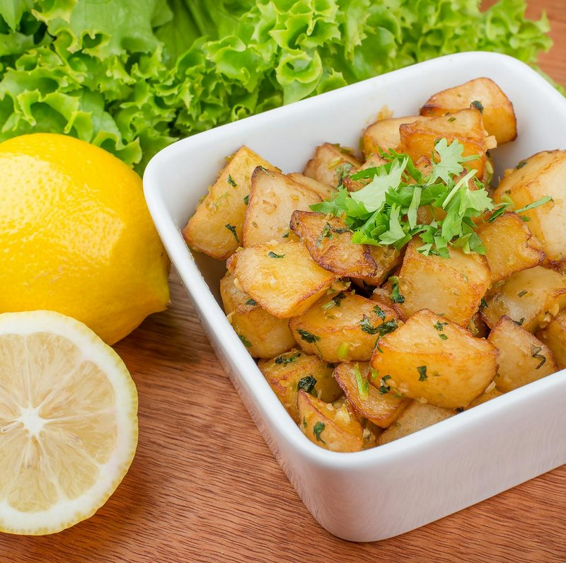

# Batata Harra

*Spicy Levantine potatoes: chunky potato cubes pan-fried until deep gold, tossed off-heat with garlic, fresh coriander, chilli flakes and lemon. Eaten as a mezze side or alongside grilled meats. Hot, garlicky, herbal - the classic Jordanian / Lebanese vegetable side that sits next to hummus on every mezze table.*

**Serves:** 4 as a side

**Prep Time:** 10 minutes

**Cook Time:** 25 minutes

## Overview
Potato cubes par-boil for 6 minutes to set the inside, drain, dry. Fried in olive oil at medium-high until deeply golden all sides (15 minutes). Off heat, garlic, coriander, chilli flakes, salt, lemon juice toss through. A handful of fresh coriander leaves on top.

## Ingredients

- 800 g floury potatoes (peeled, cut into 2 cm cubes)
- 1 teaspoon salt (for boil)
- 100 ml olive oil
- 8 garlic cloves (crushed)
- 1 ½ teaspoons dried chilli flakes (Aleppo or regular)
- ½ teaspoon ground cumin
- ½ teaspoon salt (to taste)
- ½ lemon (juice)
- 1 small bunch fresh coriander (chopped - 4 tablespoons)
- 1 tablespoon sumac (optional)

## Method

### Stage 1 - Par-boil
1. Bring a pot of salted water to a hard boil.
1. Add potato cubes; cook 6 minutes (still firm in the centre).
1. Drain very well; spread on a tea towel to dry the surface.

### Stage 2 - Fry
1. Heat the olive oil in a wide heavy pan over medium-high.
1. Add the dried potatoes in a single layer (work in batches if needed).
1. Fry 12-15 minutes total, turning every few minutes, until deeply golden on all sides.

### Stage 3 - Drain
1. Lift onto kitchen paper; reserve the oil in the pan.

### Stage 4 - Garlic
1. Pour off all but 3 tablespoons of the frying oil.
1. Reduce heat to medium-low; add crushed garlic; cook 60 seconds - pale gold, not brown.
1. Stir in chilli flakes, cumin, salt.

### Stage 5 - Combine
1. Return the fried potatoes; toss to coat in the garlic-chilli oil.
1. Off heat. Squeeze in lemon juice; toss again.
1. Add chopped coriander; toss.

### Stage 6 - Serve
1. Tip into a warm serving bowl; sprinkle sumac if using.
1. Eat warm with grilled meats, alongside hummus, or as part of a mezze.

## Notes
- **Dry the potatoes well:** Wet potatoes spatter and don't crisp. The tea-towel step is important.
- **Garlic just gold:** Brown garlic is bitter and ruins the dish. 60 seconds is enough.
- **Aleppo chilli:** The right chilli flake for Levantine cooking - fruity, medium heat. Substitute regular chilli flakes with a pinch of paprika.

## Storage
- Refrigerate 2 days. Reheat in a hot pan to re-crisp.
