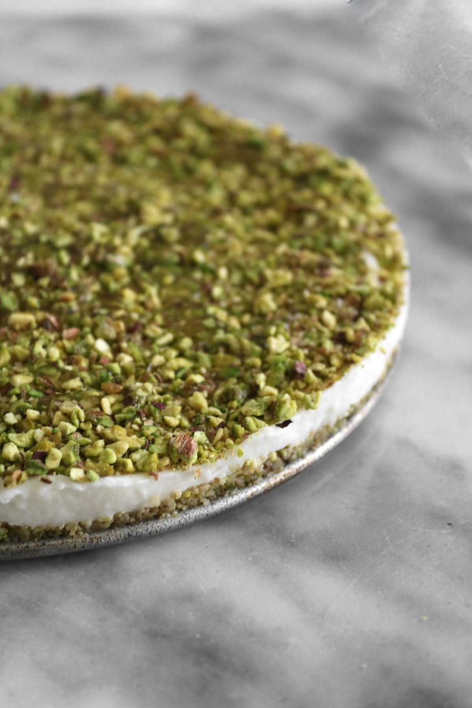

# Mafrouka

*A semolina-and-pistachio Jordanian sweet: a buttery semolina pudding baked into a slab, topped with sweetened ashta cream (clotted cream perfumed with rose water) and a snowdrift of crushed pistachios. Eat at Ramadan iftar, Eid, weddings. Soft, fragrant, rich.*

**Serves:** 6

**Prep Time:** 20 minutes

**Cook Time:** 30 minutes

## Overview
A Ramadan-iftar, Eid and wedding sweet, the kind of Jordanian pudding that lives on a glass dish at family celebrations. A buttery semolina base baked into a slab is topped with sweetened ashta (Levantine clotted cream perfumed with rose and orange-blossom water) and a snowdrift of crushed pistachios. You toast fine semolina (coarse gives gritty mafrouka) in butter till it turns pale gold and fragrant, hydrate with sugar syrup, cook to a thick paste that pulls from the pan sides. Perfume with rose and orange-blossom water, optionally bloomed saffron, then press into a tray and chill to firm up. Fold ashta (or clotted cream blended with mascarpone, the easy home substitute) with icing sugar and more floral waters, spread evenly across the cold base, scatter crushed pistachios so heavily it looks snow-covered. Cut into squares or diamonds, eat cool with Arabic coffee or strong black tea.

## Ingredients

### Semolina base
- 300 g fine semolina
- 150 g unsalted butter
- 200 g caster sugar
- 400 ml water
- 1 tablespoon rose water
- 1 tablespoon orange blossom water
- 1 large pinch saffron threads (bloomed in 1 tbsp hot water, optional)

### Ashta topping
- 250 g clotted cream (or 150 g clotted cream + 100 g mascarpone cheese)
- 2 tablespoons icing sugar
- 1 teaspoon rose water
- 1 teaspoon orange blossom water

### Garnish
- 100 g pistachios (unsalted, lightly toasted, finely chopped)
- 2 tablespoons rose petals (dried, optional)

## Method

### Stage 1 - Sugar syrup
1. In a small pan, combine 200 ml of the water with the sugar.
1. Bring to a boil; simmer 3 minutes until syrupy.
1. Off heat. Set aside.

### Stage 2 - Semolina
1. Melt butter in a wide heavy pan over medium heat.
1. Add semolina; toast 4-5 minutes, stirring constantly, until pale gold and fragrant.

### Stage 3 - Hydrate
1. Add the remaining 200 ml water, then the warm sugar syrup, stirring constantly.
1. Add the saffron-water (if using).
1. Cook 4-5 minutes more, stirring, until the mixture thickens to a soft paste that pulls from the pan sides.
1. Stir in rose water and orange blossom water.

### Stage 4 - Set
1. Tip into an oiled 22 x 22 cm tray; press flat with a wet spatula.
1. Cool to room temperature, then refrigerate 30 minutes to firm.

### Stage 5 - Ashta
1. In a bowl, fold together clotted cream (and mascarpone if using), icing sugar, rose water, orange blossom water.

### Stage 6 - Plate
1. Spread the ashta evenly over the chilled semolina layer.
1. Scatter chopped pistachios densely over the top - should look snow-covered.
1. Scatter rose petals if using.

### Stage 7 - Serve
1. Cut into squares or diamonds.
1. Eat cool. Pair with Arabic coffee or strong black tea.

## Notes
- **Fine semolina:** Coarse semolina gives gritty mafrouka. Look for fine or extra-fine.
- **Ashta:** Lebanese / Syrian clotted cream made by simmering milk and bread or cornflour into a thick cream. Clotted cream + mascarpone is the easy home substitute.
- **Toast semolina properly:** Pale gold gives a nuttier mafrouka. Skipping the toast gives raw-tasting semolina.

## Storage
- Refrigerate 3 days.
- The ashta and pistachios are best added on serving day for clean visual contrast.
