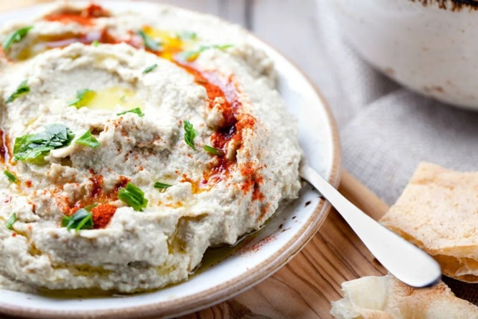

# Mutabbal Jordani

*The Levantine smoky aubergine dip with yogurt: charred aubergine mashed with tahini, yogurt, garlic, salt and lemon. Smoother and richer than baba ganoush.*

**Serves:** 4 as a mezze

**Prep Time:** 15 minutes

**Cook Time:** 20 minutes

## Overview
The smoky aubergine dip that sits on every Levantine mezze table, smoother and richer than baba ganoush thanks to a spoon of yogurt folded through. Open flame is the whole dish; aubergines charred directly on a gas burner till the skin is uniformly black and the flesh has fully collapsed give the smoky depth that defines mutabbal, where oven-roasted gives a passable but inferior result. The flesh-drain is the Levantine moisture step that home cooks miss; aubergine in a colander long enough to release its water before mashing gives a thick scoopable dip, where wet mutabbal tastes bland on the bread. Hand-mashed rather than processor-blitzed is the texture rule; mutabbal should be chunky-smooth, and a food processor's silky purée loses what makes the dip recognisable. The Greek yogurt folded through is the Jordanian variation that distinguishes mutabbal from baba ganoush. Served with ridges drawn through, olive oil pooled in the dips, pomegranate seeds, parsley and sumac scattered across. Eaten with warm pita as part of a mezze.

## Ingredients

- 2 aubergines (large, about 700 g)
- 5 tablespoons tahini (good Lebanese / Palestinian quality)
- 3 tablespoons Greek yogurt
- 2 garlic cloves (crushed to a paste with ½ tsp salt)
- 1 lemon (juice)
- ½ teaspoon ground cumin
- ½ teaspoon salt (to taste)

### To finish
- 2 tablespoons olive oil
- 2 tablespoons pomegranate seeds
- 2 tablespoons fresh parsley (chopped)
- 1 teaspoon sumac

### To serve
- Warm pita

## Method

### Stage 1 - Char
1. Place aubergines directly on a gas flame (or under a very hot grill).
1. Rotate every 5 minutes until skin is uniformly black and flesh is fully collapsed (15-20 minutes).

### Stage 2 - Steam and peel
1. Tip into a bowl; cover; rest 10 minutes (loosens the skin).
1. Peel off the burnt skin; discard.
1. Place flesh in a colander; drain 5 minutes (removes water).

### Stage 3 - Mash
1. Chop the drained flesh roughly.
1. In a wide bowl, fold together aubergine, tahini, yogurt, garlic-salt paste, lemon, cumin and salt.
1. Mash to a chunky-smooth dip with a fork - don't use a processor (too smooth).

### Stage 4 - Taste
1. Adjust salt, lemon, tahini. Should taste smoky-forward with creamy tahini-yogurt body.

### Stage 5 - Plate
1. Spread on a wide shallow plate; ridges with the back of a spoon.
1. Drizzle olive oil; scatter pomegranate seeds, parsley, sumac.

### Stage 6 - Serve
1. Eat with warm pita as part of a mezze.

## Notes
- **Open flame is the dish:** Roasting in the oven gives a passable but inferior result.
- **Yogurt is the Jordanian touch:** Baba ganoush (Levantine generic) uses just tahini; the Jordanian mutabbal adds yogurt for body. Both are right; this is the Jordan style.
- **Drain the flesh:** Aubergine releases water - drain or the dip is loose and bland.

## Storage
- Refrigerate 3 days. Bring to room temperature before serving.
