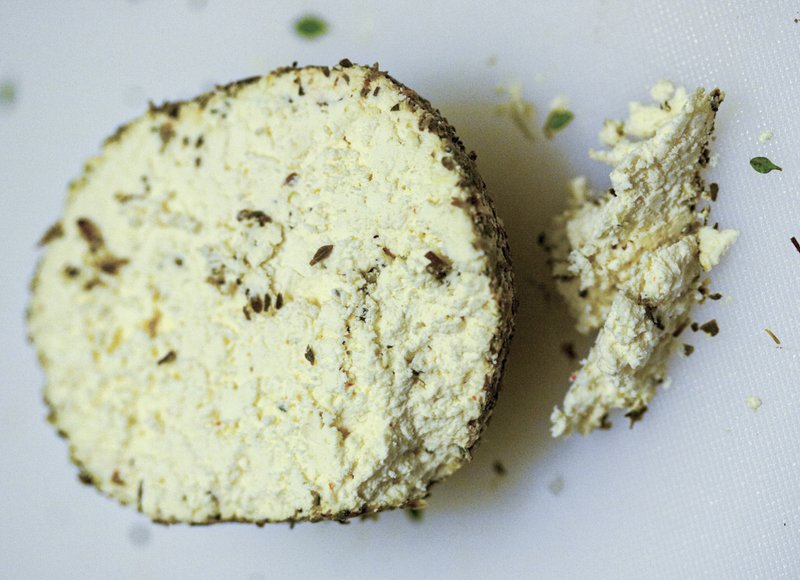

# Shanklish

*Jordanian / Levantine aged cheese balls: strained yogurt-and-cheese curds rolled into balls, dried, rolled in za'atar and dried herbs, then aged. Eaten crumbled into a chopped tomato-onion-olive oil salad on a small mezze plate. Tangy, salty, herbal. A Druze and Levantine signature.*

**Serves:** 4 as a mezze

**Prep Time:** 15 minutes (uses store-bought shanklish or labneh-aged shortcut)

**Cook Time:** 0 minutes

## Overview
Authentic shanklish is aged 3-6 weeks. A practical home version uses pre-made shanklish balls (sold at Middle Eastern shops) or a substitute made from labneh, feta, za'atar and dried mint. For the plate: crumble shanklish onto a wide shallow dish; top with diced tomato, finely chopped red onion, olive oil, a sprinkle of za'atar. Eaten with pita.

## Ingredients

### Shanklish (store-bought) or substitute
- 4 shanklish balls (about 200 g)
- OR substitute: 200 g feta cheese, 100 g labneh, 2 tablespoons za'atar, 1 teaspoon dried mint, 1 teaspoon ground cumin, ¼ teaspoon dried chilli flakes (mixed and shaped into balls, rolled in za'atar, refrigerated overnight)

### Plate
- 2 ripe tomatoes (small dice)
- 1 red onion (small, very finely chopped)
- 3 tablespoons olive oil (extra-virgin)
- 1 tablespoon za'atar
- 1 teaspoon sumac
- 1 tablespoon fresh mint (chopped)
- 1 tablespoon fresh parsley (chopped)

### To serve
- Warm pita

## Method

### Stage 1 - Shanklish balls
1. If using store-bought, place balls on a board ready to crumble.
1. If making the substitute: combine feta, labneh, za'atar, mint, cumin, chilli in a bowl. Shape into 4-5 cm balls; roll in extra za'atar; refrigerate overnight to firm up.

### Stage 2 - Tomato-onion salad
1. Combine diced tomato, chopped onion, olive oil, mint and parsley.
1. Season with a pinch of salt.

### Stage 3 - Plate
1. Crumble shanklish balls onto a wide shallow plate.
1. Spoon the tomato-onion salad over (or alongside).
1. Drizzle more olive oil.
1. Sprinkle za'atar and sumac.

### Stage 4 - Serve
1. Eat with warm pita; scoop the cheese-and-tomato mix.

## Notes
- **Real vs substitute:** The aged Druze shanklish has a sharp, almost-blue-cheese funk that the labneh-feta substitute can't match. Find a Lebanese / Syrian / Druze shop for the real thing if you can.
- **Za'atar quality:** A proper Levantine za'atar (thyme, sumac, sesame, salt) is essential. Don't substitute generic Italian herbs.
- **Eat at room temp:** Cold shanklish is closed; let it sit out 20 minutes before serving.

## Storage
- Refrigerate shanklish balls 2 weeks in olive oil.
- The dressed plate is best fresh.
