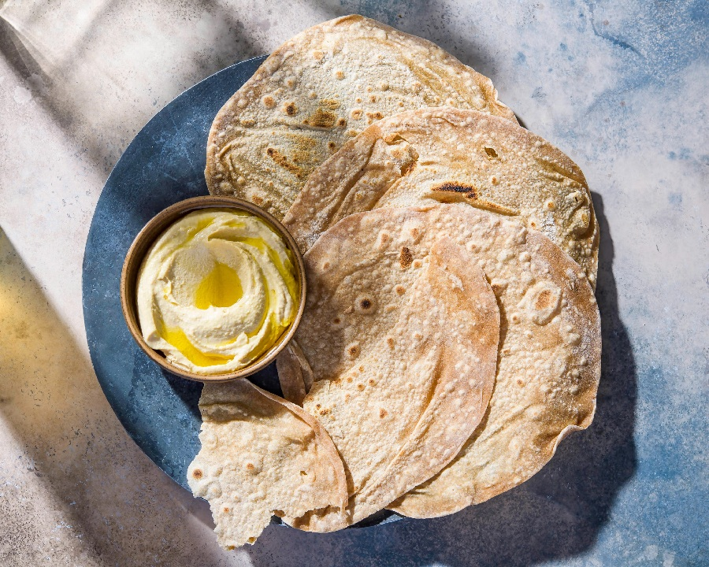

# Shrak

*Jordanian Bedouin paper-thin bread: a simple flour-and-water dough stretched almost translucent and cooked in seconds on a convex iron griddle (saj) over an open fire. Used as the base of mansaf (laid under rice and lamb), wrapped around shish tawook, or torn for scooping mezze. Each piece is 40-50 cm wide.*

**Serves:** 4 (makes 6 large breads)

**Prep Time:** 25 minutes (plus 30 minutes resting)

**Cook Time:** 15 minutes

## Overview
A simple dough of flour, water, salt and a touch of oil rests for 30 minutes. Each portion stretches by hand on an oiled surface to a 40 cm thin disc, almost translucent in places. Cooks for 30-60 seconds on a hot dry surface (saj, upturned wok, or wide hot frying pan). Stacks under a tea towel.

## Ingredients

- 500 g plain flour
- 1 teaspoon salt
- 1 tablespoon olive oil
- 300 ml warm water (approximately)

## Method

### Stage 1 - Dough
1. Whisk flour and salt.
1. Add olive oil and warm water; mix to a soft slightly tacky dough.
1. Knead 8 minutes until very smooth and elastic.
1. Cover; rest 30 minutes.

### Stage 2 - Heat the pan
1. Place a heavy upturned wok or wide cast-iron pan (or a flat dry griddle) over high heat 3-4 minutes - should be very hot.

### Stage 3 - Stretch
1. Divide dough into 6 portions.
1. Oil the work surface lightly.
1. Press one portion flat; gently stretch by hand (or use a rolling pin lightly) to 40-50 cm wide, paper-thin.
1. The dough should be almost translucent at the centre.

### Stage 4 - Cook
1. Drape the thin disc over the hot pan (or upturned wok).
1. Cook 30-60 seconds - small bubbles rise; the surface dries; light brown spots appear.
1. Flip with tongs or a wide spatula; cook 20 seconds more.
1. The bread should be soft and pliable - not crisp.

### Stage 5 - Stack
1. Stack on a board under a clean tea towel - keeps it soft.

### Stage 6 - Serve
1. Use immediately or within a few hours. Tear for scooping or wrap around grilled meats.

## Notes
- **Stretch don't roll thick:** Shrak is identifiable by its paper-thinness. A rolling pin works but use a light touch; hand-stretching is traditional.
- **Hot pan, fast cook:** A medium pan gives bready, doughy shrak. Very hot pan gives the right texture in 30-60 seconds.
- **Upturned wok:** Many Bedouin cooks use a domed saj. An upturned wok over a gas burner mimics the curve.

## Storage
- Best fresh, eaten warm.
- Stack between layers of baking paper in a sealed bag; keeps 24 hours.
- Freeze 1 month; thaw at room temperature, refresh briefly on a hot pan.
