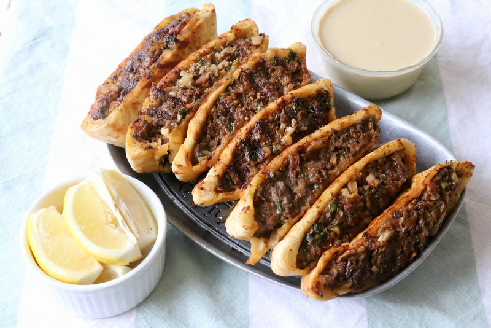

# Arayes

*Stuffed pita pockets with spiced lamb mince, grilled or pan-fried until the bread is crisp and the filling is just cooked through. Eaten hot with tahina sauce, yogurt and a wedge of lemon. A Jordanian and Lebanese street snack that's also a fast weeknight dinner.*

**Serves:** 4

**Prep Time:** 20 minutes

**Cook Time:** 15 minutes

## Overview
A Jordanian-and-Lebanese street snack that's also a fast weeknight dinner: pita pockets stuffed with spiced lamb mince, then grilled or pan-fried till the bread is crisp and the filling is just cooked. You mix lamb (or beef) with finely grated onion (juices and all), parsley, garlic, baharat, allspice and cinnamon, a spoon of pomegranate molasses if you have it, and pine nuts for crunch. Split each pita along one edge to open the pocket without tearing it, press the filling thin (5 to 6 mm) all the way to the edges in both halves so it cooks through fast; thick filling stays raw while the bread burns. Brush both sides with olive oil, place in a hot pan or under a grill, press lightly with a spatula for even contact, three or four minutes a side till the bread is crisp and gold. Cut into quarters or sixths, serve hot with tahina sauce, Greek yogurt, lemon wedges and pickled vegetables for dipping.

## Ingredients

### Filling
- 500 g lamb mince (or beef)
- 1 onion (medium, very finely grated, juices reserved)
- 4 tablespoons fresh parsley (chopped)
- 2 garlic cloves (crushed)
- 1 ½ teaspoons [Baharat](../../../base-ingredients/spices/baharat.md)
- 1 teaspoon ground allspice
- ½ teaspoon ground cinnamon
- 1 teaspoon salt
- ½ teaspoon ground black pepper
- 2 tablespoons pine nuts (toasted, optional)
- 1 tablespoon pomegranate molasses (optional)

### Pita
- 4 pita breads (large, split, but kept intact on one side as a pocket)
- 4 tablespoons olive oil (for brushing)

### To serve
- Tahina sauce (tahini + lemon + garlic + cold water)
- Greek yogurt
- Lemon wedges
- Pickled vegetables

## Method

### Stage 1 - Filling
1. Combine mince, grated onion (with juices), parsley, garlic, baharat, allspice, cinnamon, salt, pepper, pine nuts and pomegranate molasses (if using). Mix thoroughly.

### Stage 2 - Fill the pita
1. Split each pita open along one edge to expose the pocket.
1. Press a quarter of the filling thin (5-6 mm) into each pita, filling all the way to the edges.
1. Close the pita; press lightly to flatten.

### Stage 3 - Cook
1. Heat a wide pan over medium heat (or a grill to medium-high).
1. Brush each stuffed pita with olive oil on both sides.
1. Place in the pan; cook 3-4 minutes per side, pressing lightly with a spatula, until the bread is crisp and gold and the meat is cooked through.

### Stage 4 - Cut
1. Cut each arayes into quarters or sixths.

### Stage 5 - Serve
1. Plate with tahina sauce, yogurt, lemon wedges and pickles for dipping.

## Notes
- **Fill thin and even:** Thick filling won't cook through before the bread burns. 5-6 mm gives a fast even cook.
- **Press while cooking:** A spatula press ensures contact and even browning.
- **Grill vs pan:** Grilled arayes pick up smoky char; pan-fried is faster and just as good.

## Storage
- Best fresh. Refrigerate 1 day; re-crisp in a hot pan.
