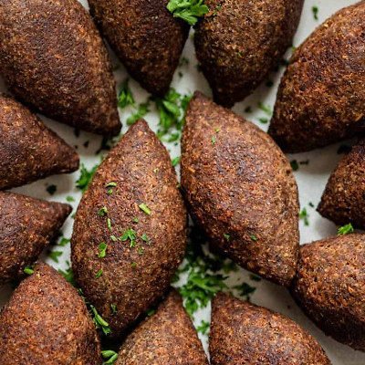

# Kibbeh Nayyeh Balls (Fried)

*Jordan's fried kibbeh: bulgur-and-lamb dough wrapped around a spiced mince and pine-nut filling, deep-fried into amber-crisp ovals.*

**Serves:** 4 (makes 18 balls)

**Prep Time:** 1 hour

**Cook Time:** 12 minutes

## Overview
A fine-bulgur-and-lean-mince dough is blitzed smooth with onion, baharat, salt and a touch of ice water. Cold mince-with-fat (the filling) sautées with onion, baharat, allspice, cinnamon, and toasted pine nuts; cools. The kibbeh dough divides; each piece is wet-handled into a small football shape, hollowed with a finger, filled with the cool spiced mince, sealed and re-shaped into an oval. Deep-fried 175°C for 3-4 minutes until amber. Drained and served warm with lemon and a yogurt-mint sauce. The shape is the test: thin walls, plump bellies, pointed tips.

## Ingredients

### Outer kibbeh dough
- 200 g fine bulgur wheat (#1 - sold as fine bulgur at Middle Eastern shops)
- 300 ml cold water (for soaking)
- 400 g very lean lamb (or beef, leg, trimmed of all fat; the leanness is key for the dough)
- 1 onion (small, rough chunks)
- 1 ½ teaspoons [Baharat](../../../base-ingredients/spices/baharat.md)
- 1 teaspoon ground allspice
- 1 ½ teaspoons salt
- ½ teaspoon black pepper
- 60 ml ice water (for processing)

### Filling
- 2 tablespoons olive oil
- 1 onion (medium, finely diced)
- 300 g fattier lamb mince (20% fat)
- 1 ½ teaspoons [Baharat](../../../base-ingredients/spices/baharat.md)
- 1 teaspoon ground allspice
- ½ teaspoon ground cinnamon
- 1 teaspoon salt
- ½ teaspoon black pepper
- 60 g pine nuts (toasted)
- 2 tablespoons fresh parsley (chopped)

### For frying
- 1 litre vegetable oil

### Yogurt-mint sauce
- 250 g Greek yogurt
- 2 garlic cloves (crushed to a paste with ¼ teaspoon salt)
- 2 tablespoons fresh mint (chopped) or 1 tablespoon dried mint
- 1 tablespoon olive oil

### To serve
- Lemon wedges
- A dish of Aleppo pepper (small)

## Method

### Stage 1 - Soak the bulgur
1. Pour cold water over the bulgur; soak 15 minutes; drain through a sieve; squeeze handfuls dry between palms.

### Stage 2 - Filling
1. Heat olive oil; sauté onion 6 minutes until soft.
1. Add fattier mince; brown 6 minutes.
1. Stir in baharat, allspice, cinnamon, salt and pepper; cook 1 minute.
1. Off heat; stir in toasted pine nuts and parsley.
1. Cool fully - warm filling tears the dough.

### Stage 3 - Outer dough
1. In a food processor, blitz lean meat, onion chunks, baharat, allspice, salt and pepper for 30 seconds to a smooth paste.
1. Add the squeezed bulgur.
1. Pulse 10 times while drizzling in ice water 1 tablespoon at a time, until you have a smooth slightly tacky dough that holds together when squeezed.
1. Refrigerate 15 minutes.

### Stage 4 - Shape
1. Wet hands with cold water (essential - keeps the dough from sticking).
1. Take 35 g of dough; roll into a ball.
1. Press a finger into the centre; turn the ball on the finger to hollow it into a cup with thin walls.
1. Drop 1 ½ teaspoons of cool filling into the cup.
1. Pinch the top closed; roll between palms into a pointed football shape (American football / rugby ball - about 6 cm long with pointed tips).
1. Set on a tray. Repeat for all 18.

### Stage 5 - Fry
1. Heat oil to 175°C.
1. Fry 4-5 balls at a time, 3-4 minutes, turning, until amber-gold.
1. Lift onto kitchen paper.

### Stage 6 - Yogurt-mint sauce
1. Whisk yogurt with garlic-salt paste, mint and olive oil.

### Stage 7 - Serve
1. Pile the warm fried kibbeh on a plate.
1. Yogurt-mint sauce in a small bowl.
1. Lemon wedges and a sprinkle of Aleppo pepper.

## Notes
- **Lean meat for the dough:** Fatty meat in the kibbeh dough gives a wet, hard-to-shape result that bursts in the fryer. Lean leg meat (any fat trimmed off) is essential.
- **Wet hands:** Bulgur-meat dough sticks to dry hands; with wet hands it slides smoothly. Re-wet often as you work.
- **The football shape:** Pointed tips, plump middle. Round balls are wrong; flat patties are wrong. The shape is half the dish.

## Storage
- Best within 30 minutes of frying.
- Raw shaped kibbeh freeze 2 months on a tray; fry from frozen at 170°C for 5-6 minutes.
- Cooked: refrigerate 2 days; re-crisp at 200°C oven 4 minutes.
