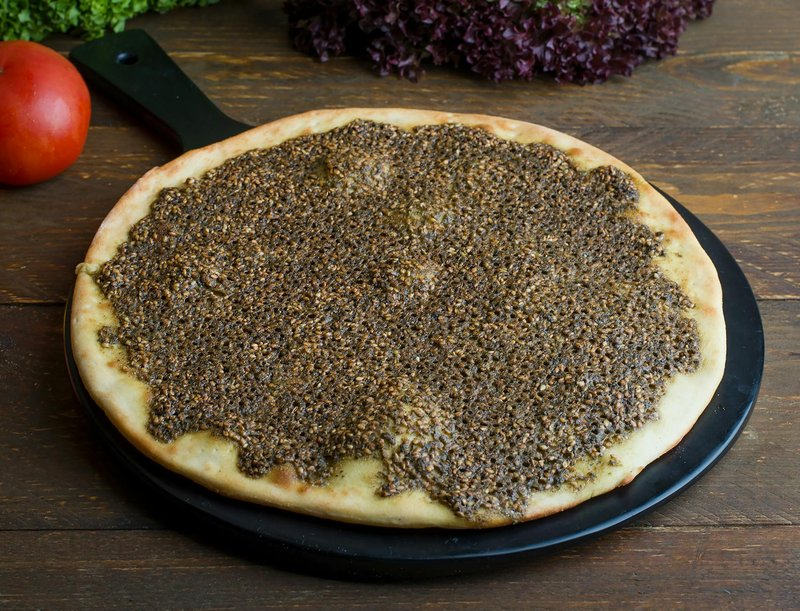

# Manakish Mini

*Snack-sized Jordan manakish: small yeasted discs topped with za'atar oil, akkawi cheese with nigella, or spiced lamb mince. Baked hot.*

**Serves:** 6 (makes 18 mini manakish; 6 of each topping)

**Prep Time:** 30 minutes (plus 1 hour dough rise)

**Cook Time:** 10 minutes per batch

## Overview
Snack-sized Jordan manakish: small yeasted discs topped three ways with za'atar oil, akkawi cheese mix with nigella, or spiced lamb mince. A platter of all three at a Friday brunch or as part of a wider mezze spread. The three toppings: za'atar whisked with olive oil into a spoonable paste; grated mozzarella with feta and halloumi mixed with nigella and dried mint; and a quick spiced lamb mince with tomato and pomegranate molasses. Discs are about 8 cm with a slightly raised rim to hold the topping. A hot baking stone or upside-down heavy tray pre-heated at 230°C is non-negotiable; without it the bases stay soft and pale. Sumac scattered across the finished platter. Folded in half like a small taco or eaten flat.

## Ingredients

### Dough
- 500 g plain flour
- 1 sachet (7 g) fast-action yeast
- 1 ½ teaspoons salt
- 1 tablespoon caster sugar
- 2 tablespoons olive oil
- 320 ml warm water

### Topping 1 - Za'atar
- 4 tablespoons [za'atar](../../../base-ingredients/spices/za-atar.md) (the Levantine herb-sumac-sesame mix)
- 4 tablespoons extra-virgin olive oil

### Topping 2 - Cheese
- 80 g low-moisture mozzarella 
- 20 g halloumi (grated)
- 50 g feta cheese (crumbled)
- 1 teaspoon nigella seeds
- 1 teaspoon dried mint

### Topping 3 - Lamb
- 2 tablespoons olive oil
- 1 onion (small, very finely diced)
- 200 g lamb mince
- 2 garlic cloves (crushed)
- 1 tomato (small, deseeded, finely diced)
- 1 teaspoon [Baharat](../../../base-ingredients/spices/baharat.md)
- ½ teaspoon ground cinnamon
- 1 tablespoon pomegranate molasses
- 1 teaspoon salt
- ½ teaspoon black pepper
- 1 tablespoon fresh parsley (chopped)

### To finish
- Extra olive oil for brushing
- A pinch of sumac

## Method

### Stage 1 - Dough
1. Whisk flour, yeast, salt and sugar.
1. Add olive oil and warm water; mix to a soft dough.
1. Knead 8 minutes until smooth and elastic.
1. Cover; rise 1 hour until doubled.

### Stage 2 - Za'atar topping
1. Whisk za'atar with olive oil to a thick spoonable paste.

### Stage 3 - Cheese topping
1. Mix grated cheeses, nigella and dried mint.

### Stage 4 - Lamb topping
1. Heat oil; sauté onion 5 minutes.
1. Add mince; brown 5 minutes.
1. Add garlic, tomato, baharat, cinnamon, pomegranate molasses, salt and pepper; cook 4 minutes.
1. Off heat; stir in parsley.
1. Cool.

### Stage 5 - Heat the oven
1. Heat oven to 230°C (210°C fan) with a baking stone or upside-down baking tray on the top rack - 20 minutes minimum.

### Stage 6 - Shape
1. Knock back the dough; divide into 18 balls (about 50 g each).
1. Cover; rest 10 minutes.
1. Roll each ball into a thin 8-9 cm disc; press a small raised rim around the edge (the rim holds the topping in).

### Stage 7 - Top
1. Six discs: spread a generous teaspoon of za'atar paste on each.
1. Six discs: pile a small handful of cheese mix on each.
1. Six discs: spread a heaped teaspoon of lamb topping on each.

### Stage 8 - Bake
1. Slide onto the hot stone / tray on baking paper, in batches of 6.
1. Bake 6-8 minutes, the dough should be gold and the toppings bubbling (cheese) / set (lamb) / glistening (za'atar).

### Stage 9 - Serve
1. Pile on a wide platter, mixing the three toppings.
1. Sprinkle a pinch of sumac across.
1. Eat warm, fold each in half like a taco, or eat flat.

## Notes
- **Hot stone is non-negotiable:** Real Jordanian manakish bakes on a fierce-hot tannur (clay oven). A baking stone or upside-down heavy tray pre-heated to 230°C is the closest home equivalent. Without it, the bases stay soft and pale.
- **Don't pile the topping:** A thin layer melts and crisps in 6 minutes. A thick layer stays raw at the centre while the dough underneath burns.
- **Eat fresh:** Manakish mini are best within 30 minutes. They survive lunch box use until midday at room temperature; refrigerated they go stale fast.

## Storage
- Best within 30 minutes.
- Cool fully and refrigerate 2 days; reheat at 200°C 3-4 minutes.
- Freeze cooked 2 months; reheat from frozen at 200°C 8 minutes.
