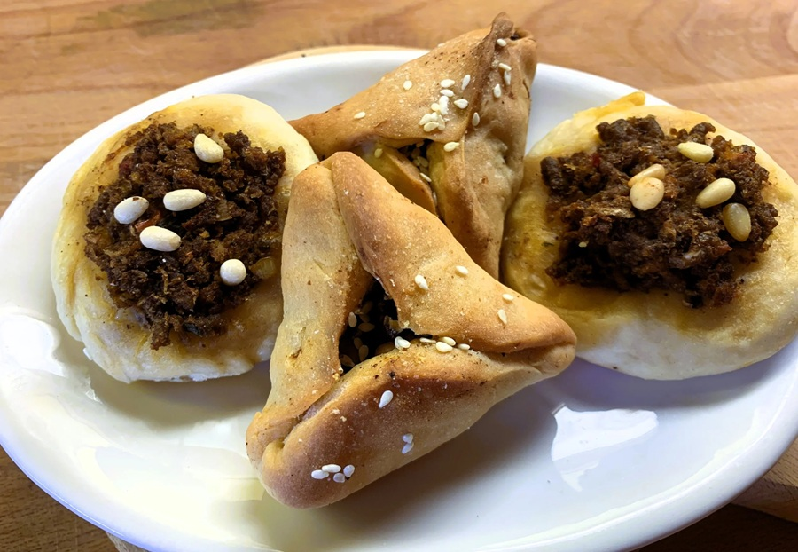

# Sfeeha Jordani

*Jordan's open-top meat pastries: small yeasted discs topped with spiced minced lamb, tomato and pomegranate molasses, baked till glossy.*

**Serves:** 6 (makes 18 sfeeha)

**Prep Time:** 40 minutes (plus 1 hour dough rise)

**Cook Time:** 12 minutes per batch

## Overview
A yeasted bread dough rises for 1 hour. Topping: lamb mince mixed RAW with grated onion (squeezed dry), diced tomato, garlic, baharat, allspice, pomegranate molasses, lemon, parsley and a small spoon of olive oil, no pre-cooking. Toasted pine nuts fold in. Dough divides into 18 balls; each rolls into an 8 cm disc with a slight raised rim. A heaped tablespoon of topping spreads on each; pinched into a slight 4-corner star shape (the Jordanian visual signature, distinguishes from the Lebanese version which is flat-edged). Baked at 220°C 10-12 minutes until the dough is gold and the meat is glossy-set. Garnished with extra parsley and pomegranate seeds.

## Ingredients

### Dough
- 500 g plain flour
- 1 sachet (7 g) fast-action yeast
- 1 ½ teaspoons salt
- 1 tablespoon caster sugar
- 2 tablespoons olive oil
- 320 ml warm water

### Meat topping
- 500 g lamb mince (20% fat) OR a 50/50 lamb-beef mix
- 1 onion (large, grated, squeezed bone-dry)
- 2 tomatoes (medium, deseeded, finely diced)
- 4 garlic cloves (crushed)
- 3 tablespoons fresh parsley (chopped)
- 1 ½ tablespoons pomegranate molasses
- 1 tablespoon tomato paste
- 2 teaspoons [Baharat](../../../base-ingredients/spices/baharat.md)
- 1 teaspoon ground allspice
- 1 teaspoon Aleppo pepper
- ½ teaspoon ground cinnamon
- 1 ½ teaspoons salt
- ½ teaspoon black pepper
- ½ lemon (juice)
- 3 tablespoons olive oil
- 40 g pine nuts (toasted)

### To finish
- 1 tablespoon olive oil (for brushing)
- 2 tablespoons fresh parsley (extra, for garnish)
- 3 tablespoons pomegranate seeds (optional)
- 2 lemons (cut into wedges)
- 200 g Greek yogurt (to serve)

## Method

### Stage 1 - Dough
1. Whisk flour, yeast, salt and sugar.
1. Add olive oil and warm water; mix to a soft dough.
1. Knead 8 minutes until smooth.
1. Cover; rise 1 hour until doubled.

### Stage 2 - Topping
1. In a wide bowl, mix lamb mince, grated onion (well-squeezed), diced tomato, garlic, parsley, pomegranate molasses, tomato paste, baharat, allspice, Aleppo pepper, cinnamon, salt, pepper, lemon juice and olive oil.
1. Mix with your hand for 2 minutes until uniform.
1. Fold in toasted pine nuts.
1. Taste a tiny piece (cooked in a small pan briefly) - adjust salt / pomegranate molasses.

### Stage 3 - Heat the oven
1. Heat oven to 220°C (200°C fan).
1. Line baking trays with paper.

### Stage 4 - Shape
1. Knock back the dough; divide into 18 balls (about 50 g each).
1. Rest 10 minutes.
1. Roll each ball into an 8-9 cm disc, 4 mm thick, with a slight raised rim.

### Stage 5 - Top
1. Spoon 1 heaped tablespoon of meat topping onto each disc.
1. Spread to within 5 mm of the edge in a thin even layer (4-5 mm thick).
1. Pinch the dough into a 4-cornered square at the edges (the Jordanian star-shape signature; corners stand up slightly above the meat).

### Stage 6 - Bake
1. Bake 10-12 minutes - the dough should be gold and the meat is glossy-set, slightly bubbling at the edges.

### Stage 7 - Serve
1. Brush each with a tiny bit of olive oil.
1. Scatter extra parsley and (if using) pomegranate seeds.
1. Plate with lemon wedges and a small bowl of Greek yogurt.
1. Eat warm; squeeze lemon over each before eating.

## Notes
- **Raw meat topping cooks on the dough:** Like lahem-bi-ajeen, sfeeha topping goes on raw. The 10-12 minutes at 220°C cooks the lamb through completely while the dough crisps underneath.
- **Squeeze the onion dry:** Wet grated onion makes a soupy topping that soaks the dough soft. Wring it in a clean towel until barely-damp.
- **Star-shape edges:** Distinguishes Jordanian sfeeha from Lebanese lahem-bi-ajeen (which has flat edges). Pinch four points at the corners while the dough is still pliable; the raised corners crisp during baking.

## Storage
- Best within 1 hour.
- Refrigerate 3 days; reheat at 200°C 4 minutes.
- Freeze cooked 2 months; reheat from frozen at 200°C 8 minutes.
- Topping alone refrigerates 24 hours.
