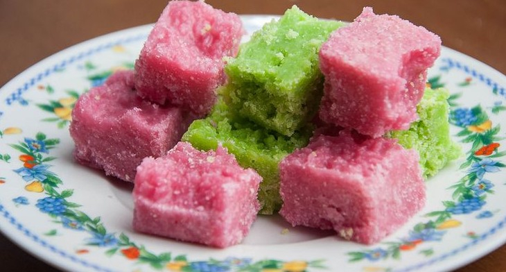

# Kashata

*A Swahili-coast coconut-and-peanut sugar candy scented with cardamom, set firm and cut into diamonds: the traditional sweet of Mombasa and Zanzibar weddings, Eid lunches and the chai trolley.*

**Serves:** 24 pieces

**Prep Time:** 10 minutes

**Cook Time:** 20 minutes, plus 1 hour setting

## Overview
Kashata is the candy of the Swahili coast, an old confection that pre-dates the colonial sugar trade and is now made in every Muslim household for Eid, weddings and any visiting guests. Granulated sugar is melted until it begins to caramelise, then a mountain of freshly grated coconut and toasted peanuts is stirred through with a generous pinch of ground cardamom. The hot mixture is pressed flat into a tray and scored into diamonds while still warm; as it cools it sets into a chewy, slightly crumbly bar that smells of toasted coconut and warm spice. It is the prestige sweet, more than just a snack; making it well is a household reputation matter. Two distinct types exist: kashata ya nazi (coconut, the original) and kashata ya karanga (peanut). This recipe gives the combined version that many cooks now favour. Cardamom is non-negotiable.

## Ingredients

- 250 g granulated sugar
- 100 ml water
- 200 g freshly grated coconut (or unsweetened dessicated coconut, lightly toasted)
- 150 g raw peanuts
- 1 tsp ground green cardamom
- 1/2 tsp vanilla extract (modern addition, optional)
- A pinch of salt

### Equipment
- A 20 cm square tray, lightly oiled
- A wooden spoon
- A heavy-bottomed saucepan

## Method

### Stage 1 - Toast the peanuts
1. Heat a dry pan over medium heat. Add the peanuts; toast 6 to 8 minutes, shaking the pan, until the skins darken and the nuts smell nutty.
1. Tip onto a plate; let cool a few minutes.
1. Rub between palms or in a clean tea towel to slip the skins off; discard the skins.
1. Roughly chop the peanuts (you want pieces, not powder).

### Stage 2 - Toast the coconut (if using dessicated)
1. In the same dry pan, toast the dessicated coconut 3 to 4 minutes over medium heat, stirring constantly, until pale gold and fragrant. Watch it; coconut burns in seconds.
1. Tip onto a plate to stop the heat.
1. Skip this step if using freshly grated coconut.

### Stage 3 - Make the caramel
1. Combine the sugar and water in a heavy-bottomed saucepan; bring to a gentle boil over medium heat.
1. Do not stir once the sugar is dissolved; swirl the pan if it colours unevenly.
1. Cook 5 to 7 minutes until the syrup turns pale amber (around 150 C if you have a thermometer, the "hard crack" stage).

### Stage 4 - Combine and set
1. Reduce heat to low. Add the cardamom, vanilla and salt; stir once.
1. Add the coconut and the chopped peanuts; stir vigorously to coat with the hot caramel. It will look sandy and dry at first; keep folding for 30 to 60 seconds until the mixture comes together as a sticky mass.
1. Tip immediately into the oiled tray; press flat with the back of an oiled wooden spoon to a thickness of about 1.5 cm.
1. While still warm but firming (about 5 minutes in), score deeply into 4 cm diamonds with an oiled knife.
1. Leave to cool fully (about 1 hour) before snapping along the scored lines.

## Notes
- **Caramel safety.** Hot caramel is around 150 C and burns instantly. Have everything else weighed and ready before the syrup goes on the heat; you have no time to look things up once you start. Keep children clear.
- **Score while warm, snap when cold.** If you cut all the way through while hot the pieces stick back together as they cool; if you wait too long to score the candy is too hard to mark cleanly.
- **Fresh coconut.** Freshly grated mature coconut gives the best flavour and chew. Dessicated coconut works but needs the toast step.
- **Cardamom strength.** Grind your own from pods for the best aroma; pre-ground loses potency fast.
- **The set.** Kashata should be firm enough to snap and chewy when you bite, not glass-shatter brittle and not soft like fudge.

## Variations
- **Kashata ya nazi:** all coconut, no peanut, the original.
- **Kashata ya karanga:** all peanut, no coconut, the Mombasa boys-eat-on-the-bus version.
- **Cashew kashata:** swap peanuts for whole cashews, an indulgence for Eid.
- **Ginger kashata:** add 1 tsp ground ginger with the cardamom; warming and a touch of bite.
- **Sesame kashata:** add 50 g toasted sesame seeds with the coconut; nuttier and prettier.

## Serving
- A small plate of diamonds at tea-time · part of the Eid hospitality spread · wrapped in greaseproof paper as a gift · with strong black coffee · alongside chai.

## Storage
- Keeps 2 weeks in an airtight tin at room temperature; the texture firms as it sits.
- Do not refrigerate; humidity makes the sugar weep.
- Freezes 3 months wrapped tightly; thaw at room temperature.
