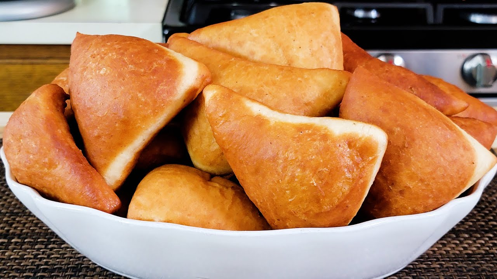

# Mahamri

*The Swahili-coast puffier, brioche-like cousin of mandazi: cardamom-and-coconut-milk doughnut made with a longer-risen enriched dough, cut into rounds or squares, fried tall and pillowy.*

**Serves:** 12 mahamri

**Prep Time:** 25 minutes, plus 2 hours rise

**Cook Time:** 25 minutes

## Overview
Mahamri (sometimes mahamri ya nazi) is the puffier, richer Swahili-coast doughnut, distinct from its triangular cousin mandazi. The dough is more enriched (more coconut milk, more egg, sometimes a touch more butter), proofed longer, and cut into rounded squares or discs rather than triangles. The frying technique is the same low-temperature long-puff approach, but the dough's extra hydration means mahamri rise dramatically into a hollow pillow with a soft, brioche-like crumb. It is the proper breakfast bread of the Lamu and Mombasa coast: torn open, scooped through a bowl of coconut-bean stew (mbaazi za nazi), or eaten plain with sweet chai. The dough wants time; rushing the rise gives dense mahamri. The reward for the wait is a slightly sweet, lightly cardamom-perfumed bread that pulls apart in soft shreds.

## Ingredients

- 500 g plain flour, plus extra for dusting
- 120 g caster sugar
- 1 sachet (7 g) instant yeast
- 1 tsp ground green cardamom
- 1/2 tsp salt
- 250 ml coconut milk (full-fat, warmed)
- 2 large eggs
- 2 tbsp melted butter
- 50 ml warm water (approximate; only if needed)
- Vegetable oil, for deep-frying (about 1 litre)

## Method

### Stage 1 - Mix and knead
1. In a large bowl, whisk the flour, sugar, yeast, cardamom and salt.
1. In a jug, whisk the warm coconut milk, the eggs and the melted butter.
1. Pour the wet into the dry; mix with a wooden spoon until a shaggy dough forms.
1. Knead 10 minutes by hand (or 6 in a mixer) until smooth, supple and only barely tacky. Add the warm water 1 tbsp at a time only if the dough is too stiff.

### Stage 2 - First rise (slow and full)
1. Oil the bowl; return the dough; cover.
1. Rise in a warm spot for 1 hour 30 minutes, or until clearly doubled.

### Stage 3 - Shape and second rise
1. Knock the dough back gently. Divide into 12 equal balls (about 70 g each), OR roll into a 6 mm sheet and cut into rounded squares (8 by 8 cm).
1. Place the shaped pieces on a lightly floured tray, spaced apart.
1. Cover; second rise 30 minutes; they should look distinctly puffed.

### Stage 4 - Deep-fry
1. Heat oil to 160 to 170 C in a heavy pot.
1. Drop the mahamri into the oil in batches of 3 to 4; they will sink, then float and puff.
1. Spoon hot oil over the tops as they fry to encourage the puff.
1. Fry 2 minutes per side until deep gold; the centre should have a pale band where the surface was lifted out of the oil.
1. Lift onto kitchen paper; stack loosely.

## Notes
- **Two rises.** The bulk fermentation and the bench proof both matter. Single-rise mahamri are dense; the second proof is what makes them pull-apart soft.
- **Coconut milk thickness.** Tin coconut milk separates; whisk thoroughly before using. The fat in the cream is what gives mahamri their richness.
- **Slow oil.** 160 to 170 C is the right range. Higher heat browns the outside before the inside cooks. The slow fry is what allows the dramatic puff.
- **Spoon oil on top.** A traditional Lamu trick: as the mahamri float, ladle hot oil over their exposed tops so they puff more evenly without flipping too soon.
- **Mahamri vs mandazi.** Mahamri have more egg, more coconut milk and longer rises; they are puffier and softer. Mandazi are simpler, triangular and slightly drier.

## Variations
- **Mbaazi za nazi pairing:** the absolute classic, served warm with a side bowl of pigeon pea stew in coconut milk for breakfast.
- **Cinnamon mahamri:** swap the cardamom for ground cinnamon, a Nairobi-area variation.
- **Coconut-flake mahamri:** fold 40 g dessicated coconut into the dough at the end of kneading.
- **Sugar-coated:** roll the hot fried mahamri in caster sugar, a tea-shop variant.
- **Mahamri without egg:** drop the eggs for a slightly leaner, more chewy version (still good).

## Serving
Hot from the fryer alongside Kenyan chai · paired with mbaazi za nazi for proper Swahili breakfast · torn open and filled with butter and honey · tea-shop standard with strong sweet milk-tea.

## Storage
- Best within 4 hours of frying.
- Refrigerate 3 days in a sealed bag; reheat at 160 C for 4 minutes to revive.
- Freezes 2 months; reheat from frozen at 160 C for 8 minutes.
