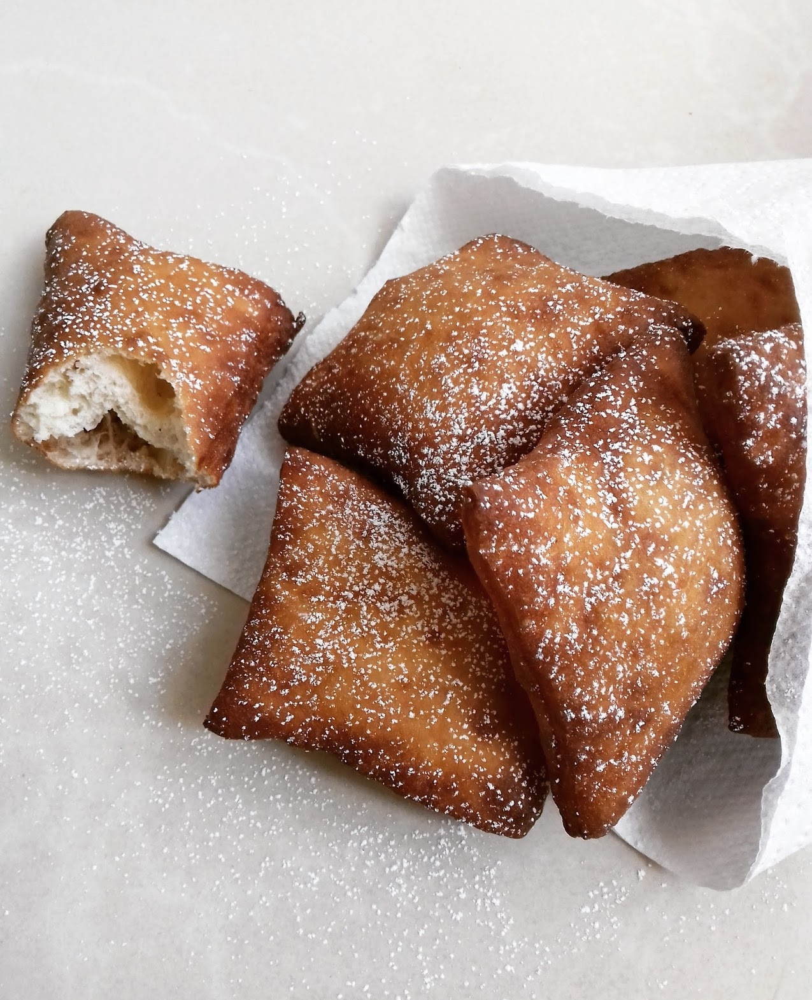

# Mandazi

*Swahili-coast triangular doughnut scented with cardamom and coconut milk, deep-fried to a soft pillowy crumb with a thin golden crust: the morning street snack of Mombasa, Lamu and Zanzibar.*

**Serves:** 12 mandazi

**Prep Time:** 20 minutes, plus 1 hour 30 minutes rise

**Cook Time:** 25 minutes

## Overview
Mandazi is the Swahili-coast cardamom-and-coconut-milk doughnut, sold at every morning chai-and-bite stall from Mombasa to Dar es Salaam. The dough is a slightly enriched yeasted bread (flour, coconut milk, sugar, egg, cardamom) rolled into a thin round, cut into four triangles, and deep-fried until the segments puff into golden pillows with a clearly visible thin crust. The interior is soft, airy and faintly sweet, with a clear cardamom note from the ground green pods and a hint of coconut richness from the milk. It is the breakfast and tea-time bread of the Swahili coast, eaten with sweet milk-tea, beans (mandazi na maharagwe is a real working breakfast) or torn open and filled with a smear of jam. Lighter and triangular distinguishes it from mahamri (puffier and square or rounded). Slightly cooler oil, longer fry, gives the pale-gold-with-paler-band signature look.

## Ingredients

- 500 g plain flour (all-purpose)
- 100 g caster sugar
- 1 sachet (7 g) instant yeast
- 1 tsp ground green cardamom (from about 12 pods, ground fresh)
- 1/2 tsp salt
- 200 ml coconut milk (full-fat, slightly warmed)
- 1 large egg
- 1 tbsp melted butter or coconut oil
- 100 ml warm water (approximate)
- Vegetable oil, for deep-frying (about 1 litre)
- Icing sugar to dust (optional)

## Method

### Stage 1 - Mix and knead
1. In a large bowl, whisk together the flour, sugar, yeast, cardamom and salt.
1. In a jug, whisk the warm coconut milk, the egg and the melted butter.
1. Pour the wet into the dry; mix with a wooden spoon, then add warm water gradually until you have a soft slightly sticky dough.
1. Knead 8 minutes by hand (or 5 in a mixer with a dough hook) until smooth, supple and only barely tacky.

### Stage 2 - Rise
1. Oil the bowl lightly; return the dough; cover with cling film.
1. Rise in a warm spot for 1 hour 30 minutes, or until doubled.

### Stage 3 - Shape
1. Knock the dough back; divide into 3 equal balls.
1. On a lightly floured surface, roll each ball into a round about 5 to 6 mm thick.
1. Cut each round into 4 triangles (like cutting a pizza into quarters). You should have 12 triangles.
1. Cover and rest 15 minutes.

### Stage 4 - Deep-fry
1. Heat the oil in a heavy pot to 160 to 170 C (a piece of dough should sizzle gently and rise slowly).
1. Drop the triangles into the oil in batches of 3 to 4; do not crowd.
1. Fry 90 seconds per side, turning when the underside is pale gold; the mandazi will puff dramatically.
1. Lift out with a slotted spoon onto kitchen paper.
1. Continue until all are fried; check oil temperature between batches.
1. Dust with icing sugar if you like (traditional in some homes, omitted in others).

## Notes
- **Oil temperature is critical.** 160 to 170 C, lower than most doughnuts. Too hot and the outside browns before the inside cooks; too cool and the dough absorbs oil and goes greasy.
- **Coconut milk.** Full-fat tinned is the standard. Light coconut milk gives a thinner dough; do not use coconut cream (too rich).
- **Cardamom.** Grind your own from green pods if possible; pre-ground cardamom fades fast. Black cardamom is wrong here.
- **The puff.** Properly proofed mandazi puff and develop a pale band on the side where they were not in direct oil contact, the signature look.
- **Sugar level.** Kenyan mandazi are lightly sweet, not sugary. The dish is meant to pair with sweet milk tea, not double up the sweetness.

## Variations
- **Mahamri:** the puffier, more brioche-like cousin (separate recipe).
- **Plain mandazi:** drop the cardamom for a more neutral version that suits jam or honey.
- **Coconut-shred mandazi:** add 30 g desiccated coconut to the dough for extra texture.
- **Cinnamon mandazi:** swap the cardamom for ground cinnamon, a Kikuyu-area twist.
- **Banana mandazi:** mash a ripe banana into the wet mix, sweeter and softer.

## Serving
Stacked still-warm on a plate · alongside hot Kenyan chai · for breakfast with maharagwe (red kidney bean stew) · torn open and filled with jam or honey · cold from a paper bag for an afternoon snack.

## Storage
- Best on the day, ideally within 4 hours of frying.
- Refrigerate 3 days in a sealed bag; reheat 30 seconds in a low oven to restore softness.
- Freeze 2 months; reheat from frozen at 160 C for 8 minutes.
