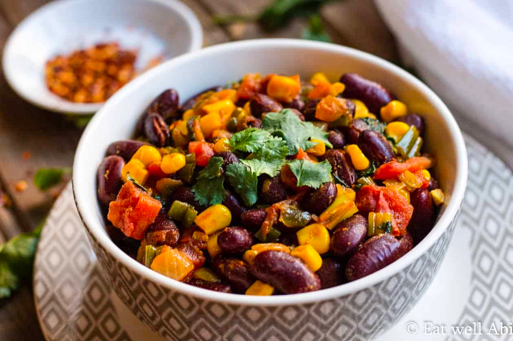

# Githeri

*The Kikuyu pot of boiled maize kernels and red kidney beans finished with a sharp tomato-and-onion fry: the central Kenyan everyday dinner, school-lunch staple and historic farm food of the Mount Kenya highlands.*

**Serves:** 4

**Prep Time:** 15 minutes, plus overnight soak

**Cook Time:** 1 hour 30 minutes

## Overview
Githeri is the Kikuyu name for boiled maize-and-bean stew, the historic farm food of central Kenya. Whole dried maize kernels and red kidney beans are soaked overnight then simmered together until both are tender and the starch has loosened the water into a light broth. A separate quick fry of onion, garlic, tomato and smoked paprika is folded through at the end to finish: this last stage is what lifts githeri out of plainness. The dish is so foundational that "githeri media" became a Kenyan internet legend in 2017 when a Nyeri voter was photographed eating it from a plastic bag at a polling station, made the front pages, and was given a state commendation. It is a wholly satisfying, protein-rich, plant-based dinner; the texture is the point, two distinct grains in a light sauce, not a puree.

## Ingredients

- 250 g dried whole maize kernels (or yellow / white hominy / samp)
- 250 g dried red kidney beans
- 1 large onion, finely chopped
- 3 cloves garlic, crushed
- 2 tomatoes, finely chopped (or 1 tbsp tomato paste plus 2 tinned tomatoes)
- 2 tbsp vegetable oil
- 1 tsp smoked paprika
- 1 tsp ground cumin
- 1 small green chilli, finely chopped (optional)
- 1 tsp salt
- A handful of coriander, chopped, to finish

### Optional
- 1 medium potato, peeled and diced (in some regions, often added)
- 1 carrot, diced

## Method

### Stage 1 - Soak overnight
1. Put the dried maize and kidney beans in a large bowl, cover with cold water to twice their depth, and leave overnight (8 to 12 hours).
1. Drain and rinse.

### Stage 2 - Boil
1. Tip the soaked maize and beans into a large heavy pot; cover with 1.5 litres fresh cold water.
1. Bring to a vigorous boil for 10 minutes (this destroys the natural lectins in the kidney beans, which is important).
1. Reduce heat; simmer uncovered, topping up the water as needed, for 70 to 90 minutes until both maize and beans are tender to the bite but still hold their shape.
1. Add the salt only in the last 10 minutes (early salt firms beans and slows cooking).

### Stage 3 - The tomato fry
1. While the maize-and-beans are finishing, heat the oil in a separate frying pan over medium-high.
1. Add the onion; cook 5 minutes until soft and pale gold.
1. Add the garlic, smoked paprika and cumin; cook 30 seconds.
1. Add the chopped tomato and the chilli if using; cook 5 to 7 minutes until the tomato has broken down to a thick sauce.

### Stage 4 - Combine and finish
1. Drain the maize-and-beans, reserving about 200 ml of the cooking liquid.
1. Tip the maize-and-beans into the tomato fry; add a splash of the reserved liquid.
1. Stir to coat; simmer together for 5 to 8 minutes so the flavours marry.
1. Adjust salt; scatter the coriander; serve.

## Method (with tinned beans, the weeknight version)

1. Use 2 tins (240 g drained each) cooked kidney beans and 1 tin (340 g) hominy / yellow corn kernels.
1. Skip the soak and the long boil; start at Stage 3 (the tomato fry), then add the drained tins, 100 ml water, and simmer 10 minutes.

## Notes
- **Maize variety.** Whole dried maize (the same kernel used for popcorn but dried fully) is the traditional choice. Hominy / samp is the closest non-African substitute and pre-cracks the grain, halving the cook time.
- **Kidney bean safety.** The 10-minute hard boil is non-negotiable; raw and undercooked kidney beans contain phytohaemagglutinin, which causes serious illness. Do not skip.
- **Smoked paprika.** Not strictly traditional but lifts the dish significantly; many home cooks now include it.
- **Texture.** Both grains should hold their shape and have a small chew, not a mush. If overcooked, the dish becomes baby food.
- **The leftover trick.** Day-old githeri, mashed coarsely with a fork and pan-fried in butter, becomes "githeri smash" (sometimes called muthokoi); excellent for breakfast.

## Variations
- **Githeri ya nyama:** with cubes of stewed beef added at Stage 3.
- **Muthokoi:** the western Kenyan version, with the maize bran rubbed off before cooking, smoother.
- **Githeri ya nazi:** finish with 100 ml coconut milk for a Swahili-coast spin.
- **Mukimo-githeri hybrid:** mash the finished githeri lightly and stir in cooked pumpkin leaves.
- **Carrot-potato:** add a diced carrot and potato in Stage 2 for a heartier one-pot.

## Serving
- A deep bowl of githeri · coriander scattered · pili pili in a small dish · sometimes a chapati alongside · sometimes a fried egg on top.

## Storage
- Refrigerate 4 days; the flavour deepens overnight.
- Freezes 3 months; portion before freezing to skip a thaw.
- Reheat in a pan with a splash of water; the dish absorbs moisture as it sits.
