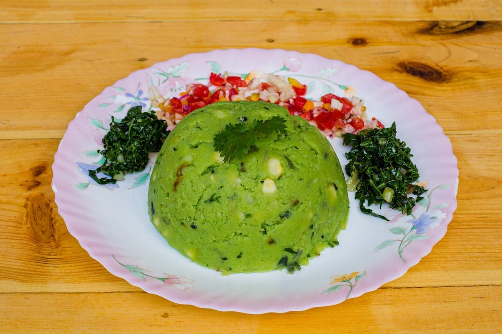

# Mukimo

*Boiled potatoes, peas, maize kernels and dark pumpkin leaves crushed together into a green-flecked savoury mash: the Kikuyu highland mountain dish from the Nyeri and Mount Kenya region.*

**Serves:** 4

**Prep Time:** 20 minutes

**Cook Time:** 35 minutes

## Overview
Mukimo is the celebration mash of the central Kenyan highlands. Floury potatoes, sweet green peas, soft-boiled maize kernels and dark wilted greens (traditionally pumpkin leaves, often spinach in the diaspora) are boiled together in the same pot and crushed coarsely with a wooden masher. The greens turn the whole thing a deep emerald, the maize gives bursts of sweet chew, and the potato carries everything. It eats more like a side than a main but is satisfying enough on its own (and traditional with a piece of grilled meat or nyama choma). In Kikuyu wedding tradition the bride's family presents a mound of mukimo to the groom's family as part of the gift exchange. The trick is the crushing: not a smooth mash, not a chunky stew, but a coarse-textured paste where you can still see the green flecks and the yellow kernels.

## Ingredients

- 600 g floury potatoes (Maris Piper, King Edward, or any starchy variety), peeled and cubed
- 200 g frozen or fresh peas (or shelled fresh garden peas)
- 200 g sweetcorn kernels (fresh, frozen or drained tinned)
- 200 g pumpkin leaves, OR spinach, OR a mix of spinach and kale, shredded
- 1 large onion, finely chopped
- 2 tbsp butter or vegetable oil
- 1 tsp salt
- 1/2 tsp ground black pepper
- 100 ml whole milk (optional, for creamier finish)

### To serve
- Grilled meat (nyama choma) or stewed beef
- Kachumbari

## Method

### Stage 1 - Boil the potatoes and maize
1. Put the cubed potatoes and the maize kernels into a large pot.
1. Cover with cold water by 3 cm; add 1/2 tsp salt.
1. Bring to a boil; simmer 15 to 18 minutes until the potatoes are very tender (a knife slides in with no resistance).

### Stage 2 - Add the peas and greens
1. Add the peas and the shredded greens to the same pot.
1. Continue boiling 4 to 5 minutes until the greens are wilted and the peas are tender.
1. Drain thoroughly. Tip everything back into the dry pot.

### Stage 3 - Sweat the onion
1. While Stage 2 is cooking, heat the butter or oil in a small pan; add the chopped onion.
1. Cook 6 to 7 minutes over medium-low heat until softened but not browned.
1. Tip the onion (and the butter) into the pot with the drained vegetables.

### Stage 4 - Crush
1. Crush the contents of the pot with a wooden masher or potato masher.
1. Work it into a coarse-textured paste, not a smooth puree, you want visible flecks of green and yellow.
1. Stir in the milk if using, for a creamier consistency.
1. Adjust salt and pepper; serve warm.

## Notes
- **Texture matters.** Mukimo is crushed, not blended, not whipped. A smooth mash loses its character. Use a hand masher, not a food processor.
- **Greens.** Pumpkin leaves are the traditional choice and give the deepest colour. Spinach is the standard substitute; kale (lacinato / cavolo nero) works for a more rustic version.
- **Maize.** Fresh corn cut from the cob is best in summer; frozen sweetcorn is the year-round standby. Avoid heavily sweetened tinned corn.
- **Potatoes.** Floury / starchy varieties are essential; waxy potatoes won't break down properly under the masher.
- **Wedding mukimo.** For ceremonies the mound is shaped on a platter and decorated with cooked beans, kidney beans set in dimples around the dome.

## Variations
- **Irio:** the very similar central-Kenyan dish, sometimes used as a synonym, with the addition of mashed cooked beans.
- **Mukimo with kidney beans:** add 150 g cooked kidney beans before mashing for extra protein.
- **Avocado mukimo:** half a ripe avocado mashed through at the end, a modern addition.
- **Sweet-potato mukimo:** replace half the potato with orange sweet potato for a sweeter, redder version.
- **Roast-onion top:** caramelise extra onions in butter and spoon them on top, a restaurant flourish.

## Serving
A dome of warm mukimo · grilled goat or beef alongside · kachumbari to cut the starch · sometimes a fried egg on top for breakfast.

## Storage
- Refrigerate 3 days; the colour darkens as it sits.
- Reheat in a pan with a splash of milk or stock to bring it back.
- Freezes 2 months but the texture suffers; fresh is much better.
