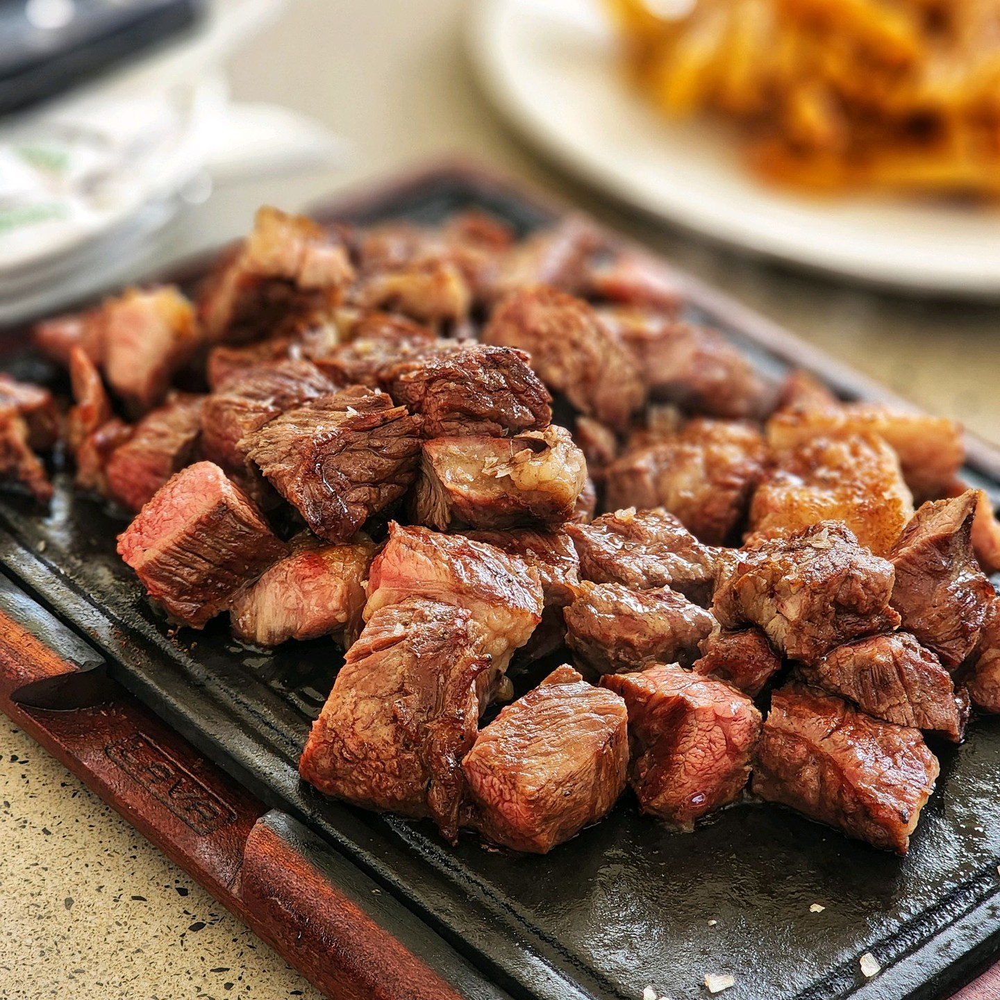

# Nyama Choma

*Slow-grilled goat (or lamb, or beef) over charcoal, salted and basted simply, hacked into pieces on a wooden board and eaten with the fingers alongside kachumbari and ugali: the Saturday-afternoon Kenyan national ritual.*

**Serves:** 6

**Prep Time:** 20 minutes, plus 1 hour rest

**Cook Time:** 1 hour 30 minutes

## Overview
Nyama choma is the Kenyan grilling tradition, and the marinade is famously minimal: salt, sometimes a squeeze of lemon, sometimes a brush of oil, and that is it. The point is the meat (goat is the prestige choice, lamb shoulder or beef sirloin work as substitutes) cooked slowly over charcoal embers, never a flame, so the fat renders and the skin crisps without burning. A whole leg or shoulder is butchered to the bone, hung over the coals on long iron skewers and turned every few minutes for over an hour, basted with a little salty water. When it comes off the grill it is taken straight to a wooden board, hacked into bite-sized pieces with a cleaver and eaten by hand with kachumbari and ugali. Eat at a butchery-and-grill with a Tusker in the other hand.

## Ingredients

- 2 kg bone-in goat leg or shoulder (or lamb shoulder, or beef sirloin / rump)
- 2 tbsp coarse sea salt
- 2 tbsp vegetable oil
- 1 lemon, halved
- 250 ml warm water

### To serve
- Kachumbari (tomato-onion-chilli salad; see separate recipe)
- Ugali (firm maize-meal mush)
- Pili pili (small bird's-eye chillies) on the side

## Method

### Stage 1 - Prepare the meat
1. Trim heavy fat caps off the meat but leave a thin layer for basting from the inside.
1. Rub the salt all over, working it into the muscle. Squeeze the lemon over.
1. Brush with the oil. Rest at room temperature for 1 hour while the coals settle.

### Stage 2 - Set up the fire
1. Light a hardwood charcoal fire in a kettle grill or a brazier; let the coals burn down to grey ash with no flame.
1. Bank the coals to one side; place the meat on the cool side of the grill at first.
1. Combine the warm water with a pinch more salt for the baste.

### Stage 3 - Slow-grill
1. Place the meat over the indirect side of the grill, lid down (or cover loosely with foil).
1. Cook for 60 to 75 minutes, turning every 10 minutes and brushing with the salt water.
1. For the last 10 minutes, move the meat directly over the coals to crisp the outside, turning often.
1. Internal temperature: goat and lamb are best at around 70 C (pulled bone gives without falling off); beef at 60 C (medium).

### Stage 4 - Rest and chop
1. Take the meat to a wooden board; rest 10 minutes uncovered.
1. With a heavy cleaver, hack the meat across the bone into bite-sized pieces, bones and all.
1. Pile on the board; carry to the table.

## Notes
- **Charcoal, never gas.** The smoke and the slow indirect heat are the dish. A gas grill produces something else.
- **Salt is the marinade.** The flavour comes from the meat, the smoke and the bones, not from a complicated rub. Resist the urge to add garlic, paprika or barbecue sauce.
- **Eat with your hands.** Cutlery defeats the point. The board comes to the table and people pick.
- **The butcher matters.** Kenyan nyama choma is sold at "choma joints" attached to butcheries; the butcher cuts and grills your selected piece in front of you. Source bone-in goat from a halal butcher or African grocer.
- **Pili pili.** A small ramekin of bird's-eye chillies in salt is the standard chilli garnish, picked up and bitten between bites.

## Variations
- **Mbuzi choma:** goat specifically, the prestige version (mbuzi = goat).
- **Kondoo choma:** with lamb, more forgiving than goat for first-timers.
- **Kuku choma:** chicken, halved and grilled flat with the same minimal seasoning.
- **Samaki choma:** whole tilapia, scored and grilled the same way, a Lake Victoria version.
- **Mishikaki:** the skewered cubed-meat version, often beef, marinated with garlic and ginger.

## Serving
Pile the chopped meat on the wooden board · kachumbari in a bowl alongside · a mound of ugali · pili pili in a small dish · cold Tusker lagers · sit outside, hands only.

## Storage
- Best eaten straight off the grill. Leftover nyama choma keeps 3 days refrigerated.
- Reheat gently in a covered pan with a splash of water, or chop into stew with onions and tomatoes.
- The bones make a strong stock; simmer 3 hours with onion and ginger.
