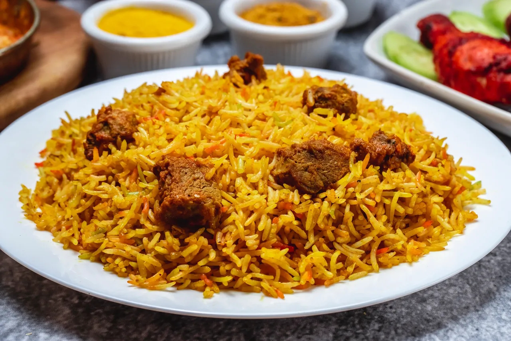

# Pilau wa Nyama

*Swahili-coast beef pilaf where rice is browned with cumin, cardamom and clove in deep-caramelised onions, then steamed with beef stock: the celebration rice of Mombasa weddings, Eid lunches and any household with something to mark.*

**Serves:** 6

**Prep Time:** 25 minutes

**Cook Time:** 1 hour 30 minutes

## Overview
Pilau on the Kenyan coast is a slow, dark, deeply spiced rice. The signature move is the kachumbari-brown onion: half a kilo of sliced onion fried in oil for a full 20 minutes until the bottom of the pan is mahogany, then a whole rack of whole spices (cumin, cardamom, clove, cinnamon, black pepper) toasted in that fat. Stewed beef on the bone goes in next, then the rice, which absorbs the dark fond and the spice oil before any liquid is added. The whole pot is finished low and slow with beef stock until each grain stands separate, brown-tinted, and smells of clove. It is the Swahili-Arab-Indian-African signature dish: served at every wedding, Eid feast and serious occasion along the coast. The mark of a good pilau is whether you can taste each spice and still find the beef.

## Ingredients

- 500 g stewing beef (chuck or shin), cut in 3 cm cubes
- 500 g basmati rice (or pishori, the Kenyan long-grain)
- 500 g onions (about 4 large), finely sliced
- 60 ml vegetable oil
- 4 cloves garlic, crushed
- 2 cm ginger, grated
- 2 tomatoes, finely chopped
- 1 tbsp pilau masala (or the spice mix below)
- 800 ml beef stock or water
- 1 tsp salt
- 1 bay leaf

### Pilau spices (whole, lightly crushed)
- 1 tbsp cumin seeds
- 8 green cardamom pods
- 6 cloves
- 1 cinnamon stick (5 cm)
- 1 tsp black peppercorns

### To serve
- Kachumbari
- Lemon wedges
- A spoon of plain yoghurt (optional)

## Method

### Stage 1 - Rinse and soak the rice
1. Rinse the rice in cold water until the water runs clear, 4 or 5 changes.
1. Cover with water and leave to soak 20 minutes while you start the onions.

### Stage 2 - Caramelise the onions (the key step)
1. Heat the oil in a heavy deep pot (with a tight lid) over medium heat.
1. Add the sliced onions; cook, stirring every 2 to 3 minutes, for 18 to 22 minutes, until they collapse and turn a deep mahogany brown. Do not rush this. Reduce the heat if they catch.
1. The pan bottom should have dark caramelised fond. This is the whole flavour of the pilau.

### Stage 3 - Toast the spices, sear the beef
1. Add the whole crushed spices to the onions; toast 1 minute until aromatic.
1. Add the garlic and ginger; cook 30 seconds.
1. Add the beef cubes; turn the heat up and brown 5 minutes, stirring to coat in onion and spice.
1. Add the chopped tomatoes and pilau masala; cook 5 minutes until the tomatoes break down.
1. Add 200 ml of the stock and the bay leaf; cover; simmer 30 minutes until the beef is becoming tender.

### Stage 4 - Add the rice
1. Drain the soaked rice. Stir into the pot, coating every grain in the dark onion-spice fat for 1 minute.
1. Add the remaining 600 ml stock and the salt; stir once.
1. Bring to a fast simmer.

### Stage 5 - Steam
1. Cover with a tight lid; reduce heat to the lowest setting.
1. Cook undisturbed for 18 minutes.
1. Take off the heat; rest, lid on, for a further 10 minutes.
1. Fluff with a fork from the edges in. Grains should be separate and stained brown by the spice oil.

## Notes
- **Onion caramelisation is not optional.** The 20-minute fry to mahogany is the dish. Stop too soon and the pilau is pale and bland.
- **Pilau masala.** Pre-ground pilau masala is sold in any Kenyan or Indian grocer. The blend above is the traditional one if making your own.
- **Pishori rice.** Kenyan pishori is a fragrant long-grain from the Mwea region, the prestige choice. Basmati is the common substitute.
- **Beef cuts.** Bone-in beef shin gives the richest stock; chuck is more practical. Whatever you use, slow simmer to tender before the rice goes in.
- **No stirring after the lid is on.** Stirring the rice during the steam stage breaks the grains and turns it gluey.

## Variations
- **Pilau wa kuku:** chicken instead of beef, on the bone, simmered 20 minutes before the rice.
- **Pilau wa mbuzi:** goat, the Eid version, simmered longer (45 minutes) before the rice.
- **Pilau ya mboga:** vegetarian, with potato and chickpea instead of meat.
- **Wali wa nazi:** the simpler coconut-rice cousin, no spice and no meat, just rice cooked in coconut milk.
- **Biryani-style:** layered with extra fried onions and saffron-soaked milk on top, an Indo-Kenyan crossover.

## Serving
- A heaped plate of pilau · a spoonful of kachumbari on the side · lemon wedge · a small bowl of yoghurt to cool the spice · eat with a fork (or fingers if you are at home).

## Storage
- Refrigerate 3 days. Reheat covered with a splash of stock to recover the fluff.
- Freezes 2 months; thaw fully before reheating to keep grains separate.
- Day-old pilau, briefly pan-fried in ghee, is excellent for breakfast.
