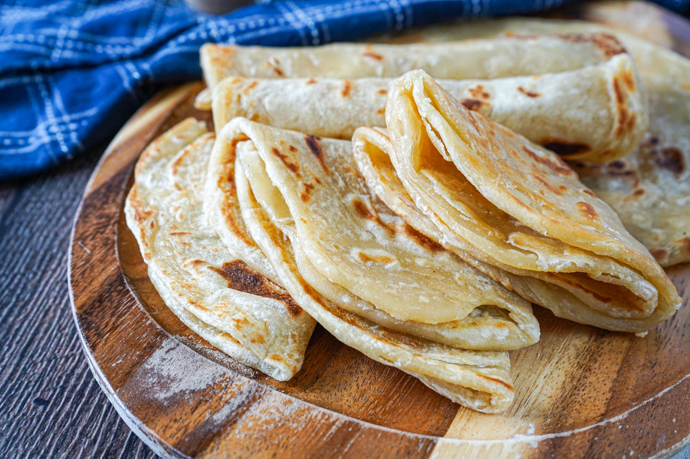

# Chapati ya Kenya

*The Indo-Kenyan layered flatbread: a wheat-flour dough oiled and rolled into a spiral before being flattened and pan-fried in ghee, flakier and richer than its Indian ancestor, the everyday Kenyan companion bread.*

**Serves:** 6 (makes 6 chapatis)

**Prep Time:** 25 minutes, plus 30 minutes rest

**Cook Time:** 25 minutes

## Overview
Kenyan chapati is descended from the Indian chapati brought by Gujarati traders and East African Railway labourers in the 1890s, but a century of Kenyan home cooking has changed it. Where Indian chapati is thin, single-layered and dry-cooked on a tawa, Kenyan chapati is rolled, oiled and spiralled into a pinwheel before being flattened again, which creates many thin layers; it is then shallow-fried in ghee or oil on a pan rather than dry-toasted. The result is closer to a flaky paratha than a true chapati, with a soft chewy interior and a crisp browned exterior. It is served folded into quarters and stacked on a plate, eaten with stews, used as a wrap for beans and sukuma, or torn cold from the fridge as a snack. Kenyans take chapati seriously; the Saturday batch is a small ritual in most households.

## Ingredients

- 500 g plain flour (all-purpose), plus extra for dusting
- 1 tsp salt
- 2 tbsp vegetable oil (for the dough)
- 1 tbsp sugar
- 300 ml warm water (approximate)
- 1 small egg (optional; gives richer dough)
- 4 tbsp ghee or vegetable oil (for the layering)
- 4 tbsp ghee or oil (for frying)

## Method

### Stage 1 - Mix and knead the dough
1. In a large bowl, whisk the flour, salt and sugar.
1. Add the 2 tbsp oil and the egg if using; rub through with fingertips.
1. Add the warm water gradually, mixing with one hand, until you have a soft tacky dough.
1. Tip onto an unfloured surface; knead vigorously for 8 to 10 minutes until smooth and elastic. Slap-and-fold if it sticks; do not add more flour unless it is truly wet.
1. Coat the dough in 1 tsp oil; rest, covered, for 30 minutes (or up to 2 hours; the longer rest gives flakier chapatis).

### Stage 2 - Portion and layer
1. Divide the dough into 6 equal balls (about 130 g each).
1. On a lightly floured surface, roll one ball into a thin disc, around 25 cm across.
1. Brush all over with melted ghee or oil; dust very lightly with flour.
1. Roll the disc into a tight log from one edge to the other; pinch the ends to seal.
1. Coil the log into a tight spiral (a pinwheel), tucking the loose end underneath.
1. Repeat with the remaining balls; rest the coiled spirals 10 more minutes (cover with a cloth).

### Stage 3 - Flatten and fry
1. Heat a heavy flat pan or cast-iron tawa over medium-high heat. Add 1 tsp ghee.
1. Take a coiled spiral; press flat with your palm; roll out into a 20 cm disc, around 3 to 4 mm thick. The spiral edges become the visible layers.
1. Slap onto the hot pan; cook 60 seconds until bubbles rise.
1. Flip; cook another 60 seconds.
1. Drizzle 1 tsp ghee over the top; press down with a folded cloth (encourages the layers to puff and separate); flip and add 1 tsp ghee to the other side; press again.
1. Cook another 30 seconds per side until both faces are deep golden with darker brown spots.
1. Stack the cooked chapatis under a cloth to keep soft.

## Notes
- **The layering is the dish.** The roll-and-spiral step is what makes Kenyan chapati Kenyan. A flat-rolled chapati skips the layers and tastes ordinary.
- **Ghee is the prestige fat.** Many home cooks use vegetable oil for everyday and ghee for guests / Sunday lunch. Both work.
- **Dough hydration.** Soft and tacky is right; too dry and the chapati cracks on the spiral, too wet and it sticks. Adjust water by feel.
- **Rest the dough.** 30 minutes is the minimum; 2 hours is better. The gluten relaxes, the chapati rolls more easily and is much flakier.
- **Stack under a cloth.** Steam softens the chapatis as they sit, which is the texture you want. Uncovered, they go leathery.

## Variations
- **Chapati ya maziwa:** made with milk instead of water for a softer, sweeter dough; the Sunday-lunch version.
- **Chapati ya nazi:** Mombasa coastal version with coconut milk in the dough.
- **Mandazi-shaped:** cut the coiled dough disc into quarters before frying for a crispier handheld snack.
- **Whole-wheat:** half plain flour and half atta for a more rustic chapati; less flaky but more flavour.
- **Egg-stuffed:** crack an egg onto the chapati halfway through cooking, fold over and finish; the breakfast version.

## Serving
- Folded into quarters and stacked · alongside beans (maharagwe), githeri or stew · wrapped around sukuma wiki and a fried egg as a "chapati roll" · torn cold with tea.

## Storage
- Best on the day; keep stacked under a cloth at room temperature.
- Refrigerate up to 3 days in a sealed bag.
- Reheat briefly on a hot dry pan, 20 seconds per side, to bring back softness.
- Freezes 2 months wrapped individually; reheat from frozen on a hot pan.
