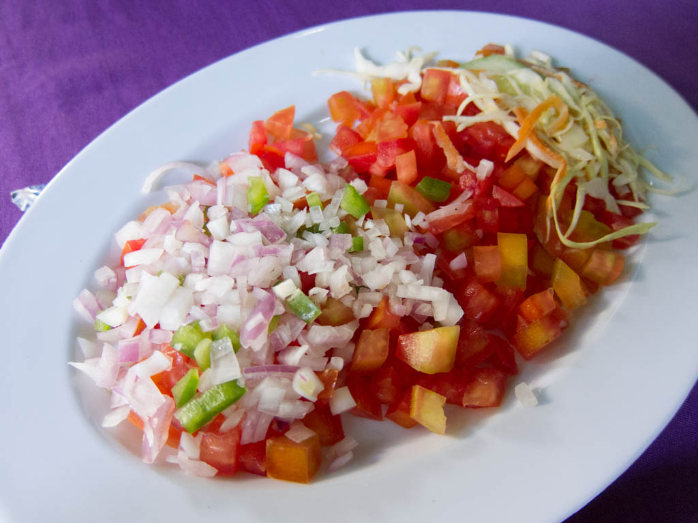

# Kachumbari

*A sharp uncooked salad of tomato, red onion, chilli and coriander dressed in lime and salt: the table relish that accompanies every plate of nyama choma, ugali, pilau or stew across Kenya.*

**Serves:** 4 as a side

**Prep Time:** 15 minutes, plus 10 minutes rest

**Cook Time:** 0 minutes

## Overview
Kachumbari is the standing condiment of the Kenyan table. The name comes from the Swahili borrowing of the Indian "cachumber" salad, brought across by Gujarati traders and indenture-line workers in the late nineteenth century and now wholly Kenyan. It is finely diced tomato, thin-sliced red onion, fresh chilli, coriander and a generous squeeze of lime, salted ten minutes in advance so the onion softens and the tomato releases its juice into a light dressing. It cuts the richness of nyama choma, freshens a heavy plate of pilau, and lifts a mound of ugali. The trick is the onion-softening rest: raw red onion straight from the board is too aggressive; ten minutes with salt and lime tames it and turns the bite mellow and translucent.

## Ingredients

- 3 firm ripe tomatoes (about 400 g), finely diced
- 1 large red onion (about 200 g), very thinly sliced
- 1 small green chilli, finely chopped (deseed for less heat)
- A small bunch of coriander (about 20 g), leaves and tender stems finely chopped
- Juice of 2 limes (or 1 lemon)
- 1/2 tsp fine salt
- 1/4 tsp ground black pepper
- 1 tsp olive oil or vegetable oil (optional, for gloss)

### Optional additions
- 1/2 cucumber, deseeded and finely diced
- 1/4 avocado, diced (added at the last moment)

## Method

### Stage 1 - Soften the onion
1. Slice the red onion as thinly as you can manage; toss into a colander with a pinch of the salt.
1. Squeeze over the juice of one lime; massage with your fingers for 30 seconds.
1. Leave to drain for 10 minutes; the onion softens, loses its aggressive bite, and turns pink.

### Stage 2 - Combine
1. In a serving bowl, combine the diced tomato, the chopped chilli, the chopped coriander and the softened onion.
1. Add the juice of the second lime, the remaining salt, the pepper and the oil if using.
1. Toss gently with your hands or a wooden spoon.

### Stage 3 - Rest and serve
1. Leave to stand 10 minutes before serving so the tomato releases juice into the dressing.
1. Taste; adjust salt and lime; serve at room temperature.

## Notes
- **Onion soak is essential.** The 10-minute salt-and-lime rest is what makes Kenyan kachumbari mellow rather than harsh. Skip it and the salad bites back.
- **Tomato quality matters.** With only five ingredients, the tomatoes need to be ripe and full of flavour. Out of season, use cherry tomatoes (quartered) instead of beefsteak.
- **No vinegar.** Kachumbari is dressed with lime juice, not vinegar. Vinegar turns it sour in a different, wrong, way.
- **Add avocado at the table.** Avocado oxidises within 20 minutes; cut and add at the last moment if at all.
- **Pili pili oil.** Some cooks stir in a teaspoon of pili pili (chilli oil) for extra heat; classic is fresh green chilli only.

## Variations
- **Kachumbari ya tango:** with cucumber, lightens the salad for hot weather.
- **Kachumbari na parachichi:** with avocado, the Nairobi cafe version.
- **Coastal kachumbari:** finished with a tiny squeeze of coconut milk and a pinch of sugar, a Swahili-coast lift.
- **Pepper kachumbari:** add a diced green bell pepper for crunch.
- **Bird's-eye fire:** swap the green chilli for two scotch bonnets, finely diced, the Lake Victoria heat version.

## Serving
- A small bowl alongside nyama choma · spooned over a plate of pilau · piled inside a chapati wrap · scraped onto githeri · the absolute companion to anything heavy.

## Storage
- Best within 2 hours; the tomato weeps water and the salad turns wet.
- Refrigerate up to 24 hours but eat from cold; the texture goes.
- Do not freeze.
