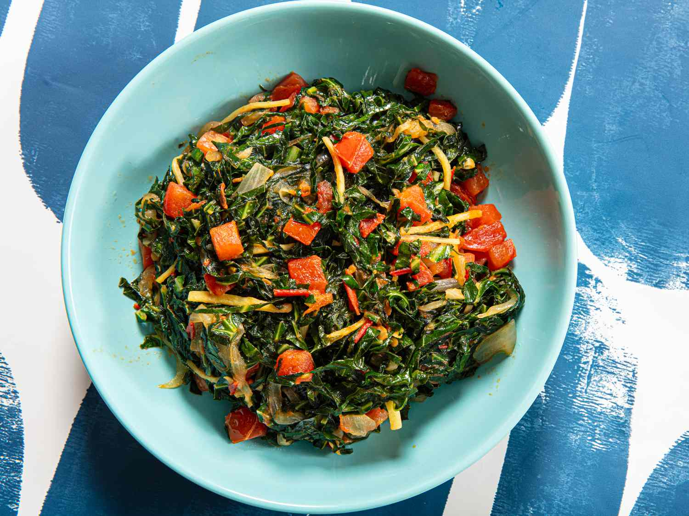

# Sukuma Wiki

*Collard greens shredded fine and stir-fried with onion, tomato and garlic over high heat: the Kenyan everyday side that literally means "stretch the week", the cooked green that goes with everything.*

**Serves:** 4

**Prep Time:** 10 minutes

**Cook Time:** 12 minutes

## Overview
Sukuma wiki is the standing green of Kenya, served alongside ugali three or four nights a week in most households. The name translates as "stretch / push the week", a frank reference to its role as the affordable plant that fills out a small portion of meat into a complete dinner. The cooking is fast: hot oil, onion to soft gold, garlic, then the chopped collards in two batches over high heat so they wilt without going grey. A diced tomato added near the end gives a touch of dressing-by-pan-juice; salt, pepper and sometimes a little ground coriander finish it. The greens should stay bright, hold a small bite, and have just enough onion-and-tomato moisture clinging to them. Long, slow stewing is wrong; high heat and short cook is right.

## Ingredients

- 500 g collard greens (sukuma) or cavolo nero, de-stemmed and very finely shredded
- 1 large onion, finely sliced
- 3 cloves garlic, crushed
- 2 medium tomatoes, finely chopped
- 3 tbsp vegetable oil
- 1 tsp salt
- 1/2 tsp ground black pepper
- 1/2 tsp ground coriander (optional)
- 1 small green chilli, finely chopped (optional)
- Juice of half a lemon (to finish)

## Method

### Stage 1 - Prep the greens
1. Wash the collards thoroughly; strip the leaves off the thick central rib and discard the ribs (or save for stock).
1. Stack a handful of leaves at a time, roll into a tight cigar, and shred crosswise into 5 mm ribbons.

### Stage 2 - Build the base
1. Heat the oil in a wide heavy pan over medium-high heat.
1. Add the sliced onion; cook 4 minutes until softened and pale gold at the edges.
1. Add the garlic and chilli if using; cook 30 seconds.
1. Add the chopped tomato; cook 4 to 5 minutes until it breaks down into a loose pulp.

### Stage 3 - Wilt the greens
1. Add the shredded collards in two additions, letting each batch wilt before adding the next.
1. Toss and stir-fry over high heat 4 to 6 minutes total, until the greens are tender but still bright and have a small bite.
1. Season with salt, pepper and ground coriander; cook another 30 seconds to bloom the spice.

### Stage 4 - Finish
1. Squeeze over the lemon juice; toss once more.
1. Taste; adjust salt; serve hot.

## Notes
- **High heat, short cook.** This is a stir-fry, not a braise. Overcooked sukuma goes grey, limp and slightly bitter. The whole greens stage should take 4 to 6 minutes.
- **Shred fine.** Thin ribbons cook fast and stay glossy; coarsely chopped greens stew rather than fry.
- **Wash carefully.** Collards trap grit at the leaf base. Three changes of water if needed.
- **No water in the pan.** The tomato and the onion provide all the moisture; adding water turns the dish into a sad boil.
- **Lemon at the end.** A small squeeze just before serving lifts the dish; it tastes flat without.

## Variations
- **Sukuma na nyama:** with a small amount of minced beef cooked into the onion base, a more substantial version.
- **Sukuma na karoti:** with grated carrot added with the tomato, sweeter and more colourful.
- **Spinach version:** swap collards for spinach; cooking time drops to 2 minutes.
- **Coastal sukuma:** finish with 2 tbsp coconut milk instead of lemon for a richer Mombasa take.
- **Kachumbari topper:** spoon a tablespoon of fresh kachumbari over the hot sukuma at the table.

## Serving
- Piled alongside a wedge of ugali · spooned over rice · packed into a chapati wrap with a slick of pili pili · over a fried egg for breakfast.

## Storage
- Refrigerate 3 days; the greens darken but the flavour holds.
- Reheat in a dry pan over high heat to recover the texture; the microwave makes it limp.
- Freezes 2 months in a pinch but fresh is much better.
