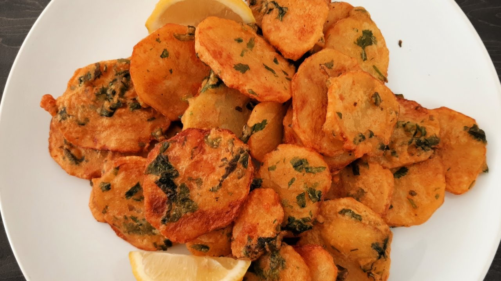

# Bhajia

*Indo-Kenyan potato pakora: thin slices of potato dipped in a spiced gram-flour batter and deep-fried until crisp, served piping hot with tamarind chutney and a wedge of lemon.*

**Serves:** 4 as a snack

**Prep Time:** 20 minutes

**Cook Time:** 20 minutes

## Overview
Bhajia (the Kenyan spelling of the Indian "bhajiya" or pakora) is one of the most loved Indo-Kenyan snacks, sold at every chai-and-bite stall from Mombasa to Kisumu. Where the Indian pakora is often grated or chopped vegetable in batter, the Kenyan bhajia is specifically thin-sliced potato (sometimes also banana, fish or chicken) dipped one slice at a time into a smooth chickpea-flour batter spiced with cumin, turmeric and chilli. They are fried at lower heat so the potato cooks through, then sometimes given a quick high-heat second fry for crisp. The result is a snack with a crisp golden batter shell and a soft cooked potato inside, scented with cumin and the slight nuttiness of gram flour. They are eaten hot from a paper bag, dipped in tamarind chutney, with a wedge of lemon squeezed over.

## Ingredients

- 500 g floury potatoes (Maris Piper, King Edward), peeled
- 200 g gram (chickpea / besan) flour
- 1 tsp ground cumin
- 1 tsp ground coriander
- 1/2 tsp ground turmeric
- 1/2 tsp chilli powder
- 1 tsp salt
- 1/2 tsp baking powder
- A small handful of coriander, finely chopped
- 1 small green chilli, finely chopped (optional)
- 300 ml cold water (approximate)
- 1 litre vegetable oil, for deep-frying

### To serve
- Tamarind chutney
- Lemon wedges
- Pili pili
- A small handful of fried curry leaves (optional)

## Method

### Stage 1 - Slice the potato
1. Slice the potatoes into thin discs, 3 to 4 mm thick (a mandoline is helpful).
1. Soak the slices in cold water for 10 minutes; this rinses off surface starch and stops them sticking together in the fryer.
1. Drain; pat dry thoroughly with a clean towel.

### Stage 2 - Make the batter
1. In a bowl, whisk the gram flour, cumin, coriander, turmeric, chilli powder, salt and baking powder.
1. Add the chopped fresh coriander and the green chilli.
1. Whisk in the cold water gradually until the batter is the thickness of single cream and coats the back of a spoon. Add water tablespoon by tablespoon at the end; gram flour absorbs unevenly.
1. Let stand 10 minutes; this hydrates the gram flour.

### Stage 3 - First fry
1. Heat the oil in a heavy pot to 160 C.
1. Dip each potato slice into the batter, lift out so excess drips off, and lower carefully into the oil.
1. Fry 4 to 5 slices at a time for 3 minutes per side, until pale gold.
1. Lift onto kitchen paper; let cool 5 minutes.

### Stage 4 - Second fry (the crisper)
1. Raise the oil to 180 C.
1. Return the bhajia in small batches; fry 60 to 90 seconds until deep gold and crisp.
1. Lift onto fresh kitchen paper; serve immediately.

## Notes
- **Two-stage fry.** The lower-heat first cook gets the potato done through; the high-heat second cook crisps the batter. Skipping the second stage gives soft, slightly damp bhajia; skipping the first leaves the potato raw.
- **Slice thickness.** 3 to 4 mm is the standard. Thicker slices stay undercooked inside the batter; thinner slices crisp into chips with no soft middle.
- **Batter consistency.** Single-cream thickness is the goal. Too thick and the bhajia are doughy; too thin and the batter falls off the potato.
- **Soak the slices.** Cuts surface starch, keeps the bhajia from sticking together, and gives a cleaner crust.
- **Salt the bhajia hot.** A pinch of salt sprinkled on bhajia straight from the fryer sticks to the oil and brings out the spices.

## Variations
- **Banana bhajia:** unripe green plantain or banana slices instead of potato; sweeter and softer.
- **Mhogo bhajia:** with cassava (mhogo) slices, a Mombasa coastal favourite.
- **Fish bhajia:** flake of white fish folded into the batter, then dropped by spoonfuls; the seaside-Mombasa version.
- **Chicken bhajia:** thin strips of chicken thigh dipped in the same batter.
- **Onion bhajia:** finely sliced onion mixed with thicker batter and dropped as clumps (the Indian "onion pakora" form).

## Serving
Hot from the fryer in a paper cone · tamarind chutney in a small dish · lemon wedge on the side · sometimes coriander chutney · sweet milk chai alongside.

## Storage
- Best within 30 minutes; the batter loses its crisp fast.
- Reheat leftover bhajia at 200 C oven for 5 minutes (never microwave).
- Do not freeze fried bhajia.
- Batter keeps 2 hours covered in the fridge; whisk again before using.
