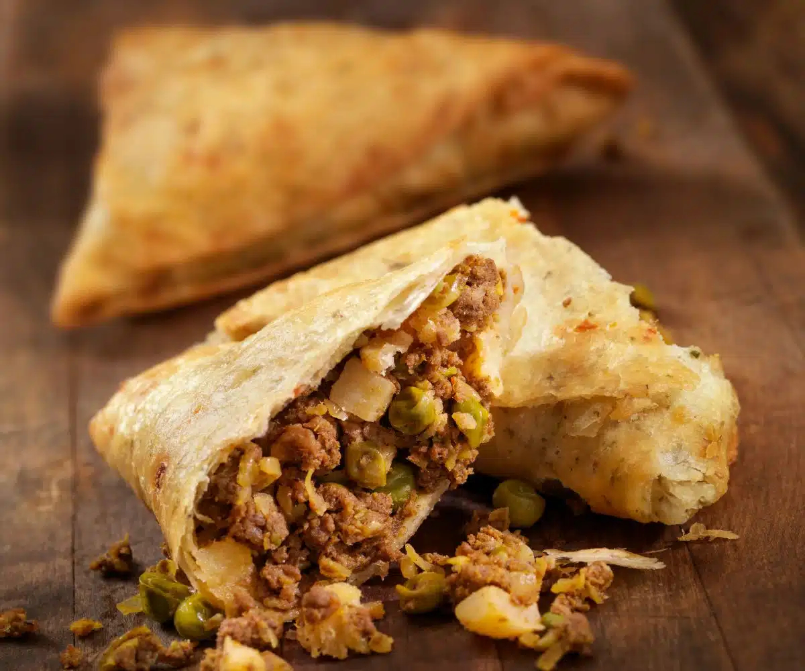

# Kenyan Samosa

*The Indo-Kenyan triangular pastry parcel: a thin wheat-flour wrapper folded into a cone, packed with spiced minced beef and onion, deep-fried until shatter-crisp and served with tamarind chutney.*

**Serves:** 12 samosas

**Prep Time:** 1 hour

**Cook Time:** 30 minutes

## Overview
Kenyan samosa is the most recognisable Indo-Kenyan snack, sold at every roadside duka, train station, market stall and Saturday lunch counter in the country. Brought across by Gujarati railway workers and traders in the 1890s, the samosa was naturalised quickly: in Kenya the standard filling is spiced minced beef (rather than the Indian potato-and-pea), the wrapper is slightly thinner and crisper, and the chilli is restrained, leaving room for tamarind chutney on the side to add the punch. The triangular fold is precise: a square of dough folded into a cone, packed with cooled filling, sealed with a flour-and-water paste, then deep-fried in two stages so the outside shatters when you bite. They are eaten by hand, hot from the fryer, with a small dish of chutney and a paper napkin. A proper Kenyan samosa cracks audibly.

## Ingredients

### For the dough
- 300 g plain flour, plus extra for dusting
- 1 tsp salt
- 2 tbsp vegetable oil
- 150 ml warm water (approximate)

### For the filling
- 400 g minced beef (15 to 20 percent fat)
- 1 large onion, finely chopped
- 3 cloves garlic, crushed
- 2 cm ginger, grated
- 1 small green chilli, finely chopped
- 1 tsp ground cumin
- 1 tsp ground coriander
- 1/2 tsp ground turmeric
- 1/2 tsp [garam masala](../../../base-ingredients/curry-powder/garam-masala.md)
- 1 tsp salt
- 1/2 tsp ground black pepper
- 1 tbsp vegetable oil
- A small handful of coriander, chopped
- Juice of half a lemon

### For sealing
- 2 tbsp plain flour mixed with 3 tbsp water to a thick paste

### For frying
- 1 litre vegetable oil

### To serve
- Tamarind chutney
- Lemon wedges
- Sliced raw red onion

## Method

### Stage 1 - Make the dough
1. In a large bowl, whisk the flour and salt.
1. Add the oil; rub through with fingertips so the texture turns sandy.
1. Add the warm water gradually; mix to a soft firm dough.
1. Knead 5 minutes until smooth; rest, covered, 30 minutes.

### Stage 2 - Cook the filling
1. Heat the 1 tbsp oil in a wide pan over medium-high heat.
1. Add the onion; cook 5 minutes until soft and pale gold.
1. Add the garlic, ginger and chilli; cook 30 seconds.
1. Add the minced beef; break up with a spoon; brown 6 to 8 minutes until cooked through and any liquid has evaporated.
1. Stir in the cumin, coriander, turmeric, garam masala, salt and pepper; cook 1 minute.
1. Add a splash of water (about 50 ml); cook 3 minutes until the filling is moist but not wet.
1. Stir in the lemon juice and the chopped coriander; cool completely (spread on a tray to cool faster).

### Stage 3 - Roll and shape
1. Divide the dough into 6 balls; cover the rest while you work.
1. Roll each ball into a thin disc, about 20 cm across.
1. Cut each disc in half straight across the middle. Each half becomes one samosa wrapper.
1. Take one half-circle: brush the straight edge with the flour paste; fold the two corners of the straight edge over to meet, forming a cone. Press the seam firmly to seal.
1. Hold the cone open in one hand; spoon in 2 tablespoons of cooled filling.
1. Brush the inside of the open top with the flour paste; pinch shut into a flat seal, then fold the seal back on itself for a tight finish.
1. Repeat with the rest; you should have 12 samosas.

### Stage 4 - Fry
1. Heat the oil in a heavy pot to 160 C.
1. Fry the samosas in batches of 3, 4 to 5 minutes per batch, turning, until pale gold all over.
1. Lift out; let cool on a rack 5 minutes.
1. Just before serving, raise the oil to 180 C and re-fry each samosa for 30 to 60 seconds until deep gold and audibly crisp. (This two-stage fry is the secret to the proper shatter.)
1. Drain on paper and serve immediately.

## Notes
- **Two-stage fry.** Single-stage frying makes samosas crisp at the moment but soggy in 20 minutes. The cool-and-refry technique gives a wrapper that stays shattering-crisp for an hour.
- **Filling must be cold.** Hot filling steams the wrapper from inside and the samosa splits in the fryer.
- **Seal carefully.** Any gap in the seam leaks filling into the oil and ruins the batch. Wet the seam well and press firmly.
- **Beef fat content.** 15 to 20 percent fat gives juicy filling; lean mince dries out.
- **Sheet samosa shortcut.** Spring-roll wrappers (folded into triangles using the strip-and-fold method) work as a quick substitute; the bite is different but the result is acceptable.

## Variations
- **Vegetable samosa:** spiced potato, peas and carrot instead of beef; the original Indian filling.
- **Chicken samosa:** finely diced chicken thigh instead of mince, a Mombasa favourite.
- **Lentil samosa:** spiced red lentils, the Gujarati home version still common in Nairobi.
- **Samosa chaat:** crushed samosa topped with chickpeas, yoghurt, chutneys; the Indo-Kenyan street-food platter.
- **Mini samosas:** half-size wrappers, served as canapes at weddings.

## Serving
- Stacked hot on a plate · with a small bowl of tamarind chutney · sliced raw red onion and lemon wedge on the side · sometimes with sweet chai · sometimes with Tusker.

## Storage
- Best within 2 hours of frying.
- Refrigerate cooked samosas 2 days; reheat at 180 C oven for 8 minutes to crisp.
- Freeze unfried, fully shaped samosas 2 months; fry from frozen at 160 C (5 minutes), then 180 C (1 minute).
