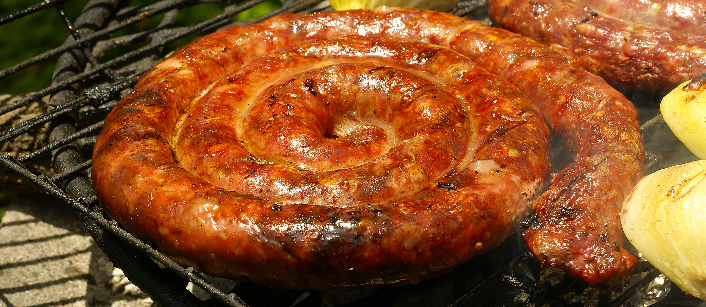

# Mutura

*Kenyan grilled blood sausage: beef intestines stuffed with minced meat, fresh blood, onion, garlic and chilli, simmered then charcoal-grilled and sliced into rounds: the Nairobi street snack alongside nyama choma.*

**Serves:** 6 (as a snack)

**Prep Time:** 45 minutes

**Cook Time:** 1 hour 15 minutes

## Overview
Mutura is the Kenyan blood-and-meat sausage, a Kikuyu speciality that has become a Nairobi street-food standard. Beef intestines (the natural casing) are stuffed with a mixture of finely diced beef, fresh beef blood, soft-cooked onion, garlic, chilli and herbs, tied off, then simmered in seasoned water for an hour until firm. The cooked sausage is finished on a charcoal grill until the casing crisps and chars, then sliced into thick coin rounds on a wooden board and served by the handful with kachumbari, salt and pili pili. At the choma joint it is the side-snack to nyama choma; at the street kiosk it is dinner. The recipe below is the practical home-kitchen version using sausage casings and a small quantity of blood (often available pre-frozen from a halal butcher); the texture and flavour are very close to the original.

## Ingredients

- 1 m natural beef or hog sausage casings (rinsed thoroughly)
- 500 g beef (chuck or shoulder), very finely diced (or coarsely minced)
- 200 ml fresh beef blood (from a halal butcher; alternatively, 150 ml of strong beef stock plus 2 tbsp dark soy as a non-blood substitute)
- 1 large onion, finely diced
- 4 cloves garlic, crushed
- 2 cm ginger, grated
- 1 to 2 bird's-eye chillies, finely chopped
- 2 tbsp vegetable oil
- 1 tsp salt
- 1 tsp ground black pepper
- 1 tsp ground coriander
- 1/2 tsp ground cumin
- A small handful of coriander, chopped
- A small handful of mint, chopped

### For simmering
- 2 litres water
- 1 onion, halved
- 2 bay leaves
- 1 tsp salt
- 1 tsp black peppercorns

### To finish
- Vegetable oil for brushing
- Kachumbari to serve
- Pili pili and salt to serve

## Method

### Stage 1 - Prep the casings
1. Rinse the casings inside and out with cold water; soak in cold water for 30 minutes.
1. Run a thin trickle of water through the casing length to check for leaks; trim any damaged sections.

### Stage 2 - Make the filling
1. Heat the oil in a pan over medium heat; add the onion. Cook 6 minutes until soft and pale gold.
1. Add the garlic, ginger and chilli; cook 30 seconds.
1. Stir in the salt, pepper, ground coriander and cumin; cook another 30 seconds.
1. Tip the onion mixture into a large bowl; let cool 10 minutes.
1. Add the diced beef, the fresh blood (or the stock-and-soy substitute), and the chopped fresh coriander and mint. Mix thoroughly with clean hands; the mixture should be loose and well combined.

### Stage 3 - Stuff and tie
1. Slip one end of the casing over a wide funnel (or a sausage stuffer if you have one).
1. Tie the far end of the casing with kitchen string.
1. Push the filling into the funnel and work it gently into the casing, easing out any air bubbles as you go. Do not pack too tight; the casing will burst when it cooks.
1. When the casing is full, tie the open end tightly with string.
1. Twist into 15 cm lengths if you want individual sausages; otherwise leave as one long coil.
1. Prick gently 4 or 5 times along the length with a sharp pin (releases steam during cooking).

### Stage 4 - Simmer
1. In a wide pot, combine the simmering water, halved onion, bay leaves, salt and peppercorns; bring to a low simmer.
1. Lower the sausage into the simmering water; do not boil.
1. Cook gently at 80 to 85 C (just below a simmer; bubbles barely rising) for 50 to 60 minutes.
1. Lift out carefully; let drain and cool 10 minutes.

### Stage 5 - Grill
1. Brush the sausage lightly with oil; place over hot charcoal embers (or a hot griddle pan).
1. Grill 8 to 10 minutes, turning every couple of minutes, until the casing is crisp, blistered and lightly charred.
1. Take to a wooden board; slice into 2 cm coin rounds with a sharp knife.

## Notes
- **Casings.** Natural beef casings are traditional; hog casings are easier to find and work. Wash thoroughly, soak in cold water, and check for leaks before stuffing.
- **Blood sourcing.** Fresh beef blood is sold by halal butchers and African grocers; phone ahead. If unavailable, the dark stock-and-soy substitute gives much of the flavour and dark colour, if not the exact iron-rich note of the original.
- **Simmer, don't boil.** A rolling boil bursts the casing. Hold the water just below a simmer; the surface should barely twitch.
- **Two-stage cook.** The simmer cooks the filling; the grill finishes the casing. Skipping the grill makes it pale and limp; skipping the simmer leaves the inside underdone.
- **Street version.** At a Nairobi roadside stall, the sausage is grilled directly over coals without the pre-simmer; this works only with very thin sausages and an experienced cook. The pre-simmer is the safer home version.

## Variations
- **Mutura ya kondoo:** with lamb instead of beef, common in some Kikuyu households.
- **Mild mutura:** drop the chilli for a less aggressive version; the dish stands without it.
- **Liver-enriched:** add 100 g finely chopped beef liver to the filling for deeper flavour.
- **Smoked mutura:** finish on a covered grill with wood chips for 10 minutes after the char.
- **Pan-fry version:** slice the simmered sausage into rounds and pan-fry the coins until crisp on both sides, for a cleaner kitchen finish.

## Serving
Sliced into coins on a wooden board · kachumbari piled alongside · pili pili and salt in small dishes · cold Tusker · eaten by hand at a choma joint.

## Storage
- Cooked mutura keeps 3 days refrigerated.
- Reheat sliced coins in a hot dry pan to recrisp the edges.
- Freezes 2 months; thaw fully before reheating.
- Eat within 4 days of any blood-containing preparation; do not stretch it longer.
