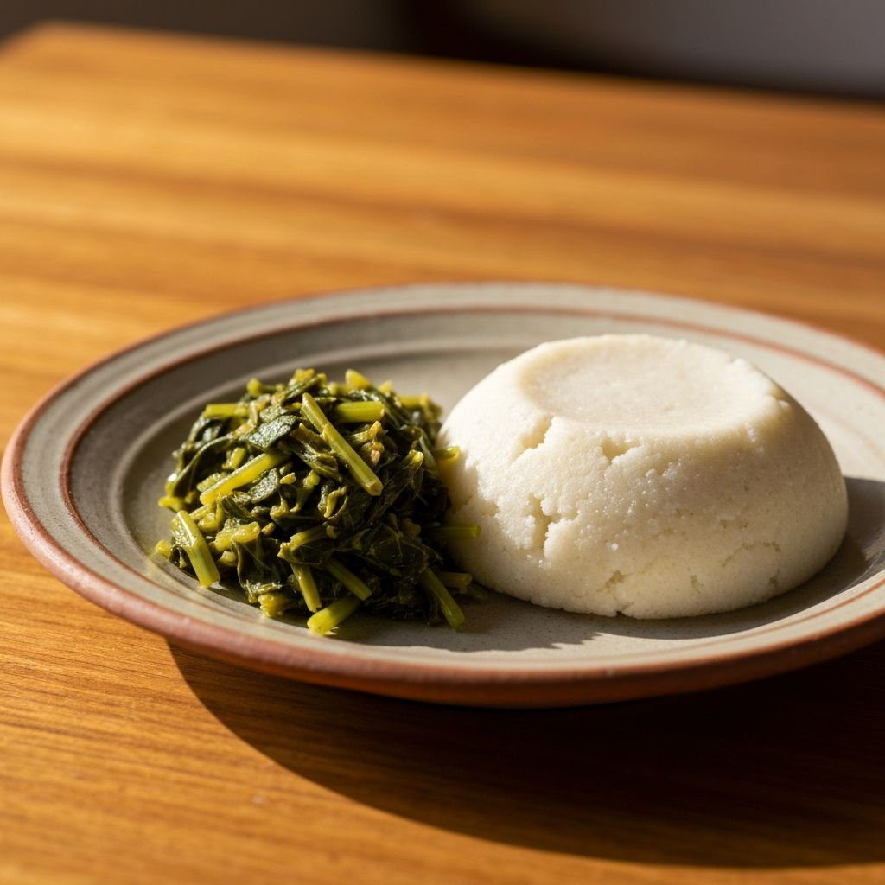

# Ugali na Sukuma

*A firm white maize-meal mush cut into wedges and eaten by hand with a sharp tomato-and-onion stew of collard greens: the Kenyan dinner plate most nights, in most homes, across the country.*

**Serves:** 4

**Prep Time:** 10 minutes

**Cook Time:** 25 minutes

## Overview
Ugali na sukuma is the everyday Kenyan dinner. Ugali is white maize meal stirred into boiling water until it tightens into a dense, sliceable cake firm enough to hold a piece of stew without breaking. Sukuma wiki, literally "stretch the week", is collard greens stir-fried with onion, tomato and a little chilli, the standard side that pads out the week's spending. The two together (with no meat or with a small amount of meat) is the national working dinner: filling, fast, made from ingredients in every kitchen. The technique is in the ugali stirring (a stiff wooden mwiko paddle and constant arm-work for the last five minutes) and in the sukuma not turning to mush (high heat, short cook). It is eaten with the right hand: tear off a piece of ugali, dent it with your thumb to make a scoop, gather a pinch of sukuma.

## Ingredients

### For the sukuma wiki
- 400 g collard greens (sukuma), de-stemmed and finely shredded
- 1 large onion, finely sliced
- 2 tomatoes, finely chopped
- 2 tbsp vegetable oil
- 2 cloves garlic, crushed
- 1 small green chilli, finely chopped (optional)
- 1 tsp salt
- 1/2 tsp ground black pepper

### For the ugali
- 500 ml water
- 250 g white maize meal (unga wa mahindi; coarse white cornmeal)
- 1/2 tsp salt

## Method

### Stage 1 - Start the sukuma wiki
1. Heat the oil in a wide pan over medium-high heat.
1. Add the onion; cook 4 minutes until softened and pale gold.
1. Add the garlic and chilli; cook 30 seconds.
1. Add the chopped tomato; cook 4 to 5 minutes until it breaks down into a loose pulp.

### Stage 2 - Wilt the greens
1. Add the shredded collards in two additions, letting each batch wilt before adding the next.
1. Stir-fry over high heat 4 to 6 minutes, until the greens are tender but still bright green and have a little bite. They should not be soft and grey.
1. Season with salt and pepper; turn off the heat. Cover to keep warm.

### Stage 3 - Cook the ugali
1. Bring 500 ml water and the salt to a rolling boil in a heavy saucepan.
1. Reduce heat to medium. Add the maize meal slowly in a thin stream, stirring constantly with a stiff wooden spoon.
1. Keep stirring vigorously for 3 to 4 minutes as the mixture thickens and pulls away from the sides of the pan.
1. Reduce heat to low. Press the ugali against the side of the pan with the back of the spoon and fold it over on itself, working it for 4 to 5 more minutes; it should be smooth, glossy and firm enough to cut.
1. Wet a plate; turn the ugali out onto it and shape into a smooth dome with damp hands.

### Stage 4 - Serve
1. Cut the ugali into thick wedges at the table; serve hot with the sukuma alongside.
1. Eat with the right hand: pinch off a piece of ugali, dent it with the thumb, scoop the sukuma.

## Notes
- **Maize meal grade.** Use unga wa mahindi, the medium-coarse white maize meal sold in any African grocer. Yellow polenta is finer and tastes wrong; jowar / sorghum meal works as a Kenyan-style millet ugali variant.
- **The stir.** The defining technique. Underworked ugali is grainy and falls apart; properly worked ugali holds a sharp edge when cut.
- **No spoon at the table.** Ugali is hand food. A wedge sits on the plate; you pinch from it.
- **Sukuma timing.** Greens go in last, on high heat, for a short time. Long-cooked sukuma turns grey and limp.
- **Salt the water, not the meal.** Salting the boiling water before the meal goes in distributes the seasoning evenly.

## Variations
- **Ugali na nyama:** ugali with a small beef-and-tomato stew (mboga ya nyama) instead of greens.
- **Ugali wa sembe:** plain ugali, the absolute base version, just maize meal and water.
- **Ugali wa mtama:** sorghum-meal ugali, darker and more rustic, from western Kenya.
- **Sukuma with mbuzi:** stir a few pieces of leftover goat into the greens for a richer plate.
- **Spinach swap:** sukuma is often made with spinach when collards are scarce; the cooking is faster, the flavour milder.

## Serving
- Wedge of hot ugali · sukuma piled to the side · a small ramekin of pili pili · sometimes a fried egg or a piece of grilled meat on top · ice water, never wine.

## Storage
- Ugali is best fresh. Day-old ugali firms up and is usually sliced and pan-fried in oil for breakfast.
- Sukuma keeps 3 days refrigerated; reheat in a dry pan over high heat to recover texture.
- Both freeze poorly; cook only what you will eat.
