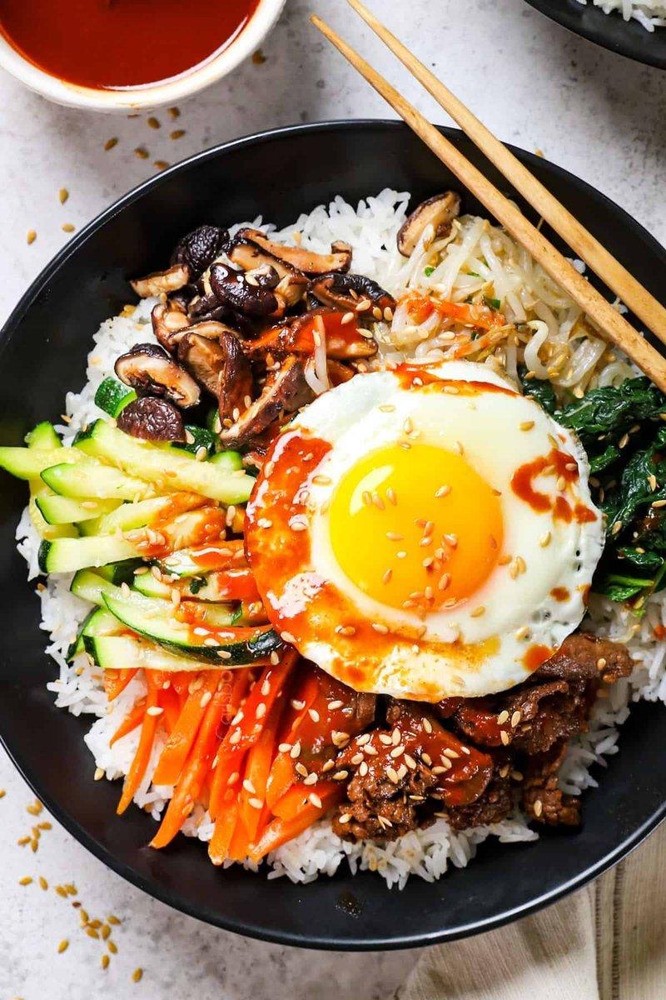

# Bibimbap

*Korean rice bowl: warm rice topped with sautéed and seasoned vegetables in groups, a fried egg, optional bulgogi, and a generous spoon of gochujang sauce. The diner mixes everything at the table - bibim means "mixed", bap means "rice".*

**Serves:** 4

**Prep Time:** 30 minutes

**Cook Time:** 30 minutes

## Overview
Korea's rice bowl, the dish that tells you what kind of cook you are: warm rice topped with sautéed and seasoned vegetables arranged in colourful groups, a fried egg on top, optional bulgogi, and a generous spoon of gochujang sauce on the side. Bibim means mixed, bap means rice, and you do the mixing yourself at the table, breaking the yolk into everything and folding it through till the colours blur. The work is in the separate-vegetable parade: spinach blanched and dressed with sesame oil and garlic, bean sprouts the same way, julienned carrot sautéed in sesame oil, mushrooms in soy and garlic, courgette quick-cooked, each going onto its own pile around the rice. The discrete colours and textures are the point, and one undifferentiated stir-fry isn't the same dish. Slide a sunny-side-up egg on top, set a spoon of gochujang sauce on the side, bring to the table. A dolsot (hot stone bowl) version is worth investing in if this becomes regular; the rice catches into a crisp crust on the bottom as you mix.

## Ingredients

### Rice
- 300 g short-grain rice (cooked according to packet instructions)

### Vegetables
- 200 g spinach
- 200 g bean sprouts
- 1 carrot (julienned)
- 200 g shiitake (or chestnut mushrooms, sliced)
- 1 courgette (small, julienned)

### Seasoning (used across vegetables)
- 4 tablespoons toasted sesame oil
- 4 garlic cloves (crushed)
- 4 tablespoons soy sauce
- 4 teaspoons toasted sesame seeds
- Salt

### Beef (optional)
- 200 g rib-eye (or sirloin, very thinly sliced)
- 1 tablespoon soy sauce
- 1 tablespoon sugar
- 1 teaspoon sesame oil
- 1 garlic clove (crushed)

### To assemble
- 4 eggs
- 1 tablespoon vegetable oil

### Gochujang sauce
- 4 tablespoons gochujang
- 2 tablespoons toasted sesame oil
- 2 tablespoons rice vinegar
- 1 tablespoon honey
- 1 tablespoon water

## Method

### Stage 1 - Sauce
1. Whisk all gochujang sauce ingredients in a small bowl.

### Stage 2 - Vegetables (each separate)
1. Blanch the spinach 30 seconds; squeeze dry, chop, dress with 1 teaspoon sesame oil, ¼ teaspoon garlic, ½ teaspoon soy, sesame seeds, salt.
1. Blanch the bean sprouts 2 minutes; drain, dress same as spinach.
1. Sauté the carrot in 1 teaspoon sesame oil for 2 minutes; salt lightly.
1. Sauté the courgette in 1 teaspoon sesame oil for 3 minutes; salt lightly.
1. Sauté the mushrooms in 1 teaspoon sesame oil with ½ teaspoon garlic and 1 teaspoon soy for 5-6 minutes.

### Stage 3 - Beef (if using)
1. Marinate the beef in the soy, sugar, sesame oil and garlic for 10 minutes.
1. Stir-fry in a hot dry pan for 2-3 minutes until cooked.

### Stage 4 - Eggs
1. Heat the oil in a non-stick pan; fry the eggs sunny-side up.

### Stage 5 - Assemble
1. Mound rice in deep bowls.
1. Arrange the vegetables in colourful piles around the edge, beef in another pile.
1. Slide an egg on top.
1. Put a generous spoonful of gochujang sauce on the side.

### Stage 6 - Mix and eat
1. At the table: drizzle the sauce over, then mix vigorously with a spoon until everything is combined and the egg yolk coats the rice.

## Notes
- **Each vegetable separate:** This is what defines bibimbap. The discrete colours and textures matter; one undifferentiated stir-fry isn't the same dish.
- **Gochujang is the heart:** Korean fermented red chilli paste; available in any Korean or major Asian shop. Sriracha isn't a substitute.
- **Stone bowl bibimbap:** A traditional dolsot version cooks the rice into a crisp crust on the bottom of a hot stone bowl. Worth investing in one if this becomes regular.

## Storage
- Components keep separately for 2 days. Don't pre-mix; reheat rice and warm vegetables fresh, add a fresh egg.
