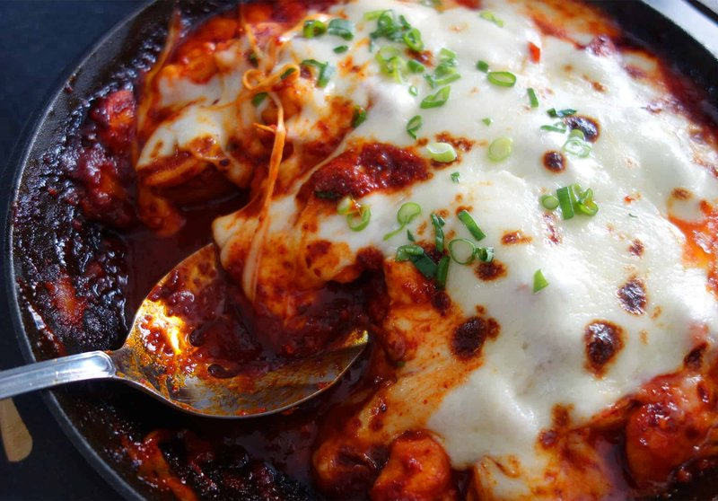

# Buldak

*Korea's fire chicken: boneless thighs marinated in a vivid red sauce of gochujang, gochugaru, soy and garlic, pan-grilled hot, topped with melted mozzarella.*

**Serves:** 4

**Prep Time:** 15 minutes (plus 1 hour marinating)

**Cook Time:** 20 minutes

## Overview
Korea's fire chicken, named for what it does to the mouth: boneless thighs marinated in a vivid red paste of gochujang, gochugaru, soy, garlic and ginger, then pan-grilled in a cast-iron skillet till the sauce caramelises and the chicken just-cooks, then crowned with melted mozzarella as a stretchy, cooling counterweight to the heat. Cast-iron is the right pan; it holds the heat for the canonical caramelisation that gives the sauce its lacquered, almost-burnt edge, where non-stick stays cool and gives a paler stewy result. Low-moisture mozzarella is the second technique detail home cooks miss; fresh mozzarella weeps water across the pan and dilutes the sauce into a thin red slick, while low-moisture mozzarella melts cleanly into the stretchy cap that buldak is famous for. The gochujang-gochugaru double dose is the heat profile (fermented chilli paste for depth, dry chilli flakes for the cleaner burn). Brought to the table in the skillet with steamed rice, kimchi and lettuce leaves for wrapping chicken-and-cheese bites.

## Ingredients

### Marinade
- 800 g boneless skinless chicken thighs (cut into 3 cm chunks)
- 4 tablespoons gochujang (Korean chilli paste)
- 2 tablespoons gochugaru (Korean chilli flakes)
- 3 tablespoons soy sauce
- 3 tablespoons soft brown sugar
- 2 tablespoons mirin (or rice wine)
- 1 tablespoon honey
- 6 garlic cloves (crushed)
- 1 thumb fresh ginger (grated)
- 1 tablespoon sesame oil
- 1 tablespoon vegetable oil

### To cook
- 2 tablespoons vegetable oil

### Topping
- 250 g grated mozzarella (low-moisture, full-fat)
- 2 spring onions (sliced thin)
- 1 tablespoon toasted sesame seeds
- 1 sheet roasted seaweed (cut into thin strips, optional)

### To serve
- Steamed white rice
- [Kimchi (Cabbage)](side-dishes/kimchi.md)
- Lettuce leaves (for wrapping, optional)

## Method

### Stage 1 - Marinate
1. Whisk all marinade ingredients (except the chicken) to a thick red paste.
1. Add the chicken; turn to coat.
1. Refrigerate 1 hour, ideally 2-3.

### Stage 2 - Cook
1. Heat the 2 tablespoons of oil in a wide cast-iron pan over medium-high heat.
1. Add the marinated chicken in a single layer with all the marinade.
1. Cook 10-12 minutes, stirring occasionally, until the chicken is just cooked and the sauce has reduced, caramelised and clings.

### Stage 3 - Cheese
1. Reduce heat to low. Scatter the mozzarella over the top.
1. Cover with a lid (or hood with a metal bowl) 2 minutes, or finish under a hot grill 3 minutes, until the cheese is melted and just starting to bubble.

### Stage 4 - Top
1. Scatter spring onions, sesame seeds and seaweed strips.

### Stage 5 - Serve
1. Bring the pan to the table.
1. Serve with steamed rice, kimchi, and lettuce leaves to wrap chicken-and-cheese bites if you want.

## Notes
- **Heat level:** Gochugaru and gochujang together pack a real punch. Cut both by half for a milder version - still recognisably buldak.
- **Low-moisture mozzarella:** Fresh mozzarella weeps water and dilutes the sauce. Use the supermarket block / pre-grated kind.
- **Cast-iron is the right pan:** Holds heat for the caramelisation step. A regular non-stick works but the sauce reduces less crisply.

## Storage
- Best fresh. Refrigerate 2 days; reheat in a pan.
