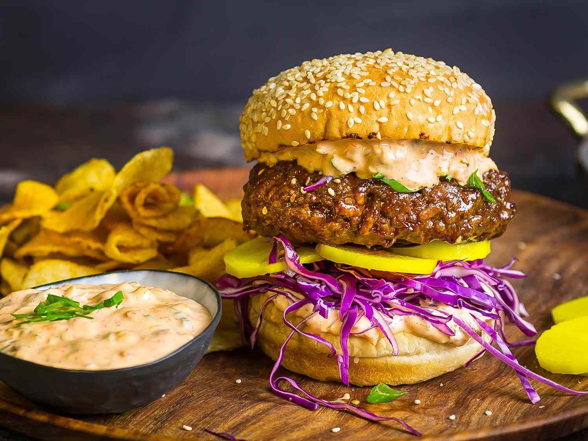

# Bulgogi Burger

*Korea's bulgogi-flavoured burger: a beef patty seasoned with the sweet-savoury bulgogi marinade of soy sauce, pear, garlic, sesame oil and ginger, grilled hard till caramelised, topped with quick-pickled daikon and carrot, gochujang mayo, butter lettuce, and a fried egg with a runny yolk, on a soft potato bun. The Korean-American fusion burger of Seoul gastropubs and Los Angeles Koreatown.*

**Serves:** 4

**Prep Time:** 30 minutes (plus 30 minutes marinating)

**Cook Time:** 15 minutes

## Overview
The bulgogi burger is one of the great Korean-American fusion creations, born out of Los Angeles' Koreatown food trucks (Roy Choi's Kogi truck launched the genre in 2008) and refined in modern gastropubs in Seoul, LA and New York: a beef patty (typically 80/20 chuck) seasoned through-and-through with the classic bulgogi marinade ingredients (soy sauce, sugar, Korean pear or apple, garlic, ginger, sesame oil, scallion), grilled or pan-seared till deeply caramelised and crusty, then served on a soft potato bun with a generous spoon of gochujang mayonnaise (Kewpie mayo + Korean fermented chilli paste + lime), a heap of quick-pickled daikon and carrot (the muu kimchi-adjacent slaw that cuts the richness), butter lettuce, and a fried egg with a runny yolk on top. The dish takes the canonical Korean barbecue flavours and packages them into the most American format, with each element doing the work that the Korean-barbecue side dishes would do separately at a proper Korean meal. Three details: bulgogi marinade in the patty (not on top), gochujang mayo (not plain), runny fried egg.

## Ingredients

### Patty
- 800 g ground beef chuck (80/20)
- 4 tablespoons soy sauce
- 2 tablespoons brown sugar
- 1 small Korean pear or 1 Asian pear or 1 small apple (peeled, grated)
- 8 garlic cloves (crushed)
- 1 thumb (3 cm) fresh ginger (grated)
- 2 tablespoons sesame oil
- 4 spring onions (white part finely chopped; greens reserved for the build)
- 1 teaspoon ground black pepper
- 1 teaspoon fine sea salt

### Gochujang mayo
- 8 tablespoons Kewpie Japanese mayonnaise (or regular mayo)
- 2 tablespoons gochujang (Korean fermented chilli paste)
- 1 teaspoon sesame oil
- 1 teaspoon rice vinegar
- 1 teaspoon caster sugar
- Juice of ½ lime

### Pickled daikon and carrot
- 1 large carrot (grated)
- 200 g daikon radish (grated)
- 4 tablespoons rice vinegar
- 1 tablespoon caster sugar
- 1 teaspoon fine sea salt

### Toppings
- 4 large eggs (for frying, one per burger)
- 1 small head butter lettuce (leaves separated)
- 4 soft potato buns (split)
- 2 tablespoons butter (for toasting buns)
- 2 spring onions (greens; sliced thin for garnish)
- 2 teaspoons toasted sesame seeds (for garnish)

### To serve
- Korean fried potato wedges or thick-cut chips
- Kimchi
- Cold Korean beer (Hite or Cass)

## Method

### Stage 1 - Make gochujang mayo
1. Whisk mayonnaise, gochujang, sesame oil, rice vinegar, sugar, lime juice.
2. Refrigerate till needed.

### Stage 2 - Pickle daikon and carrot
1. Whisk rice vinegar, sugar and salt till dissolved.
2. Toss grated carrot and daikon in the brine.
3. Rest 30 minutes.

### Stage 3 - Mix the patty
1. In a wide bowl, combine ground beef, soy sauce, brown sugar, grated pear, crushed garlic, grated ginger, sesame oil, chopped spring onion whites, pepper and salt.
2. Mix gently; don't overwork.
3. Form into 4 patties about 12 cm wide and 2 cm thick. Press a shallow dimple into each.
4. Refrigerate 30 minutes (the pear-soy marinade tenderises the meat).

### Stage 4 - Toast the buns
1. Spread the soft butter on the bun cut sides.
2. Toast cut-side-down in a wide pan 90 seconds till golden.

### Stage 5 - Cook patties
1. Heat a cast-iron pan or grill pan to high.
2. Lay the patties down; don't crowd.
3. Cook 3-4 minutes per side till deeply caramelised. The sugar in the marinade will char; that's the right look.
4. Rest 3 minutes on a warm plate.

### Stage 6 - Fry the eggs
1. In a separate pan, fry 4 eggs sunny-side-up till the whites are set and the yolks are runny.

### Stage 7 - Build the burgers
1. Spread gochujang mayo on both halves of each bun.
2. Layer butter lettuce on the bottom half.
3. The bulgogi patty.
4. A heap of drained pickled daikon and carrot.
5. The fried egg.
6. A scatter of sliced spring onion greens and sesame seeds.
7. Close. The yolk will burst into the patty on the first bite - that's the point.

### Stage 8 - Serve
1. Cut diagonally for the photo.
2. Korean fries and kimchi alongside.

## Notes
- **Pear in the marinade:** the Korean pear (or substitute Asian pear or apple) is enzymatic; it tenderises the meat and adds a subtle sweetness no other ingredient gives.
- **Don't skip the gochujang mayo:** plain mayo with bulgogi tastes underseasoned.
- **Caramelise the patty hard:** the sugar in the marinade is supposed to char.
- **Runny egg yolk essential:** the yolk is the sauce.

## Variations
**Spicier:** double the gochujang in the mayo; add gochugaru (Korean chilli flakes) to the patty.
**With kimchi:** stack a forkful of chopped kimchi on top of the patty for full Korean barbecue energy.
**Pork bulgogi burger:** swap beef for ground pork shoulder; same marinade.
**Chicken bulgogi burger:** swap beef for ground chicken thigh.
**Vegetarian bulgogi:** swap meat for marinated portobello mushrooms or grilled marinated tofu.

## Serving
At a Koreatown food truck. At a Seoul gastropub. At home with kimchi and a cold beer.

## Storage
- Best fresh.
- Raw patties refrigerate 1 day; freeze 2 months.
- Gochujang mayo keeps refrigerated 2 weeks.
- Pickled daikon-carrot keeps refrigerated 1 week.
