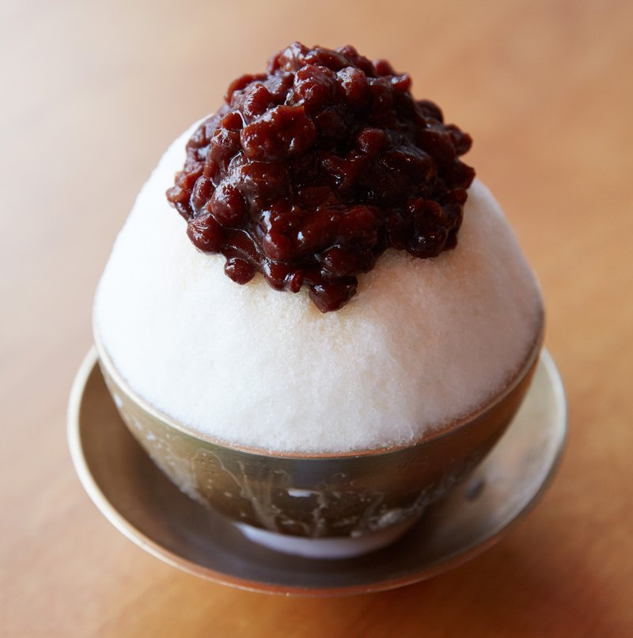

# Bingsu (Shaved Ice with Sweet Toppings)

*Korea's summer sundae: a mountain of finely shaved milk-ice topped with sweet red bean, condensed milk, fruit, mochi and roasted soybean powder.*

**Serves:** 2 (sized to share)

**Prep Time:** 20 minutes (most components made ahead)

**Cook Time:** 0 minutes (assembly only)

## Overview
Whole milk freezes solid in a shallow tray overnight. The frozen milk shaves into a fluffy snow (an ice-shaving machine is ideal; a powerful blender pulsed briefly is the alternative). Piled into a large bowl. Topped with sweet red bean paste (pat), a drizzle of sweetened condensed milk, fresh fruit pieces, chewy mochi balls (or short-grain rice cake squares), a dusting of injeolmi (sweet soybean flour). Eaten quickly, the ice melts.

## Ingredients

### Frozen milk base
- 500 ml whole milk
- 2 tablespoons sweetened condensed milk

### Sweet red bean (pat) - quick version
- 200 g pre-cooked sweetened azuki (or adzuki beans, canned or pre-made)
- (or make from scratch: 200 g dried red beans + 150 g sugar, cooked till soft)

### Toppings (vary to taste)
- 100 g fresh strawberries (hulled, halved)
- 100 g blueberries
- 50 g mochi pieces (sold ready, or make from glutinous rice flour)
- 50 g sweet rice cake (tteok) cut into 1 cm cubes (optional)
- 3 tablespoons sweetened condensed milk (for drizzling)
- 2 tablespoons injeolmi powder (roasted soybean powder, sold at Korean markets - substitute toasted soya flour or finely crushed sweet biscuits)
- 1 scoop vanilla ice cream (optional, on top)

## Method

### Stage 1 - Freeze the milk
1. Whisk the 500 ml whole milk with 2 tablespoons condensed milk.
1. Pour into a wide shallow tray (a small loaf tin or freezer-safe container).
1. Freeze overnight until solid.

### Stage 2 - Shave the milk
1. **Method 1 (ice shaver):** scrape the frozen block into fine flakes with a Korean ice shaver - pile into a bowl.
1. **Method 2 (blender):** break the frozen milk into chunks; pulse in a powerful blender briefly (3-4 short pulses) until it's a snow-soft consistency. Don't over-blend (you'll get milkshake).
1. **Method 3 (manual):** scrape the surface of the frozen milk repeatedly with a fork; takes longer but gives a nice flake.

### Stage 3 - Build
1. Pile the shaved milk into a wide shallow bowl, mounding generously above the rim.
1. Spoon the red bean paste in a generous mound on top.
1. Drizzle 3 tablespoons of condensed milk over the ice.
1. Scatter strawberries, blueberries, mochi pieces and rice cake cubes.
1. Top with a scoop of vanilla ice cream if using.

### Stage 4 - Finish
1. Dust generously with injeolmi powder (the sweet roasted soybean flour gives the iconic nutty layer).
1. Serve immediately with two long spoons.
1. Eat quickly - the bingsu melts fast.

## Notes
- **Milk bingsu vs water-ice bingsu:** the modern Korean version freezes milk (creamy and shaves into snow); the traditional version uses crushed water-ice (icier, less rich). Milk is the popular choice now.
- **Don't over-blend:** shaved ice should be snow-fluffy, not slushy. Pulse briefly.
- **Sweet red bean paste is the soul:** the savoury-sweet beans against the cold milk-ice is the iconic flavour. Don't substitute regular azuki beans (unsweetened) without adding sugar.
- **Injeolmi powder:** roasted soybean powder. Korean grocers stock it. Substitutes (toasted soya flour, ground roasted peanuts, crushed sweet biscuits) are acceptable but not the same.

## Storage
- Assemble immediately before eating.
- Pre-made frozen milk and toppings keep separately for weeks.
- Don't try to keep assembled bingsu - it melts.
