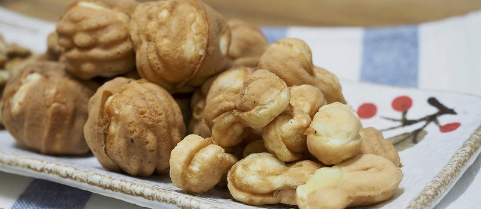

# Hodu Gwaja (Walnut Cake)

*Cheonan's walnut-shaped cake: a tender flour-and-egg batter cooked in iron moulds around sweet red bean paste and a whole walnut piece.*

**Serves:** Makes 12 cakes

**Prep Time:** 25 minutes

**Cook Time:** 25 minutes

## Overview
Cheonan's walnut-shaped cake, the kind of small-bite sweet you'll find boxed and gift-wrapped at every Korean train station and now in every Korean tea shop abroad: a tender flour-and-egg batter cooked in iron walnut moulds around sweet red bean paste with a whole walnut piece pressed into the centre. You whisk eggs and sugar till pale and slightly foamy, fold in melted butter, milk and vanilla, then a flour-and-baking-powder mix folded in just till combined (overmixed batter gives tough heavy cakes). Divide the red bean paste into 12 balls and press a walnut half into each so it embeds; the visible walnut at the centre of every cake is the visual signature, so use good walnuts. Spoon batter into walnut-shaped moulds (or a 12-cup mini-muffin tin lined with paper), tuck a bean-and-walnut ball in the centre of each, cover with more batter so the centre is hidden. Bake 12 to 15 minutes till the tops are golden, cool, dust with icing sugar. Eat with Korean coffee or hot tea.

## Ingredients

### Batter
- 200 g plain flour
- 1 ½ teaspoons baking powder
- ¼ teaspoon salt
- 2 eggs (large)
- 100 g caster sugar
- 50 g unsalted butter (melted)
- 150 ml whole milk
- 1 teaspoon vanilla extract

### Filling
- 300 g sweet red bean paste (pat, Korean koshi-an or Japanese tsubu-an; sold ready)
- 12 walnut halves (good quality - they're a visible feature)

### To finish
- 1 tablespoon icing sugar (optional, for dusting)

## Method

### Stage 1 - Heat oven and prep tin
1. Heat the oven to 180°C (160°C fan).
1. If using a walnut-mould tin: grease lightly with butter.
1. If using a 12-cup muffin tin: line each cup with a paper case.

### Stage 2 - Filling
1. Divide the red bean paste into 12 equal portions.
1. Roll each into a small ball.
1. Press a walnut half into the centre of each ball; pinch to seal so the walnut is embedded.

### Stage 3 - Batter
1. In a wide bowl, whisk flour, baking powder and salt.
1. In another bowl, whisk eggs and sugar until pale and slightly foamy (1-2 minutes with electric beaters or 4 minutes by hand).
1. Whisk in the melted butter, milk and vanilla.
1. Fold the wet into the dry until just combined (don't overmix).

### Stage 4 - Fill the moulds
1. Spoon about 1 tablespoon of batter into each mould (half-fill).
1. Place a filled bean-ball in the centre of each.
1. Cover with another tablespoon of batter so the bean-ball is hidden.
1. Smooth the top.

### Stage 5 - Bake
1. Bake 12-15 minutes until the tops are golden and a skewer inserted into the cake part (not the bean centre) comes out clean.

### Stage 6 - Cool
1. Cool in the tin 5 minutes.
1. Tip out onto a wire rack; cool completely.
1. Dust with icing sugar if desired.

## Notes
- **Walnut-shaped iron pan is traditional:** sold at Korean specialty stores. A 12-cup mini-muffin tin is a workable substitute - the cakes are smaller but the technique is identical.
- **Don't overmix the batter:** stop folding the moment the flour disappears. Overmixed batter gives tough heavy cakes.
- **Walnut quality matters:** the whole walnut is visible at the centre of every cake. Rancid walnuts ruin the dessert.
- **Sweet red bean paste sold ready:** Korean and Japanese grocers stock pat (Korean) or anko/tsubu-an (Japanese). Make from scratch only if you can't source it.

## Storage
- Keeps 4 days at room temperature in a sealed tin.
- Freezes baked, 2 months; thaw at room temp 1 hour.
- The walnut centre stays crunchy; the cake softens slightly over time but is still good.
