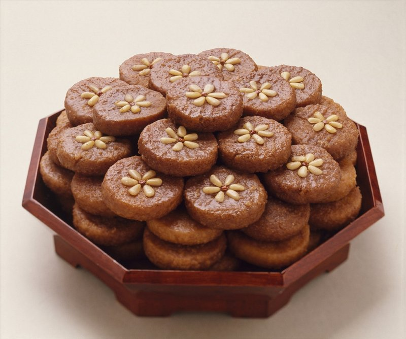

# Yakgwa (Honey-Fried Wheat Cookies)

*Korea's royal cookie: a sesame-oil-and-honey dough deep-fried golden, then soaked in a rice-syrup-and-ginger glaze. Eaten at Seollal.*

**Serves:** Makes 20-24 cookies

**Prep Time:** 1 hour (plus 30 minutes resting)

**Cook Time:** 25 minutes

## Overview
A dough of flour, sesame oil, honey, sugar, soju (Korean rice wine), and a pinch of cinnamon and ginger rubs together, yakgwa dough is sandy, not stretchy (no gluten development is desired). Rests for 30 minutes. Rolls 8 mm thick; cuts into 3 cm flower shapes with a cutter. Pricks each piece with a fork or knife (helps the syrup soak in). Fries in two stages: gentle 110°C heat first to swell the dough; then 160°C to crisp. While frying, syrup of honey, rice syrup (or maple/corn), water and ginger simmers briefly. Hot fried cookies dunk into warm syrup; rest for 1 hour to absorb; lift onto a rack to drain excess.

## Ingredients

### Dough
- 350 g plain flour
- ½ teaspoon salt
- ¼ teaspoon ground cinnamon
- ¼ teaspoon ground ginger
- 60 ml toasted sesame oil (the dark Korean kind)
- 60 ml honey
- 30 ml soju (Korean rice spirit, substitute vodka or dry sake)
- 20 g caster sugar

### Frying
- 800 ml neutral oil

### Soaking syrup
- 100 g honey
- 100 ml rice syrup (jocheong, substitute maple syrup or light corn syrup)
- 50 ml water
- 20 g fresh ginger (sliced thin)
- 1 cinnamon stick (small)

### To finish (optional)
- 2 tablespoons pine nuts (chopped fine)
- 2 tablespoons toasted sesame seeds

## Method

### Stage 1 - Dough
1. In a wide bowl, whisk the flour, salt, cinnamon and ginger.
1. Pour in the sesame oil; rub through the flour with your fingertips for 3-4 minutes until the mixture resembles damp sand (like making shortcrust but with sesame oil).
1. In a small bowl, whisk the honey, soju and sugar.
1. Pour over the floured mix; stir with a spatula until just bound.
1. Press together - DO NOT KNEAD. Yakgwa dough should be soft, slightly oily, with no gluten development.
1. Wrap; rest 30 minutes.

### Stage 2 - Soaking syrup
1. Combine honey, rice syrup, water, sliced ginger and cinnamon stick in a small pan.
1. Bring to a gentle simmer; cook 5 minutes.
1. Remove from heat; let infuse while you fry.

### Stage 3 - Cut shapes
1. Roll the rested dough on a lightly floured surface to 8 mm thick.
1. Cut with a 3 cm flower-shaped cutter (or any small shape).
1. Prick each shape 3-4 times with a fork or the tip of a small knife - this lets the syrup penetrate.

### Stage 4 - Two-stage fry
1. **Stage A (low heat):** heat the oil to 110°C. Lower the yakgwa shapes in (6-8 at a time). Fry 6-8 minutes at this low temperature - they should puff slightly and turn pale gold without browning. The dough cooks through.
1. **Stage B (high heat):** turn the heat up to 160°C. Continue frying 2-3 more minutes; the surface deepens to amber gold.
1. Lift onto a wire rack; let drain briefly.

### Stage 5 - Soak
1. While still warm, drop the fried yakgwa into the syrup (strain out the ginger and cinnamon first if you prefer a clean look).
1. Soak 30-60 minutes - they absorb the syrup.

### Stage 6 - Drain and finish
1. Lift onto a wire rack to drain excess syrup (place a tray underneath to catch drips).
1. Sprinkle with chopped pine nuts and sesame seeds.
1. Cool completely.

## Notes
- **Two-stage frying is essential:** straight high-heat frying browns the outside before the inside cooks - yakgwa stays raw in the middle. The low-temperature first stage cooks the centre, the high-temperature second stage colours and crisps.
- **Don't knead:** the dough must stay short and crumbly. Kneading develops gluten and the texture goes tough.
- **Sesame oil:** must be the dark toasted Korean / Asian sesame oil. Light untoasted is wrong.
- **Soak warm cookies in warm syrup:** the temperature drives absorption. Cold cookies in cold syrup just get sticky on the outside.

## Storage
- Keeps 2 weeks at cool room temperature in a sealed tin.
- The texture improves on day 2-3 as the syrup distributes fully.
- Don't refrigerate - the dough goes hard.
- Don't freeze - texture suffers.
