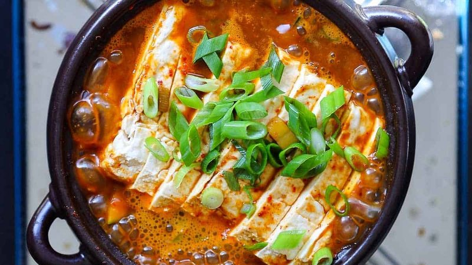

# Doenjang Jjigae

*Korea's everyday stew: tofu, courgette and clams simmered in a deep, funky doenjang broth. Served bubbling at the table.*

**Serves:** 4

**Prep Time:** 15 minutes

**Cook Time:** 25 minutes

## Overview
A quick anchovy-and-kelp stock makes the broth backbone (the Korean kitchen standard, taking 10 minutes). Doenjang (about 3 tablespoons) whisks into the hot stock with a small spoonful of gochujang for warmth, never aggressive heat. The vegetables go in by sturdiness: potato first, then courgette and mushrooms, then onion and chilli, finally cubed tofu and clams (or anchovies) at the end. Simmers for 12-15 minutes total. A little minced garlic stirs in at the very end so it doesn't dull. Brought to the table in the cooking pot, still bubbling.

## Ingredients

### Stock
- 1 litre water
- 12 dried anchovies (about 20 g; gut the heads if very large)
- 1 piece dried kelp (kombu / dasima, about 5 × 5 cm)
- 4 dried shiitake mushrooms (optional, deepens the stock)

### Stew
- 3 tablespoons doenjang (Korean fermented soybean paste)
- 1 teaspoon gochujang (Korean fermented chilli paste - for warmth, not full heat)
- 1 potato (medium, peeled, cubed 2 cm)
- 1 courgette (small, cut into half-moons 1 cm thick)
- 100 g fresh shiitake (or oyster mushrooms, sliced)
- 1 onion (medium, cut into wedges)
- 2 green chillies (sliced)
- 1 red chilli (sliced, optional, for colour)
- 350 g silken (or firm tofu, cubed 2 ½ cm)
- 200 g fresh clams (cleaned; or substitute 100 g peeled shrimp or extra dried anchovies)
- 4 garlic cloves (minced; added at the end)
- 2 spring onions (sliced, for serving)
- 1 teaspoon toasted sesame oil (to finish)

### To serve
- Steamed short-grain rice
- Banchan (kimchi, oi-muchim, kongnamul muchim - see our recipes for these)

## Method

### Stage 1 - Stock
1. Combine the water, dried anchovies, kelp and dried shiitake (if using) in a wide pot.
1. Heat over medium; bring to just-simmering (not a rolling boil - kelp turns bitter if boiled).
1. Simmer 10 minutes.
1. Strain through a fine sieve into a clean pot (discard the anchovies and kelp; if you used dried shiitake, slice and save for the stew).

### Stage 2 - Doenjang base
1. Bring the strained stock to a simmer.
1. Whisk in 3 tablespoons doenjang and 1 teaspoon gochujang until fully dissolved.
1. Taste - the broth should be deeply savoury, slightly funky, gently warm. Add more doenjang if it tastes thin.

### Stage 3 - Build the stew
1. Add the cubed potato; simmer 5 minutes.
1. Add the courgette, mushrooms, onion wedges and chilli; simmer 5 more minutes.
1. Add the cubed tofu and clams; simmer 4-5 minutes until the clams open and the tofu is heated through.

### Stage 4 - Finish
1. Stir in the minced garlic in the LAST minute (raw-garlic top note is the signature finish).
1. Off heat; drizzle the toasted sesame oil over.
1. Scatter sliced spring onion.

### Stage 5 - Serve
1. Bring the pot (or a hot stone bowl / ttukbaegi if you have one) straight to the table - the stew should still be bubbling.
1. Serve with steamed short-grain rice and a few small dishes of banchan.
1. Each diner ladles a spoonful into rice; eats with chopsticks and a spoon.

## Notes
- **Doenjang isn't miso:** the Korean version is more fermented, more pungent, less sweet. Korean grocers sell it in clay-coloured tubs. Substituting Japanese miso gives a much milder, sweeter stew - distinguishable as not-doenjang-jjigae.
- **Gochujang is for warmth, not heat:** doenjang jjigae is the comfort cousin of kimchi jjigae. The chilli paste is a teaspoon, not a tablespoon. Mild palates can skip; spicy palates should have kimchi jjigae instead.
- **Garlic in LAST:** the raw-garlic finish is the Korean signature. Adding garlic at the start dulls it into a generic background note.
- **Anchovy-kelp stock is the Korean kitchen standard:** Korean home cooks make this stock in 10 minutes and use it for everything - soups, stews, sauces. Once you have the dried anchovies and kelp in the pantry, it's faster than opening a stock cube.

## Storage
- Keeps 3 days refrigerated; reheat gently.
- The flavour deepens overnight - day 2 is arguably better than day 1.
- Doesn't freeze well - tofu turns spongy.
