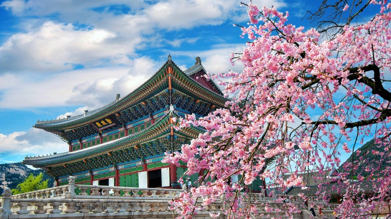

# Korean Cuisine

A cuisine built on banchan (the small side dishes that fill the table) and the alchemy of fermentation. Gochujang and gochugaru chillies, doenjang fermented soybean paste, soy and toasted sesame oil drive the flavour; kimchi appears at almost every meal. Live grilling at the table (bulgogi, dak galbi), wok-quick stir-fries, layered bibimbap rice bowls and slow-cooked stews like jjigae define the experience.
