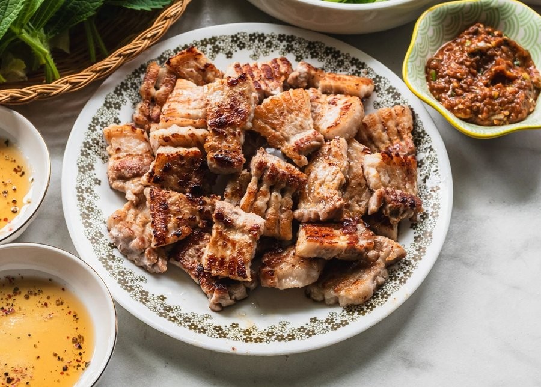

# Samgyeopsal

*Thick slabs of pork belly sizzling on a tabletop grill, the fat rendering into glassy puddles, edges curling and turning amber. The air smells of sesame oil, raw garlic and toasted perilla, and everyone reaches in with chopsticks for the next crackling piece.*

**Serves:** 4

**Prep Time:** 20 minutes

**Cook Time:** 15 minutes

## Overview
Samgyeopsal, literally "three-layered flesh" after the visible stripes of meat and fat, is the most beloved grill-at-the-table meal in South Korea. It is not a marinade-heavy preparation: the entire point is the quality of the pork belly itself, sliced thick and grilled fresh over charcoal or a hot griddle while everyone sits around the table with side dishes, garlic, and a pile of lettuce leaves. The eating ritual is as important as the cooking. You take a leaf of lettuce or sesame perilla, lay on a piece of grilled belly fresh off the heat, add a smear of ssamjang (a thick, savoury paste of doenjang fermented soybean paste and gochujang chilli paste), a sliver of raw garlic grilled briefly in the pork fat, maybe a strand of spring onion salad, then wrap the whole thing tight, pop it into your mouth in one bite, and chase it with a shot of soju. Korean restaurants do not slice the belly for you at the table on purpose: the host or eldest cuts it with kitchen scissors as it cooks, in messy diagonals, which is part of the relaxed, social character of the meal. Difficulty is low; the cook is essentially supervision and a pair of tongs. The skill is in the side dishes (banchan) and the pacing. Sourcing matters: ask for skin-off pork belly cut between 1 ½ and 2 cm thick. Thin belly burns; thicker belly stays juicy.

## Ingredients

### Pork
- 800 g skinless pork belly, cut into slabs 1 ½ to 2 cm thick

### Ssamjang
- 2 tbsp doenjang (Korean fermented soybean paste)
- 1 tbsp gochujang (Korean chilli paste)
- 1 tsp sesame oil
- 1 tsp toasted sesame seeds
- 1 garlic clove, grated
- 1 spring onion, finely chopped
- 1 tsp honey (or rice syrup)

### Spring onion salad (pa muchim)
- 4 spring onions, julienned lengthwise and soaked in iced water
- 1 tbsp gochugaru (Korean chilli flakes)
- 1 tsp rice vinegar
- 1 tsp soy sauce
- 1 tsp sesame oil
- ½ tsp sugar
- 1 tsp toasted sesame seeds

### For the table
- 1 head of soft butter lettuce, leaves separated and washed
- 12 sesame perilla leaves (kkaennip), if available
- 1 whole bulb garlic, cloves thinly sliced
- 2 green chillies, sliced
- Coarse salt mixed with a few twists of black pepper, in a small dish
- 2 tbsp toasted sesame oil mixed with a pinch of salt, for dipping
- Kimchi
- Steamed white rice

## Method

### Stage 1 - Ssamjang
1. Stir all the ssamjang ingredients together until smooth and glossy. Set out in a small bowl.

### Stage 2 - Spring onion salad
1. Drain the soaked spring onions thoroughly and pat dry; they should curl.
2. Toss with gochugaru, vinegar, soy, sesame oil, sugar and sesame seeds just before serving.

### Stage 3 - Set the table
1. Wash lettuce and perilla leaves and dry them well. Arrange on a platter.
2. Set out the sliced garlic, chillies, salt-pepper dish, sesame oil dip, ssamjang, spring onion salad, kimchi and rice.
3. Heat a tabletop grill or heavy cast-iron pan to high.

### Stage 4 - Grill
1. Lay the pork belly slabs onto the dry hot grill, fat side down first if possible. Do not crowd.
2. Let them sizzle undisturbed for 3 to 4 minutes until the underside is deep golden and the fat is glassy.
3. Flip with tongs. Cook another 3 to 4 minutes.
4. Tip in a few slices of garlic and chilli into the rendered fat to crisp gently alongside the meat.
5. Use kitchen scissors to cut each slab into bite-sized pieces directly on the grill.

### Stage 5 - Eat
1. Take a lettuce leaf in your palm, optionally layer a perilla leaf on top.
2. Add a piece of pork, a dab of ssamjang, a slice of grilled garlic, a few strands of spring onion salad.
3. Wrap into a tight parcel and eat in one bite. Repeat. Drink soju.

## Notes
- **Thickness is everything:** under 1 ½ cm and the belly turns to crackling before the inside has rendered. A butcher's belly cut to order is ideal.
- **Dry pan:** no oil needed. The pork's own fat is the cooking medium and a key part of the flavour.
- **Sesame oil dip:** the small dish of sesame oil with salt is non-negotiable in Korean restaurants. Dip the cooked pork into it before wrapping.
- **Perilla leaves:** sesame perilla (kkaennip) tastes nothing like Japanese shiso despite the similar look. If you cannot find it, just use lettuce.
- **One bite:** Korean ssam etiquette is to make the wrap small enough to eat in a single mouthful. Anything bigger is considered greedy.

## Storage
- Best eaten as it comes off the grill. Leftover cooked belly keeps 2 days; slice cold into kimchi fried rice. Ssamjang keeps 2 weeks refrigerated.
