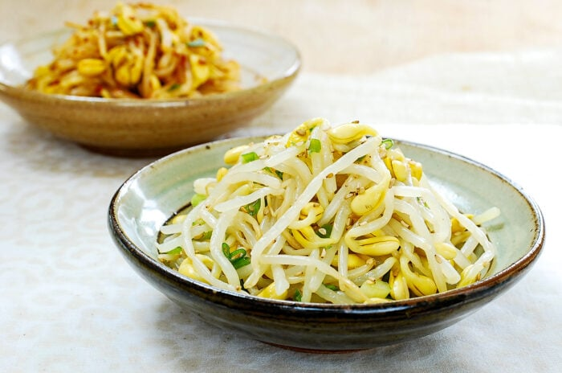

# Kongnamul Muchim (Soybean Sprout Side Dish)

*The most basic Korean banchan: blanched soybean sprouts dressed with garlic, salt, soy, sesame oil and sesame seeds. Nutty and refreshing.*

**Serves:** 4 as a side

**Prep Time:** 5 minutes

**Cook Time:** 8 minutes

## Overview
Soybean sprouts blanch in salted water 5-6 minutes (longer than mung sprouts because of the harder bean head). Drain immediately and rinse cold to stop cooking and preserve snap. Dressing: 2 minced garlic cloves, soy sauce, sesame oil, salt, sesame seeds, spring onion. Toss; chill 15 minutes; serve cool. Some versions get a pinch of gochugaru for the spicy variant.

## Ingredients
- 400 g soybean sprouts (kongnamul) - yellow-topped, with the bean still on
- 1 ½ teaspoons salt (for the blanching water)

### Dressing
- 2 garlic cloves (very finely minced)
- 1 tablespoon soy sauce
- 1 tablespoon toasted sesame oil
- ½ teaspoon salt (or to taste)
- 2 spring onions (white and green, finely sliced)
- 1 tablespoon toasted sesame seeds

### Spicy variation (optional)
- 1 teaspoon gochugaru (Korean coarse chilli flakes)

## Method

### Stage 1 - Trim
1. Pick over the sprouts; pull any darkened roots off (the long stringy bottom).
1. Wash briefly in cold water.

### Stage 2 - Blanch
1. Bring a wide pot of water to a rolling boil; add 1 ½ teaspoons salt.
1. Add the soybean sprouts.
1. Cover with a lid; cook 5-6 minutes (the harder bean head needs the longer time - too short and they're squeaky-raw).
1. Drain in a colander immediately; rinse under cold running water 1 minute to stop the cooking.
1. Squeeze gently to remove excess water.

### Stage 3 - Dress
1. In a wide bowl, combine the cooled sprouts with the minced garlic, soy sauce, sesame oil, salt, spring onions and sesame seeds.
1. If making the spicy version, add 1 teaspoon gochugaru.
1. Toss with hands until uniformly dressed.

### Stage 4 - Rest and serve
1. Chill 15 minutes for the flavours to meld.
1. Pile into a small banchan dish; sprinkle a few extra sesame seeds on top.
1. Serve cool, as a side at any meal.

## Notes
- **Cover during blanching:** Korean cookbooks insist - covering the pot reduces the raw-bean "smell" that develops if the sprouts boil uncovered.
- **Soybean sprouts ≠ mung bean sprouts:** make sure you buy the right kind. Kongnamul are larger, yellow-topped, with thicker stems. Mung bean sprouts (sukju namul) are smaller, more delicate, and need a different (shorter) blanch.
- **Cool, not hot:** kongnamul muchim is always served at room temperature or cold. Hot it tastes squeaky and grassy.

## Storage
- Keeps 3 days refrigerated.
- The texture stays good; eat within the week.
- Mix with rice and a fried egg for a quick bibimbap-light meal.
