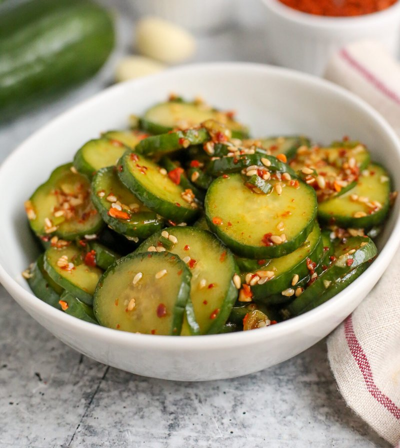

# Oi Muchim (Korean Spicy Cucumber Salad)

*A quick Korean banchan: cucumber tossed with gochugaru, garlic, soy, sesame oil and a touch of vinegar. Bright red, sharp, garlicky and crunchy.*

**Serves:** 4 as a side

**Prep Time:** 15 minutes (plus 10 minutes salting + 10 minutes resting)

**Cook Time:** 0 minutes

## Overview
Persian / Korean / English cucumbers slice into thick half-moons or julienne. Salt rests for 10 minutes; squeeze briefly. Dressing: gochugaru, soy sauce, garlic, rice vinegar, sesame oil, a touch of sugar - whisk together. Cucumber tosses with the dressing; rests for 10 minutes; sprinkles with sesame seeds and spring onion. Eats cool.

## Ingredients
- 2 long cucumbers (about 400 g; Korean, Persian or English)
- 1 teaspoon salt (for the draw)

### Dressing
- 2 tablespoons gochugaru (Korean coarse chilli flakes)
- 1 tablespoon soy sauce
- 1 tablespoon rice vinegar
- 1 teaspoon caster sugar
- 4 garlic cloves (very finely minced)
- 1 teaspoon toasted sesame oil
- 1 spring onion (sliced thin)

### Topping
- 1 tablespoon toasted sesame seeds

## Method

### Stage 1 - Prep cucumbers
1. Halve cucumbers lengthways; if seedy, scoop out the seeds with a teaspoon.
1. Slice into half-moons 5 mm thick (or julienne 5 mm × 5 mm × 5 cm if you prefer the matchstick look).

### Stage 2 - Salt and drain
1. Toss with 1 teaspoon salt in a colander.
1. Rest 10 minutes; squeeze gently to release water.
1. The cucumber should be flexible but still crunchy.

### Stage 3 - Dressing
1. In a small bowl, combine the gochugaru, soy sauce, rice vinegar, sugar, minced garlic and sesame oil.
1. Whisk until the gochugaru hydrates and the dressing turns into a bright red paste.

### Stage 4 - Toss
1. Tip the drained cucumber into a wide bowl.
1. Pour the dressing over; toss with hands (wear gloves - gochugaru stains).
1. Add the sliced spring onion.
1. Rest 10 minutes (the flavours meld; the cucumber takes on the red colour).

### Stage 5 - Serve
1. Tip into a small banchan dish.
1. Sprinkle the sesame seeds over the top.
1. Serve cool.

## Notes
- **Korean cucumbers if you can find them:** thin-skinned, ridged, almost no seeds, crisp. Failing that, Persian or thin-skinned English work. Avoid waxy supermarket cucumbers.
- **Salt and squeeze:** unsalted cucumbers weep into the dressing within minutes. The squeeze is essential.
- **Gochugaru is the colour:** generic chilli flakes give a brown-orange ugly result. Korean coarse red pepper flakes give the proper vivid red.
- **Eat within hours:** oi muchim weeps. Best within 4 hours of dressing.

## Storage
- Keeps 24 hours refrigerated but the texture deteriorates.
- Best as a make-ahead-by-an-hour banchan, not as a meal-prep recipe.
