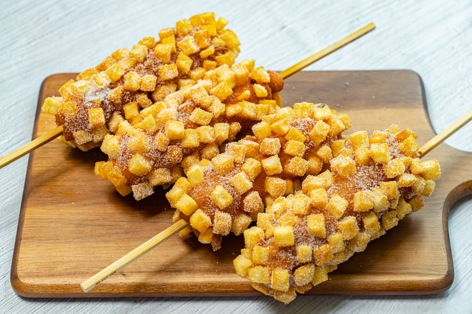

# Gamja Hot Dog (Korean Corn Dog)

*Korea's potato-cube-coated corn dog: a hot dog (or a mozzarella stick, or both) on a skewer, dipped in a sweet yeasted batter, rolled in cubes of raw potato, then deep-fried till the potato cubes are golden-crispy and the inside is hot and stretchy. Rolled in sugar and drizzled with ketchup and mustard. The Seoul Myeongdong street-food sensation.*

**Serves:** 6 (one per person; rich)

**Prep Time:** 30 minutes (plus 30 minutes batter rise)

**Cook Time:** 20 minutes

## Overview
The Korean corn dog (gamja hot dog, or "potato hot dog") is a viral Seoul street-food phenomenon that exploded in the late 2010s and now has corners in every major Korean city. A hot dog or a stick of mozzarella (or both) goes on a wooden skewer, dips into a sweet yeasted batter, rolls in tiny cubes of raw potato so the cubes stick to the batter, then deep-fries at high temperature till the potato crisps golden and the cheese inside goes gooey-stretchy. Out of the fryer, it rolls in caster sugar (yes, sugar; the sweet-savoury contrast is the defining feature) and gets drizzled with squeezy ketchup and yellow mustard. Eat with both hands by the wooden skewer; the cheese pull on the first bite is the whole point of the genre. The combination of crispy potato, sweet batter, savoury meat, melty cheese, ketchup, mustard and a dusting of sugar shouldn't work, but it does, magnificently.

## Ingredients

### Skewers
- 6 wooden skewers (20cm long)
- 6 hot dogs (frankfurters); or 3 hot dogs + 3 mozzarella sticks; or 6 mozzarella sticks for cheese-only

### Sweet yeasted batter
- 250 g plain flour
- 2 tablespoons caster sugar
- 1 sachet (7 g) instant yeast
- 1 teaspoon fine sea salt
- 1 large egg
- 250 ml warm milk

### Potato coating
- 4 large potatoes (about 1 kg; peeled and cut into 5mm cubes; soaked in cold water 10 minutes then drained and patted dry)
- Plain flour (for the initial dredging; about 80 g)

### Frying
- 1.5 litres vegetable oil for deep-frying

### Finishing
- 100 g caster sugar (for rolling)
- Ketchup (in a squeeze bottle)
- Yellow mustard (in a squeeze bottle)
- Honey mustard (optional; in a squeeze bottle)
- Sweet chilli sauce (optional; in a squeeze bottle)

## Method

### Stage 1 - Make the batter
1. Whisk flour, sugar, yeast and salt in a bowl.
2. Whisk egg and warm milk into the dry ingredients to make a thick smooth batter (like pancake batter, slightly thicker).
3. Cover; rest in a warm spot 30 minutes till slightly puffy and bubbly.

### Stage 2 - Prep skewers
1. If using hot dogs: thread each onto a skewer, pushing the skewer through the long axis.
2. If using mozzarella: cut blocks into chunky sticks (about 2cm × 8cm) and thread.
3. If combining: half hot dog + half mozzarella on the same skewer.
4. Pat each one dry with paper towels.

### Stage 3 - Prep potato cubes
1. Cut the potatoes into 5mm cubes (the smaller the better; large cubes don't stick properly).
2. Soak in cold water 10 minutes to remove surface starch.
3. Drain VERY thoroughly; pat dry with paper towels (wet potato = the batter won't stick).
4. Spread the cubes on a large flat tray for rolling.

### Stage 4 - Set up dredge station
1. Spread the plain flour on one plate.
2. Have the batter ready in a tall glass (so the skewers can be dipped vertically).
3. Have the potato cubes spread on another tray.

### Stage 5 - Dredge and coat
1. Roll each skewered hot dog/cheese in plain flour first (helps the batter cling).
2. Dip the floured skewer into the batter, fully coating the dog (turn it to cover all sides).
3. Lift and let excess batter drip a moment.
4. Roll the battered skewer in the potato cubes, pressing gently so the cubes stick all over (some bald patches are fine; the goal is mostly covered).

### Stage 6 - Heat oil
1. Heat the oil to 175°C (350°F) in a deep heavy pot.
2. Don't go hotter (the sugar in the batter will burn before the potatoes crisp).

### Stage 7 - Fry
1. Carefully lower each skewer into the oil.
2. Fry 4-5 minutes, turning occasionally, till the potato cubes are deeply golden and crispy.
3. Lift out with tongs; drain briefly on paper towels.

### Stage 8 - Sugar coat
1. While each corn dog is still warm, roll it in caster sugar (or sprinkle generously). The sugar should stick to the warm batter.

### Stage 9 - Sauce and serve
1. Drizzle a zigzag of ketchup down the corn dog.
2. A zigzag of yellow mustard.
3. Optional: honey mustard or sweet chilli.
4. Hand to eater immediately while everything is warm.
5. Eat by the skewer, biting from the top down.

## Notes
- **Potato cubes must be dry:** wet potato won't stick to the batter.
- **Yeasted batter, not baking-powder:** the slight chew is part of the texture.
- **Sugar straight from the fryer:** if it cools, the sugar won't stick.
- **High heat (175°C):** if too low, the batter absorbs oil and goes greasy; if too hot, the sugar burns before the inside warms.

## Variations
**All cheese (mozzarella-only):** for the iconic Korean cheese-pull video version.
**Half-and-half:** the most popular Korean stall version - half hot dog, half cheese.
**Ramyeon-crusted:** swap the potato cubes for crushed Korean instant noodles for a different crunch.
**Spicy gochujang sauce:** drizzle gochujang-mayo over instead of ketchup-mustard.
**With Cheetos crust:** crushed Cheetos instead of potato (a meme variant that actually works).
**Sweet-only (no meat):** wrap a banana or sweet potato chunk in batter instead of a hot dog.

## Serving
At a Korean street-food stall in Myeongdong, Seoul. At a Koreatown food court. At home as a party showstopper.

## Storage
- Best immediately.
- Don't refrigerate cooked corn dogs (the batter goes soggy and the potato loses crunch).
- Batter keeps refrigerated 1 day; potato cubes keep refrigerated in water 1 day (drain and dry before using).
- Reheat (if you must) in a hot oven at 200°C for 5 minutes.
