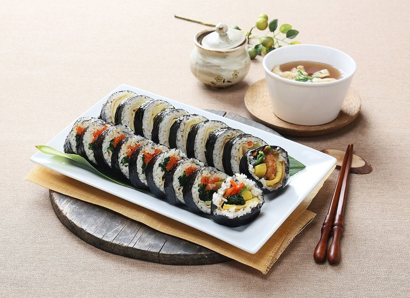

# Gimbap

*Korea's lunchbox roll: short-grain rice with sesame oil, rolled with pickled radish, spinach, carrot, ham and egg inside a sheet of nori.*

**Serves:** Makes 4 rolls (serves 4)

**Prep Time:** 1 hour

**Cook Time:** 25 minutes

## Overview
Korea's lunchbox roll, the bento equivalent of the Korean kitchen: short-grain rice dressed in toasted sesame oil rolled with pickled yellow radish, spinach, julienned carrot, ham (or bulgogi, or tuna mayo) and a thin strip of egg inside a sheet of gim. Each filling preps separately so its colour and flavour stay distinct in the cross-section. You cook short-grain rice, dress it with sesame oil and salt while warm, let it cool to lukewarm (steaming hot rice steams the seaweed; cold rice splits when rolled). Stir-fry julienned carrot briefly with salt; blanch spinach, squeeze dry, dress with garlic and sesame oil; cook eggs as a thin omelette and slice into long strips; cut pickled yellow radish (danmuji, the salty-sharp sweet crunch that's the soul of the dish, find it at any Korean grocer) into long strips. Lay a gim sheet on a bamboo mat shiny-side down, spread rice thin across the bottom two-thirds, line the fillings horizontally near the bottom edge. Roll forward with the mat, pressing firmly to compact the cylinder. Brush the outside with sesame oil, scatter sesame seeds, slice with a very sharp wet knife into 10 to 12 rounds. Eat cool or at room temperature with a small dish of kimchi.

## Ingredients

### Rice
- 400 g short-grain rice
- 480 ml water (1.2:1 ratio)
- 1 tablespoon toasted sesame oil
- 1 teaspoon salt
- 1 teaspoon sesame seeds (optional, mixed in)

### Fillings (per 4 rolls - adjust to taste)
- 4 eggs (large)
- 1 carrot (medium, julienne 3 mm × 3 mm × 15 cm)
- 200 g spinach (or pre-trimmed baby spinach)
- 4 strips pickled yellow radish (danmuji), 15 cm long
- 4 strips ham (or 200 g beef bulgogi cooked, or 1 tin tuna mixed with mayo)
- 2 garlic cloves (minced)
- 1 ½ tablespoons toasted sesame oil (for fillings)
- salt
- pepper

### Wrapping
- 4 sheets gim (roasted seaweed for gimbap - bigger than nori)
- 1 tablespoon sesame oil (for brushing)
- 1 tablespoon sesame seeds (for sprinkling)

### Equipment
- 1 bamboo sushi mat (makisu) - strongly recommended

## Method

### Stage 1 - Rice
1. Rinse the rice in 3 changes of water until the runoff is clear.
1. Cook in a rice cooker (or 480 ml water, lid on, low heat, 18 minutes, 10 min rest).
1. While still warm, transfer to a wide bowl; drizzle with sesame oil and salt; fluff with a fork.
1. Cool to lukewarm (cold rice is too firm to spread; hot rice steams the seaweed).

### Stage 2 - Fillings
1. **Carrot:** stir-fry the julienned carrot in a teaspoon of sesame oil with a pinch of salt for 2 minutes. Spread on a plate to cool.
1. **Spinach:** boil a pot of water; blanch spinach 30 seconds; drain; rinse cold; squeeze hard. Toss with 1 minced garlic, 1 teaspoon sesame oil and a pinch of salt.
1. **Egg:** beat the eggs with a pinch of salt. Heat a non-stick pan over medium-low; add a teaspoon of oil. Pour in the eggs; cook 2 minutes as a thin sheet; flip; cook 30 seconds; slide onto a board; cool; cut into long strips 1 cm wide.
1. **Protein:** if using ham, cut into 4 long strips. If using bulgogi, cook 200 g sliced beef in a hot pan with soy + sugar + garlic + sesame oil; cool; cut into strips. If using tuna, drain a 150 g tin; mix with 2 tablespoons mayo + a pinch of salt.

### Stage 3 - Assemble
1. Place a bamboo mat on the work surface; lay a sheet of gim shiny-side-down.
1. With wet hands or a wet rice paddle, spread a quarter of the cooked rice evenly across the bottom two-thirds of the sheet (leave the top third bare).
1. Press gently so the rice sticks but stays loose.
1. Lay strips of each filling horizontally across the rice, near the bottom edge: pickled radish, carrot, spinach, egg, protein.

### Stage 4 - Roll
1. Lift the bottom of the bamboo mat over the fillings; tuck the fillings tightly under the rice.
1. Roll forward, pressing firmly through the mat to compact the roll.
1. Once the bare seaweed edge is reached, dampen it lightly with water and press to seal.
1. Squeeze gently through the mat to firm the cylinder.
1. Unroll the mat; the gimbap is done.

### Stage 5 - Finish
1. Brush the outside of each roll with a thin coat of sesame oil.
1. Sprinkle a few sesame seeds.
1. With a very sharp wet knife (wipe between cuts), slice each roll into 10-12 rounds about 1 ½ cm thick.

### Stage 6 - Serve
1. Arrange the slices on a plate, cut-side up to show the cross-section.
1. Serve cool or room temperature.
1. Pair with a small dish of kimchi.

## Notes
- **Rice at lukewarm:** not steaming hot (seaweed turns soggy and tough), not cold-from-fridge (rice splits when rolled). Aim for body temperature.
- **Wet the knife between cuts:** dry blade tears the seaweed and squashes the rice. A damp cloth on the counter is helpful.
- **Don't over-rice:** common mistake is to use too much rice. A thin even layer rolls cleanly; thick rice makes a fat ungainly roll.
- **Pickled yellow radish (danmuji) is the soul:** the salty-sharp sweet crunch is iconic. Korean and Japanese groceries stock it; substitute pickled cucumber if absolutely necessary.

## Storage
- Best within 8 hours of making.
- Refrigerate the unsliced roll if needed; bring back to room temperature 30 minutes before slicing and serving.
- Don't refrigerate sliced gimbap - the rice goes hard and the seaweed turns chewy.
