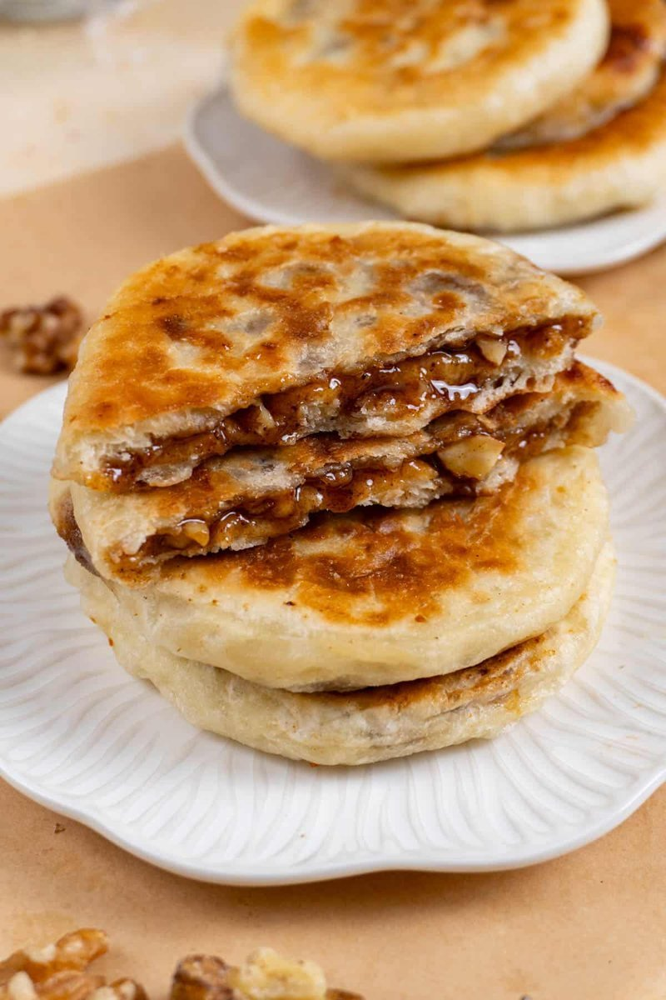

# Hotteok

*Korea's winter street pancake: a yeasted disc filled with brown sugar, cinnamon and peanuts that melt to molten caramel as it griddles.*

**Serves:** Makes 8 hotteok

**Prep Time:** 30 minutes (plus 1 hour rising)

**Cook Time:** 25 minutes

## Overview
A wet yeasted dough, combining plain flour, sweet rice flour, yeast, milk and a little oil, rises for 1 hour. Filling: dark muscovado, cinnamon, chopped peanuts. Dough divides into 8 oily balls; each flattens in the palm, fills with a heaped tablespoon of sugar mix, pinches shut. Pan-fries seam-side-down in oil; presses flat with a heavy spatula; flips; cooks the other side. Eats hot.

## Ingredients

### Dough
- 250 g plain flour
- 50 g sweet rice flour (mochiko / glutinous rice flour)
- 7 g instant yeast
- 1 tablespoon caster sugar
- ½ teaspoon salt
- 200 ml warm milk
- 1 tablespoon neutral oil
- Extra oil (for hands and pan)

### Filling
- 120 g dark muscovado (or soft dark brown sugar)
- 30 g roasted peanuts (chopped)
- 1 ½ teaspoons ground cinnamon
- A pinch of salt

### Cooking
- 4 tablespoons neutral oil

## Method

### Stage 1 - Dough
1. In a wide bowl, whisk both flours, yeast, sugar and salt.
1. Pour in the warm milk and 1 tablespoon oil.
1. Stir with a wooden spoon to a wet sticky dough (don't knead - the dough is too wet to knead conventionally).
1. Cover with cling film; rise in a warm spot 1 hour until doubled and bubbly on top.

### Stage 2 - Filling
1. Combine the muscovado, chopped peanuts, cinnamon and salt in a small bowl.

### Stage 3 - Divide
1. Oil your hands generously.
1. With oily hands, scoop walnut-sized portions of dough (about 70 g each) directly from the bowl.
1. The dough should slip off your fingers, oil prevents sticking.
1. You should get 8 portions.

### Stage 4 - Fill
1. Hold one portion in the palm of your hand; flatten to a small disc.
1. Place 1 heaped tablespoon of filling in the centre.
1. Gather the edges up; pinch firmly at the top to seal.
1. The ball should look like a small dumpling, seam pointing up.

### Stage 5 - Cook
1. Heat a heavy frying pan over medium heat; add 2 tablespoons oil.
1. Place 4 hotteok seam-down in the pan.
1. Cook 1 minute.
1. Press flat with a heavy spatula or a small saucepan lid pressed onto the top of each hotteok (Korean cooks use a special flat hotteok press). Press to about 1 cm thick.
1. Cook 2 more minutes - the bottom should be deep gold.
1. Flip; cook 2-3 minutes on the second side.
1. Lift onto a wire rack; the sugar inside will still be molten.

### Stage 6 - Serve
1. Eat immediately - but CAREFUL, the inside is volcano-hot.
1. The crust should be crisp; the inside molten caramel-peanut.

## Notes
- **Wet dough, oily hands:** the dough is too wet to knead conventionally. Oil is what makes it workable.
- **Seal the ball tightly:** any gap and the sugar leaks into the pan and burns. Pinch firmly at the seam.
- **Press to flatten - don't roll:** rolling tears the seam and the sugar leaks out. Press from above with a flat heavy object.
- **Eat hot:** the molten centre is the entire point. Cooled hotteok have set caramel - still tasty but less dramatic.

## Storage
- Best within 30 minutes of cooking.
- Reheats in a hot dry pan 1 minute per side or in a 180°C oven 4 minutes.
- The sugar centre re-melts when reheated.
- Freeze cooked hotteok in a bag, 2 months; reheat from frozen in a 200°C oven 7 minutes.
