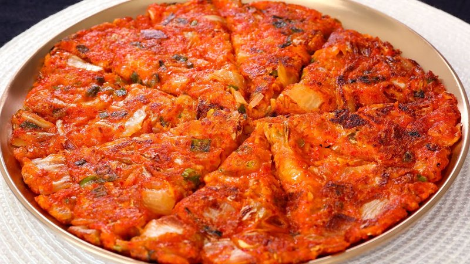

# Kimchijeon (Kimchi Pancake)

*A savoury Korean pancake bound by a thin flour-and-egg batter, packed with sour ripe kimchi and a splash of its juice - the juice tints the batter pink and gives the pancake its tang. Pan-fries crisp on both sides, the edges almost lacy. Eats hot from the pan with a soy-vinegar dip, paired with a cold beer or makgeolli (rice wine). The Korean cure for a rainy afternoon and a fridge full of fermenting kimchi.*

**Serves:** 4

**Prep Time:** 10 minutes

**Cook Time:** 15 minutes (in batches)

## Overview
Well-fermented sour kimchi chops fine; juice reserves. A batter of plain flour, an egg, water and kimchi juice mixes thin (consistency of pancake batter). Kimchi and chopped spring onion stir in. Half the batter pours into a hot oiled pan, spreads thin, fries 4 minutes; flips with a confident wrist or a wide spatula; fries another 3 minutes. Cut into wedges; eats with soy-vinegar dip.

## Ingredients

### Pancake
- 200 g well-fermented kimchi (sour is better than fresh - old kimchi is gold)
- 4 tablespoons kimchi juice (squeezed from the kimchi)
- 100 g plain flour
- 1 tablespoon sweet rice flour (optional, for chewier texture)
- 1 large egg
- 120 ml ice-cold water (or sparkling water for crisper edges)
- 1 teaspoon sugar
- 2 spring onions (sliced thin)
- 4 tablespoons neutral oil (for frying - split between 2 pancakes)

### Dipping sauce
- 3 tablespoons soy sauce
- 1 tablespoon rice vinegar
- 1 teaspoon toasted sesame oil
- 1 teaspoon sesame seeds
- 1 garlic clove (minced)
- 1 spring onion (sliced thin)
- ½ teaspoon gochugaru (optional)

## Method

### Stage 1 - Prep kimchi
1. Squeeze the kimchi over a small bowl to release 4 tablespoons of juice; reserve.
1. Chop the squeezed kimchi roughly (1-2 cm pieces, not fine).

### Stage 2 - Batter
1. In a wide bowl, whisk the plain flour, sweet rice flour and sugar.
1. Whisk in the egg, the reserved kimchi juice and the ice-cold water.
1. The batter should be smooth and thin - runnier than American pancake batter, like crepe batter.
1. Stir in the chopped kimchi and sliced spring onions.

### Stage 3 - Dipping sauce
1. Combine the soy, vinegar, sesame oil, sesame seeds, minced garlic, spring onion and optional gochugaru in a small bowl.
1. Whisk; rest 5 minutes for flavours to meld.

### Stage 4 - Fry
1. Heat a wide non-stick or cast-iron pan (25-28 cm) over medium-high heat.
1. Add 2 tablespoons of oil; swirl to coat.
1. Pour half the batter into the pan; spread with the back of a spoon to a thin even circle (the pan should be just covered).
1. Cook 3-4 minutes; the edges should crisp brown and the surface set.
1. Lift an edge with a spatula to check - if deep gold underneath, flip.
1. **Flip method:** slide pancake onto a flat plate, invert the pan over the plate, flip the whole thing. Or use two large spatulas.
1. Cook another 2-3 minutes till the second side is gold.

### Stage 5 - Repeat
1. Slide the pancake onto a board.
1. Add 2 more tablespoons of oil to the pan; cook the second pancake the same way.

### Stage 6 - Serve
1. Cut each pancake into 8 wedges with a knife or scissors (Korean cooks use kitchen scissors).
1. Pile on a plate.
1. Serve hot with the dipping sauce in a small bowl in the centre.

## Notes
- **Old sour kimchi is best:** fresh kimchi gives a milder pancake. Kimchi that's been in the fridge 2+ weeks has the deep fermented flavour that defines kimchijeon. If your kimchi is too fresh, leave it out for a day to sour.
- **Cold water in the batter:** keeps gluten development minimal and gives lacy crisp edges. Some Korean cooks use ice-cold sparkling water for extra crisp.
- **Don't make the pancake too thick:** thin batter spread thin gives the crisp-edged kimchijeon you want. Thick batter pancakes go bready in the middle.
- **Big pan, oily pan, hot pan:** the three rules. Skimp on any and the pancake won't crisp.

## Storage
- Best within an hour of cooking.
- Reheats well in a hot dry pan 1 minute per side; revives the crisp.
- Keep cooked pancakes 1 day refrigerated.
- Don't microwave - turns gummy.
