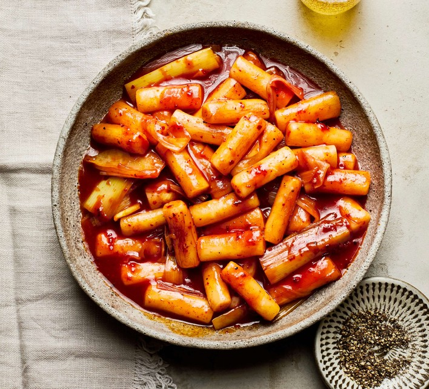

# Tteokbokki

*Korean spicy rice cakes: cylindrical Korean rice cakes (tteok) simmered in a sweet-spicy gochujang-based sauce with fish cakes, boiled egg and spring onion. Sold from every Seoul street cart in deep red sauce with steam rising. Chewy, sticky, sweet-hot. The classic Korean street snack, also a dinner-time comfort.*

**Serves:** 4

**Prep Time:** 10 minutes (plus 30 minutes soaking the rice cakes if dry)

**Cook Time:** 20 minutes

## Overview
Korea's most-eaten street snack: cylindrical rice cakes (tteok) simmered in a sweet-spicy gochujang sauce with fish cakes and a boiled egg, sold from every Seoul cart with steam rising off the deep red glaze. Chewy, sticky, sweet-hot, the kind of after-school dinner-time comfort food that every Korean recognises before they recognise their own name. You soak the rice cakes briefly in warm water if they're dry or firm. Bring stock (water or anchovy-kelp dashi, the latter for richer depth) to a simmer with gochujang, gochugaru, soft brown sugar, soy, mirin and garlic; let the gochujang dissolve. Drop in the soaked tteok and sliced onion, simmer eight to ten minutes stirring frequently so they don't stick (rice cakes are clingy; walking away gives you a scorched bottom), till the cakes are tender and the sauce has reduced to a glaze that coats them. Add fish cakes and hard-boiled eggs in the last five minutes. Drizzle toasted sesame oil over off the heat, scatter sesame seeds and spring onion. Add ramen noodles for rabokki, melt cheese on top for the modern variant; the classic is just rice cakes, fish cakes, eggs and that glossy red sauce.

## Ingredients

### Sauce
- 800 ml water (or anchovy-kelp dashi)
- 4 tablespoons gochujang
- 2 tablespoons gochugaru
- 3 tablespoons soft brown sugar
- 2 tablespoons soy sauce
- 1 tablespoon mirin
- 4 garlic cloves (crushed)

### Main
- 600 g Korean rice cake cylinders (tteok - refrigerated or frozen, thawed if needed)
- 200 g fish cakes (eomuk - flat sheets cut into strips, or tube-shape sliced)
- 4 hard-boiled eggs (peeled, whole)
- 1 onion (small, sliced)

### To finish
- 1 tablespoon toasted sesame oil
- 1 tablespoon toasted sesame seeds
- 4 spring onions (sliced on the diagonal)

## Method

### Stage 1 - Soak the rice cakes
1. If the tteok are firm or dry, soak in warm water 20-30 minutes to soften.
1. Drain.

### Stage 2 - Sauce
1. In a wide pan, combine water (or dashi), gochujang, gochugaru, sugar, soy, mirin and garlic.
1. Bring to a simmer; cook 3 minutes to let the gochujang dissolve.

### Stage 3 - Cook rice cakes
1. Add the drained rice cakes and sliced onion.
1. Simmer 8-10 minutes, stirring frequently to keep them from sticking, until the cakes are tender and the sauce has thickened to a glaze that coats them.

### Stage 4 - Fish cakes and egg
1. Add the fish cakes and boiled eggs.
1. Simmer 5 more minutes - fish cakes soften and absorb the sauce.

### Stage 5 - Finish
1. Drizzle with toasted sesame oil.
1. Off heat.

### Stage 6 - Serve
1. Tip into a wide bowl or serve in the pan.
1. Scatter sesame seeds and spring onions.
1. Halve the eggs at the table.

## Notes
- **Sauce should thicken:** As the rice cakes simmer they release starch that thickens the sauce. If too thin at the end, simmer uncovered another 2-3 minutes.
- **Stir often:** Rice cakes stick to the pan if you walk away. Keep them moving.
- **Variations:** Add ramen noodles in the last 4 minutes (rabokki); add cheese on top and broil (cheese tteokbokki); add stir-fried beef (gungjung tteokbokki).

## Storage
- Best fresh. Refrigerate 2 days; the rice cakes harden in the fridge - reheat with a splash of water and they soften again.
