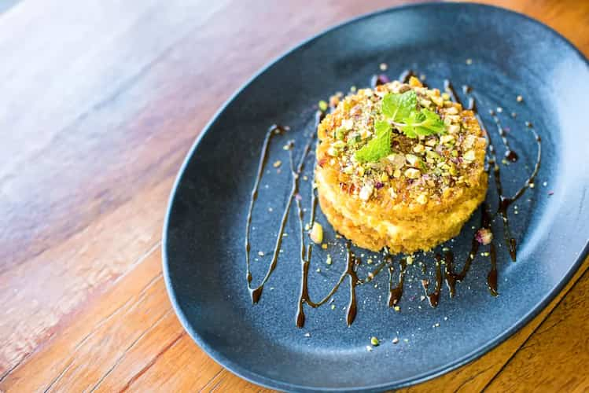

# Khabees

*Kuwaiti date-and-saffron flour pudding: toasted flour cooked into a glossy paste with butter, sugar, dates, saffron and cardamom, the rich winter sweet of Gulf households.*

**Serves:** 6

**Prep Time:** 5 minutes

**Cook Time:** 25 minutes

## Overview
Khabees is the desert sweet of Kuwait and the eastern Gulf: flour toasted in ghee until it goes nutty and gold, then loosened with hot water or milk, sweetened with date syrup and sugar, perfumed with saffron and cardamom and folded with chopped dates. The result is somewhere between a fudge and a halva, glossy and dense, eaten warm from a shallow bowl with a spoon. It's a Ramadan sweet, a winter sweet, and a sweet for new mothers and guests at family occasions. Make it the same day; the texture stiffens too much overnight.

## Ingredients

- 200 g plain flour
- 150 g ghee
- 100 g caster sugar
- 100 g pitted dates, chopped (Medjool or other soft variety)
- 600 ml whole milk (or 500 ml water + 100 ml date syrup)
- 1/2 tsp ground cardamom
- 1/4 tsp saffron threads, steeped in 2 tbsp warm water
- 1/4 tsp salt
- 1 tbsp date syrup (additional, for finishing)
- 2 tbsp pistachios or almonds, chopped

## Method

### Stage 1 - Toast the flour
1. Melt the ghee in a wide heavy saucepan over medium-low heat.
2. Add the flour all at once. Stir constantly with a wooden spoon.
3. Toast 8 to 10 minutes; the flour goes from pale to deep golden brown and smells nutty. Do not let it burn.

### Stage 2 - Loosen and sweeten
1. Pour in the milk slowly, whisking hard to avoid lumps. The mixture will steam and seize at first, then loosen.
2. Add the sugar, salt and chopped dates.
3. Stir constantly over low heat for 8 to 10 minutes; the mixture thickens into a glossy paste and pulls away from the sides of the pan.

### Stage 3 - Perfume
1. Stir in the cardamom and the saffron-water.
2. Cook 1 more minute.
3. Taste; add a spoonful more date syrup if you want it sweeter.

### Stage 4 - Serve
1. Spoon into shallow bowls.
2. Drizzle a little extra date syrup across the top.
3. Scatter pistachio or almond.

## Notes
- **Toast properly.** Pale flour gives a raw, pasty pudding. The colour must go deep gold and the aroma nutty.
- **Whisk hard when the milk goes in.** Lumps are the main failure mode; a flat whisk works better than a spoon for this stage.
- **Eat warm.** Khabees stiffens as it cools; reheat with a splash of milk if it sets too firm.

## Serving
Warm from the pan in shallow bowls, with Arabic coffee. Iftar and winter favourite.

## Storage
- Refrigerate 2 days
- Reheat in a pan with a splash of milk; whisk back to glossy
- Freezing not advised

