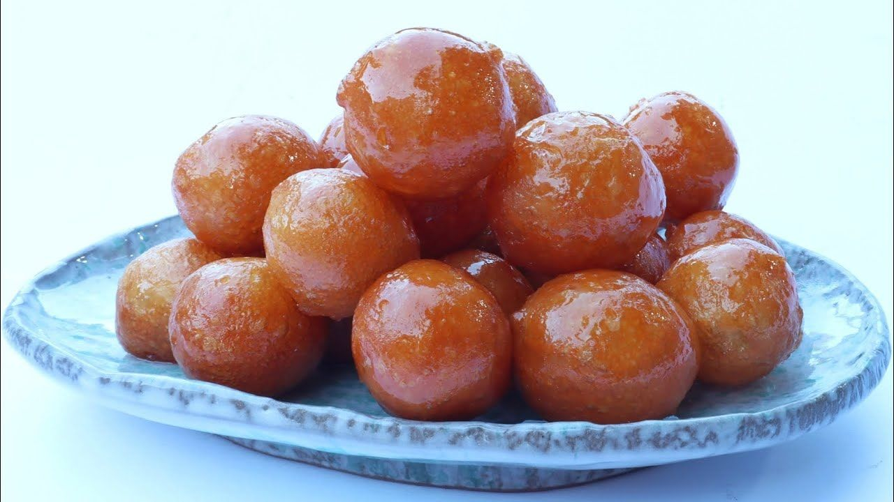

# Luqaimat

*Kuwait's Ramadan staple: small yeasted dough balls fried golden and crisp, then tossed in warm date syrup, eaten by the handful at iftar.*

**Serves:** 6 (makes about 40 pieces)

**Prep Time:** 15 minutes (plus 1 hour rise)

**Cook Time:** 20 minutes

## Overview
Luqaimat are the iftar sweet of Kuwait, the Emirates and the eastern Gulf: a soft yeasted dough enriched with cardamom and saffron, dropped in small balls into hot oil where they puff and turn gold, then drained briefly and rolled through warm date syrup so each one wears a dark sticky coat. The Arabic word means "little bites" and the eating is exactly that, three or four at a time off a shared plate with a glass of karak chai or gahwa. The inside is light and airy from the yeast, the outside crackles, the syrup soaks into the surface but leaves the centre dry. Eat fresh from the pan.

## Ingredients

### Dough
- 250 g plain flour
- 50 g cornflour
- 1 tbsp caster sugar
- 1 tsp dry yeast
- 1/2 tsp ground cardamom
- 1/4 tsp saffron, steeped in 1 tbsp warm water
- 1/4 tsp salt
- 300 ml warm milk (or water)
- Vegetable oil for deep frying (about 750 ml)

### Syrup
- 150 ml date syrup (dibs)
- 50 ml honey
- 1/2 tsp ground cardamom
- 1 tsp rose water (optional)

### To finish
- 2 tbsp sesame seeds, toasted (optional)
- 1 tbsp chopped pistachio (optional)

## Method

### Stage 1 - Dough and rise
1. Whisk flour, cornflour, sugar, yeast, cardamom and salt in a bowl.
2. Add the saffron water and warm milk; whisk to a smooth batter, slightly thicker than pancake batter.
3. Cover; rest in a warm spot 1 hour until bubbly and risen.

### Stage 2 - Syrup
1. Warm the date syrup with the honey and cardamom in a small pan over low heat until pourable.
2. Off the heat, stir in the rose water if using.
3. Keep warm.

### Stage 3 - Fry
1. Heat the oil to 170 C in a wide pan (a piece of bread should turn gold in 60 seconds).
2. Wet your hand and scoop a small ball of batter; squeeze a walnut-sized piece between thumb and forefinger and let it drop into the oil. Or use two teaspoons.
3. Fry in batches of 8 to 10. They sink, rise, puff and turn deep gold, about 3 to 4 minutes. Turn them so they brown evenly.
4. Lift out with a slotted spoon onto kitchen paper.

### Stage 4 - Coat
1. While still warm, drop the fried balls into the warm date syrup; toss to coat.
2. Lift onto a plate; scatter with sesame and pistachio.

## Notes
- **Oil temperature is the key.** Too hot and they brown outside while the centre stays raw; too cool and they soak oil and go heavy. 170 C is the sweet spot.
- **Wet your hand.** A wet hand stops the sticky dough from gluing to skin while you portion.
- **Eat fresh.** Luqaimat go from crisp to leathery within an hour of frying; this is a same-day sweet.

## Serving
Warm, piled on a plate, with karak chai or gahwa. Iftar staple.

## Storage
- Best within 1 hour of frying
- The dough keeps overnight in the fridge; fry to order
