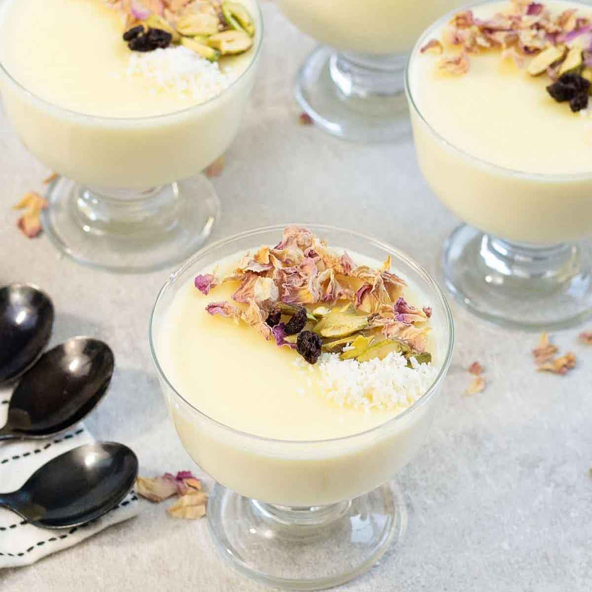

# Mahalabia

*Kuwaiti rose-water milk pudding: smooth cornflour-thickened cream set in shallow bowls, scattered with pistachio, the cooling sweet at the end of any spiced meal.*

**Serves:** 6

**Prep Time:** 5 minutes

**Cook Time:** 15 minutes (plus 2 hours chilling)

## Overview
Mahalabia is the Gulf and Levantine milk pudding, made with whole milk, sugar and cornflour, perfumed with rose water and orange blossom, set just to the firmness of a soft custard rather than a wobbly jelly. The Kuwaiti version is fragrant and pale, served in small shallow bowls or wide-rim coupes, the top scattered with crushed pistachio so the green stands against the cream-white. It cools the palate after a meal of spiced rice and meat, the rose water and cardamom giving the perfume that no European milk pudding has. Make in the afternoon, eat in the evening.

## Ingredients

- 800 ml whole milk
- 200 ml double cream
- 100 g caster sugar
- 60 g cornflour
- 4 green cardamom pods, lightly crushed
- 1 tbsp rose water
- 1 tsp orange blossom water (optional)

### To finish
- 3 tbsp pistachios, finely chopped
- 1 tbsp dried rose petals (optional)
- 1 tbsp honey or sugar syrup (optional)

## Method

### Stage 1 - Mix and warm
1. In a small bowl, whisk 200 ml of the milk with the cornflour until smooth (no lumps).
2. Put the remaining 600 ml milk, the cream, sugar and crushed cardamom in a heavy saucepan over medium heat.
3. Warm to a gentle steam (don't boil); the sugar dissolves.

### Stage 2 - Thicken
1. Strain out the cardamom pods.
2. Whisking constantly, pour the cornflour slurry into the warm milk.
3. Cook 6 to 8 minutes, whisking, until the pudding thickens to a coating consistency (it'll thicken more as it cools).
4. Off the heat, stir in the rose water and orange blossom water.

### Stage 3 - Set
1. Pour into 6 small shallow bowls or coupes.
2. Cool 20 minutes at room temperature.
3. Cover and chill at least 2 hours, ideally 4.

### Stage 4 - Finish
1. Just before serving, scatter the pistachio (and rose petals if using) over each bowl.
2. Drizzle a thread of honey or syrup over the top if you want it sweeter.

## Notes
- **Rose water dosage:** Start with 1 tbsp; add more only after tasting. Too much and it goes soapy.
- **No skin on top:** Cover the bowls with cling film pressed onto the surface as they cool, if you don't want a skin.
- **Set firmness:** Aim for just-set, soft enough to take a spoon without resistance. If it's wobbling, it's right.

## Serving
- Cold, in small bowls, with Arabic coffee or karak chai.

## Storage
- Refrigerate 3 days covered
- Eats best within 24 hours; the rose water fades after that

