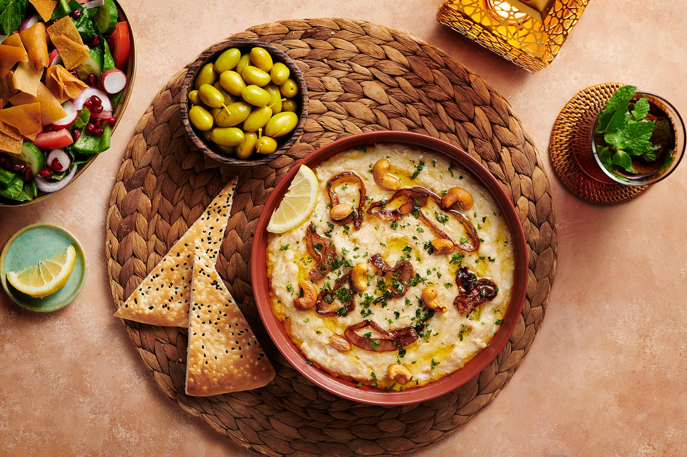

# Harees

*Kuwaiti wheat-and-meat porridge cooked slowly overnight: cracked wheat and lamb or chicken broken down together into a smooth savoury mass, served at Ramadan iftar and at weddings.*

**Serves:** 6

**Prep Time:** 10 minutes (plus overnight soak)

**Cook Time:** 4 to 5 hours

## Overview
Harees is one of the oldest dishes of the Arabian Peninsula, mentioned in tenth-century cookery books and still the centrepiece of Ramadan iftar tables across Kuwait, Qatar and the Emirates. The technique is patience: whole or coarsely cracked wheat is soaked overnight, then simmered with lamb or chicken for four or five hours, stirred and beaten with a wooden mallet until grain and meat collapse into a uniform pale-cream porridge. The seasoning is restrained on purpose, salt, cinnamon, a finish of ghee and a pinch of cumin or cinnamon-sugar on top. The pleasure is the texture and the slow comfort, not the spicing.

## Ingredients

- 400 g whole wheat berries (or coarsely cracked wheat), soaked overnight in cold water
- 700 g lamb shoulder or 700 g chicken thighs on the bone
- 1 onion, halved
- 1 cinnamon stick
- 4 cardamom pods
- 2 tsp salt
- 2.5 litres water (more as needed)

### To finish
- 4 tbsp ghee, melted
- 1 tsp ground cinnamon
- 1 tsp ground cumin
- 1 tbsp sugar (optional, for the sweet finish)

## Method

### Stage 1 - Soak and start
1. Drain the soaked wheat.
2. Put wheat, meat, onion, cinnamon, cardamom and salt in a heavy pot. Add the water.
3. Bring to a boil; skim the scum.

### Stage 2 - Long simmer
1. Drop to low heat, cover and simmer 3 hours, stirring occasionally and topping up water as needed. The wheat should be tender and the meat falling apart.
2. Lift the meat out. Discard bones, skin and the cinnamon stick.
3. Shred the meat finely; return it to the pot.

### Stage 3 - Beat to smoothness
1. Cook another 45 minutes on low, stirring and beating with a wooden spoon or hand whisk. The wheat breaks down; the meat fibres dissolve into the wheat; the porridge turns smooth and pale.
2. Add hot water as needed to keep it loose enough to stir; consistency should be like thick porridge.
3. Taste; adjust salt.

### Stage 4 - Finish
1. Spoon into a wide shallow bowl.
2. Drizzle melted ghee in pools across the top.
3. Dust with cinnamon, cumin and sugar in stripes (some prefer no sugar; the savoury version is equally proper).

## Notes
- **Slow-cooker option:** Eight hours on low after the initial boil; mash and shred at the end.
- **Pressure cooker option:** 50 minutes high pressure, natural release, then 30 minutes uncovered on low to beat down.
- **The texture is the dish.** Aim for smooth, not chunky; if it's still grainy after the long simmer, beat harder.

## Serving
Serve hot in shallow bowls for Ramadan iftar, with dates and laban on the side.

## Storage
- Refrigerate 3 days; reheat gently with extra water (it thickens to a near-solid when cold)
- Freezes 2 months; thaw overnight and reheat with water

